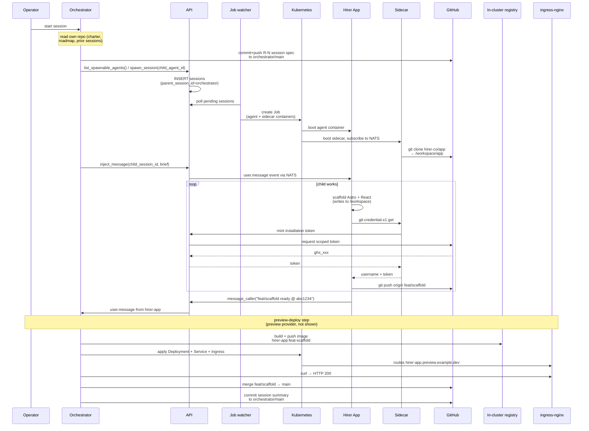

This page walks through one full arc of the orchestration loop: the human starts an orchestrator session, the orchestrator picks a roadmap item, commissions a coding agent to build it, and the work lands on a preview URL the operator can click. The point is to show how the pieces described elsewhere in the docs fit together.

The mechanics of each piece live in their own pages: [orchestration](./orchestration), [sessions](./sessions), [preview environments](./preview-environments), [runtime images](./runtime-images), [credential proxy](../security/credential-proxy), [repository access](../security/repo-access). This page is the horizontal view.

## The scenario

An orchestrator agent for a small product — let's call it **hirer.co** — owns a git repo with a project charter and a roadmap. One of the roadmap items is "scaffold the app and ship it to a preview URL." The orchestrator's charter forbids writing app code directly; it commissions a coding agent (**Hirer App**) to do the build. The human starts the orchestrator, walks away, and returns to a working preview.

## The actors

- **Orchestrator agent** (`hirer-orchestrator`) — a long-lived session running its runtime CLI (Claude Code, Codex, opencode, or any other pluggable coding-agent SDK). Its repo `hirer-co/orchestrator` is attached as working memory. Its system prompt is that repo's `CLAUDE.md`.
- **Hirer App agent** (`hirer-app`) — a short-lived, per-task coding agent. `hirer-co/app` is attached. No knowledge it was spawned by an orchestrator; treats the spawning brief as a user message.
- **Sidecar** — a Rust container in every agent pod. NATS bus, git credential proxy, collection routes. Agents never see raw tokens.
- **API** — the Hono service. Owns the `sessions` and `session_events` tables, job watcher, credential minting, the internal routes MCP tools call.
- **Job watcher** — a loop inside the API that polls pending sessions and creates Kubernetes Jobs for them.
- **In-cluster registry** — `registry:2` running inside the cluster, holds images built from preview branches.
- **ingress-nginx** — routes `*.preview.example.dev` traffic to the right Service.

## The arc



## Step-by-step

### 1. The operator starts the session

The human clicks **Run** on the orchestrator agent in the dashboard. The API creates a `sessions` row with `triggered_by='user'` and `parent_session_id=NULL`. The job watcher picks it up on its next tick and creates a Kubernetes Job. The pod has two containers: the agent (runtime CLI) and the sidecar (Rust).

The agent container boots with the orchestrator's repo cloned to `/workspace/orchestrator`. Its system prompt is the `CLAUDE.md` from that repo plus a short block the job watcher appends listing the child agents the orchestrator is permitted to spawn (see [orchestration § auto-injected system prompt](./orchestration#auto-injected-system-prompt)).

### 2. The orchestrator reads its own repo

Orchestrators do not take tasks as inputs. They read their own state — charter, roadmap, prior session summaries, any pending post-mortems — and decide. This step is entirely local to the agent container: no network calls, no tool use beyond file reads.

Why git-as-memory? It's human-readable, diffable, survives pod restarts, supports review, and commits are atomic. It's not a database — it's durable, versioned, narrative memory. The orchestrator's CLAUDE.md tells it exactly what files to read and in what order.

### 3. The orchestrator writes a session spec

The orchestrator decides the next highest-ROI roadmap item and writes a session spec at `orchestrator/sessions/<date>-<slug>.md`. The spec names: the child agent, the target branch, scope (in and out), files to create, acceptance criteria, self-verification commands. It commits and pushes this file to `orchestrator/main` before spawning — the commit is the contract.

### 4. The orchestrator spawns the child

```
spawn_session({ child_agent_id: hirerApp.id })
inject_message({
  child_session_id: spawned.session_id,
  text: "Read orchestrator/sessions/2026-04-22-r1-scaffold.md for scope. Work on branch feat/scaffold. Do not merge."
})
```

The sidecar translates this into `POST /api/internal/sessions`. The API checks the orchestrator has an active `spawn` grant naming `hirer-app`. If yes, it inserts a pending `sessions` row with `parent_session_id=<orchestrator's id>` and `triggered_by='agent'` (this is the third valid value of the trigger enum, alongside `'user'` and `'scheduler'`).

### 5. The job watcher materializes the child pod

Every tick, the job watcher queries for `status='pending'` rows and creates a Kubernetes Job for each. The Job runs a two-container pod: the Hirer App's configured runtime image (containing the CLI — Claude Code / Codex / opencode / etc.) and the sidecar. Two containers, separate trust zones.

### 6. The child's sidecar clones the repo

Before the agent container sees any code, the sidecar reads `AGENT_REPOS_JSON` from the pod env and clones each attached repo into `/workspace/<mount_path>`. For `hirer-app`, that's `hirer-co/app → /workspace/app`. The clone uses a GitHub App installation token minted by the API just-in-time — the token is injected into the git URL for a one-shot clone, then discarded. It never lands in env vars, never in files, never in the agent container's process.

See [credential proxy](../security/credential-proxy) and [repository access](../security/repo-access).

### 7. The child agent works

The agent boots, reads the spawn prompt as its first user message, and goes to work. It reads the session spec the orchestrator committed. It scaffolds Astro + React + Tailwind + shadcn into the working tree. When it needs to push, it runs `git push origin feat/scaffold`. Git invokes the `git-credential-x1` credential helper, which HTTPs the local sidecar. The sidecar re-mints a fresh installation token, returns it. Git uses it for the push, then forgets it.

Everything the agent writes emits an event on the session's NATS subject — tool calls, text, thinking, status, tool results. The sidecar forwards those events through to the API, which persists them to `session_events`.

### 8. The child signals its parent

When the scaffold is green (build passes, acceptance criteria met, branch pushed), the child calls `report_to_parent`:

```
message_caller({
  summary: "ready-for-deploy: hirer-co/app branch feat/scaffold @ abc1234. npm build passed. curl / returns HTTP 200 with the expected empty-state card."
})
```

The child sidecar publishes to `x1.session.<orchestrator>.input` with the payload tagged `from_session_id`. The orchestrator's sidecar picks it up and injects it as a user message into the orchestrator agent. The orchestrator sees it in context; the UI renders it with a chip showing the child agent's name.

See [orchestration § report_to_parent](./orchestration#3-report-to-parent-called-by-the-child).

### 9. The preview goes live

The orchestrator verifies the branch exists on origin, then triggers a preview deploy. The preview provider (a platform-provided NATS actor described in [preview environments](./preview-environments)) reads the `.x1agent/preview.yaml` file in the branch, builds the Dockerfile using an in-cluster Kaniko job, pushes the result to the in-cluster registry (`x1-registry.x1agent.svc.cluster.local:5000`), and applies a Deployment + Service + Ingress.

The ingress terminates TLS using a mkcert-signed wildcard cert for the preview domain. Traffic arrives via two paths:

- **From a browser:** public DNS resolves `*.preview.example.dev` to `127.0.0.1`, which OrbStack (in dev) or the cloud load balancer (in prod) routes to ingress-nginx.
- **From inside the cluster:** CoreDNS rewrites `*.preview.example.dev` to `ingress-nginx-controller.ingress-nginx.svc.cluster.local`, hitting the same ingress.

Same URL, two routes, same destination. No dev/prod URL drift.

### 10. The orchestrator verifies and merges

The orchestrator curls the preview URL, checks the HTTP status + body against the session spec's acceptance criteria, then merges `feat/scaffold` into `main` on `hirer-co/app`. It writes a session summary commit to `orchestrator/main` updating `roadmap.md` (R-N → done, R-(N+1) → active) and moves on to the next loop iteration.

## Why each piece is the shape it is

**Why git is the orchestrator's memory, not a database.** Diffable review, atomic commits, human-readable, survives pod restarts, and decisions land in the same place code does. The orchestrator's past iterations are reviewable the same way any codebase is.

**Why a sidecar instead of baking tokens into the agent container.** The agent runs untrusted model output. Putting a GitHub token in the same container as the prompt is equivalent to giving the prompt the token. The sidecar is the trust boundary. See [credential proxy](../security/credential-proxy).

**Why children push to a branch, not main.** The orchestrator — not the child — decides what ships. Every session spec names a `feat/<slug>` branch. The child has no authority to merge. See [repository access § attachment shape](../security/repo-access#the-attachment-shape) for the per-attachment `allow_push` flag.

**Why the preview provider builds inside the cluster.** So the operator doesn't need a local docker daemon to deploy a preview, and so image pulls stay inside the cluster — no public registry exposure, no cross-workspace image bleed. See [in-cluster registry](../deployment/in-cluster-registry).

**Why same URL in browser and pod.** When the orchestrator curls the preview to verify, it has to hit the same URL that the operator will later click. If dev and prod URLs diverge, verification lies. Wildcard DNS + CoreDNS rewrite solves it with one address.

**Why `message_caller` is push, not poll.** A busy orchestrator with several children can't afford to poll each one on a tight cadence. Children push signals at milestones via `message_caller`; the parent reacts. The parent can still pull the full stream via `read_child_output` for inspection, but the normal control flow is event-driven.

## What's not shown here

- **Watchdog and wake semantics.** If the child goes silent, the orchestrator doesn't hang forever — the API's server-side watchdog wakes it with a `watchdog` signal, and it decides whether to poke, kill, or keep waiting. Exponential backoff on repeated silent wakes. Covered in [orchestration § failure modes](./orchestration#failure-modes).
- **The orchestrator's graph-collection working memory.** Accumulated rules, repo-specific traits, known-failure patterns — queryable with the collection MCP tools so the orchestrator doesn't rediscover the same traps on every cold start.
- **Multi-runtime children.** The same orchestrator can commission a Codex child for a refactor, a Gemini child for test generation, and a Claude Code child for architecture work in the same iteration. The MCP/event/sidecar layer is runtime-agnostic; `runtime` is a per-agent attribute the job watcher resolves to the right image. See [runtime images](./runtime-images).
- **Preconditions and secrets.** An orchestrator cannot provision secrets. If a roadmap item needs `SLACK_BOT_TOKEN` and a human hasn't configured it yet, the orchestrator halts that item, flags it in its roadmap, and picks an unblocked one. Secrets are a human responsibility; working around their absence is not a permitted strategy.

## The headline move

The orchestrator did not just call a tool that wrote code. It *hired* a child agent, briefed it, watched it work, accepted its output, and shipped it to a URL. Same shape as a tech lead supervising a contractor, down to the "tell me when you're blocked" reporting loop. The platform's job is to make that shape cheap, auditable, and safe — so an operator can set a charter in the morning and review shipped preview URLs in the afternoon.
