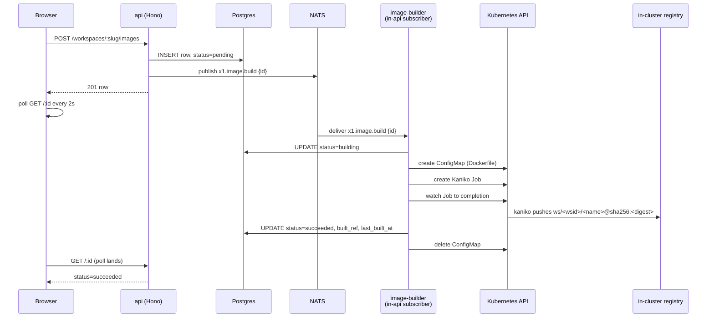

Every agent in a workspace runs in a container image. The platform ships five presets ([Runtime images](/architecture/runtime-images)) and that covers most cases. When a workspace needs language tooling or system packages the presets don't include, an admin writes a Dockerfile in the UI and the platform builds it into a pinned, digest-addressed image. This doc specifies how that works.

Companion docs:

- [Runtime images](/architecture/runtime-images) — the runtime-core base every workspace image `FROM`s.
- [In-cluster registry](/deployment/in-cluster-registry) — where built images live and how the registry is namespaced.
- [Domain layout](/architecture/domain-layout) — the bounded-context structure this feature follows.

## Boundary

| Concern | Platform | Workspace admin |
|---|---|---|
| Authors Dockerfile | Yes — `deploy/images/<preset>/Dockerfile` | Yes — UI textarea, persisted to `agent_images.dockerfile_source` |
| Builds image | At repo CI time, pushed to `x1agent/<name>` | At save time via Kaniko Job, pushed to `ws/<workspace_id>/<name>` |
| Versions image | Single-tag, latest wins | Single-tag, latest wins (v1 — see [Versioning](#versioning)) |
| Visible to | Every workspace | Only the owning workspace |
| Deletable from UI | No | Yes (with reference safety) |

The two tracks share one table — `agent_images`, with `is_preset` distinguishing them — but never mix at the API layer. Platform presets are read-only to workspace admins; workspace images are invisible to other workspaces.

## Schema

Single table. Latest build wins. No version history in v1 (see [Versioning](#versioning) for why).

```sql
agent_images (
  id              UUID PRIMARY KEY,
  workspace_id    UUID,                  -- NULL = platform preset
  name            TEXT NOT NULL,         -- e.g. 'preset-python', 'workspace-django'
  display_name    TEXT NOT NULL,
  description     TEXT,
  built_ref       TEXT NOT NULL,         -- registry/host/path@sha256:digest
  is_preset       BOOLEAN NOT NULL,
  dockerfile_source TEXT NOT NULL DEFAULT '',
  build_status    TEXT NOT NULL DEFAULT 'ready',
  build_log       TEXT NOT NULL DEFAULT '',
  last_built_at   TIMESTAMPTZ,
  created_at      TIMESTAMPTZ NOT NULL DEFAULT now(),
  updated_at      TIMESTAMPTZ NOT NULL DEFAULT now()
)

UNIQUE (name) WHERE workspace_id IS NULL          -- one preset of each name
UNIQUE (workspace_id, name) WHERE workspace_id IS NOT NULL  -- name unique per workspace
```

`agents.image_id` is a nullable FK into `agent_images`. NULL means "platform default" — the runtime-core preset.

### Build status state machine

```
            Workspace                Preset
            ─────────                 ──────
            pending                   ready  (set by seed at api boot)
              ↓
            building
              ↓
        ┌───┴────┐
   succeeded    failed
        ↑
   (rebuild loops back to pending)
```

`pending` and `building` are transient. `succeeded` and `failed` are terminal until the next save. `ready` is what presets sit at indefinitely; it exists to keep the dropdown filter simple — "show images with status in (`ready`, `succeeded`)".

### Versioning

v1 keeps one row per image. Editing the Dockerfile rebuilds in place; `built_ref` is updated to the new digest after a successful push. The previous digest is no longer addressable from the UI but the registry blob remains until garbage collection.

This is intentional. Version history (rollback, side-by-side comparison, frozen pinning) is real workspace-tier ergonomics that the runtime-core fork-and-extend pattern doesn't yet need. When someone hits the wall — wants to roll back without re-editing the Dockerfile — we add an `agent_image_versions` companion table and migrate. Until then, the simpler model ships.

## Domain bounded context

Following [Domain layout](/architecture/domain-layout):

```
packages/domains/image-catalog/
  src/
    domain/
      agent-image.ts                  # entity
      value-objects/
        image-name.ts                 # 1-63 chars, k8s label-safe
        dockerfile-source.ts          # validated against allowed-syntax whitelist
        image-status.ts               # the state-machine enum
        image-ref.ts                  # registry/path@sha256:digest
    application/
      image-catalog-service.ts          # methods: listImages, getImage,
                                        # createWorkspaceImage, updateDockerfile,
                                        # requestRebuild, deleteWorkspaceImage
    ports/
      agent-image-repository.ts
      build-queue.ts
      agent-image-usage-reader.ts       # cross-domain workspace check
    adapters/
      postgres/
        postgres-agent-image-repository.ts
      nats/
        nats-build-queue.ts
```

`packages/api/src/image-catalog/routes.ts` becomes a thin Hono shell that wires the application use cases. The current SQL-direct reads move into `postgres-agent-image-repository.ts`.

## API surface

All routes are workspace-scoped under `/workspaces/:slug/images`. Every handler resolves the workspace from the URL slug and the actor's membership ([workspace tenant isolation — a load-bearing rule from CLAUDE.md, principle 7]). Mutations operate only on rows where `workspace_id` matches.

| Method | Path | Purpose |
|---|---|---|
| GET | `/` | List presets ∪ workspace images. Already exists. |
| GET | `/:id` | Read a single image (with build_log for failed builds). |
| POST | `/` | Create a new workspace image. Body: `{ name, display_name, description?, dockerfile_source }`. Returns `201` with row at `build_status=pending`. Publishes build request. |
| PATCH | `/:id` | Update Dockerfile and/or display fields. If `dockerfile_source` changes, sets `build_status=pending` and publishes build request. |
| POST | `/:id/rebuild` | Force a rebuild from the existing Dockerfile. Useful after upstream base-image fix. |
| DELETE | `/:id` | Delete. Refuses with `409` if any agent has `image_id = :id`. |

Routes never accept `workspace_id` in the body — it comes from the URL. Routes never let a request operate on `is_preset = true` rows except via GET. Cross-tenant ids in any field are validated against the URL workspace before the use case runs.

## Build pipeline

The pipeline reuses the Kaniko machinery from `packages/providers/preview` and adds an inline-Dockerfile build mode.

### Trigger flow



The api never blocks on the build. It enqueues and returns. Builds take 20s–3min; HTTP can't carry that.

### image-builder

v1 ships the builder as a NATS subscriber inside the api process. The api already has Kubernetes RBAC for Jobs and ConfigMaps, a Postgres connection, and a NATS connection — putting the builder there avoided a new deployment, a new chart slot, and a new RBAC stanza. Phase 3 extracts it to its own deployment if api memory pressure becomes a real problem.

Subscribes to `x1.image.build` (queue group `image-builder` for at-least-once delivery with crash recovery). For each message:

1. Load the row. Refuse if `is_preset=true`.
2. Materialize the Dockerfile into a per-build ConfigMap in the build namespace (`x1agent-infra`, alongside the registry).
3. Create the Kaniko Job. Mount the ConfigMap at `/build-ctx/Dockerfile`. Args: `--context=dir:///build-ctx --dockerfile=/build-ctx/Dockerfile --destination=<registry>/ws/<wsid>/<name>:latest --insecure` (registry is HTTP in-cluster).
4. Watch the Job until terminal status (`waitForJob` from the shared kaniko helper).
5. On success: read the digest from the Kaniko log (Kaniko emits the pushed manifest digest), update the row with `built_ref=<registry>/ws/<wsid>/<name>@sha256:<digest>`, `build_status=succeeded`, `last_built_at=now()`. Delete the ConfigMap.
6. On failure: capture the last 4KB of pod logs, write to `build_log`, set `build_status=failed`. Delete the ConfigMap.

Idempotence: NATS delivers at-least-once. The use case guards with `UPDATE ... WHERE build_status='pending' RETURNING` — only one consumer wins, duplicates exit immediately.

Concurrency: one build per workspace at a time, enforced by the use case via a row-level advisory lock keyed on `workspace_id`. Cluster-wide cap is configured at the deployment (default: 4 concurrent Kaniko Jobs).

### Shared kaniko helper

The current `buildKanikoJob` in `packages/providers/preview/src/manifests.ts` is moved to `packages/infrastructure/kaniko/`. The build-context source becomes a discriminated union:

```ts
type BuildContext =
  | { kind: 'git'; url: string; ref: string;
      dockerfilePath: string; buildContext: string;
      accessToken: string }
  | { kind: 'inline'; dockerfileConfigMap: string };  // mounted at /build-ctx
```

`providers/preview` keeps using `git`. `image-catalog` uses `inline`. Both share the Job spec scaffolding, the security context, the wait-for-Job helper.

### Allowed Dockerfile syntax (v1)

Workspace Dockerfiles cannot upload local files — there's no build context to ship around. The validator (in `dockerfile-source.ts`) parses the source and rejects anything outside this whitelist:

| Allowed | Rejected |
|---|---|
| `FROM` | `COPY` (without `--from=`) |
| `RUN` | `ADD` |
| `ENV` | (any unknown directive) |
| `ARG` | |
| `WORKDIR` | |
| `COPY --from=<image>` | |
| `ENTRYPOINT`, `CMD` | |
| `LABEL` | |
| `USER` | |
| `EXPOSE` | |
| `VOLUME` | |
| `SHELL` | |

`COPY` from a local context is a Phase 3 follow-up — it requires shipping a build-context tarball, which is real work without a clear v1 use case. `ADD` stays banned (auto-extract behavior is a footgun).

### Tag scheme

`built_ref` is digest-pinned. The pod-spec generator uses `built_ref` verbatim — never `:latest`. This means:

- Pulling the image is reproducible. A pod that worked yesterday pulls the same bytes today.
- Rebuilds atomically swap `built_ref`. No window where a half-pushed image is referenced.
- The registry's `:latest` tag is overwritten on every rebuild; the stable identifier is the digest.

```
ws/<workspace_id>/<image_name>@sha256:<digest>
```

The Kaniko Job pushes both `:latest` and resolves the digest. Digest goes in `built_ref`.

## UI

`ContainerRegistryPanel.tsx` ([code](https://github.com/x1agent/x1agent/blob/main/packages/app/src/features/workspaces/ContainerRegistryPanel.tsx)) gains:

- An **Add image** button → opens a side drawer with `name`, `display_name`, `description`, `dockerfile_source` (textarea, `font-mono`).
- A **Status** column on the existing table. `pending` and `building` show a pill with a spinner; `failed` shows a red pill with a "View log" affordance; `succeeded` and `ready` show a neutral "ready" pill.
- Per-row actions on workspace rows: **Edit**, **Rebuild**, **Delete**. Edit reopens the drawer pre-filled. Rebuild fires `POST /:id/rebuild`. Delete confirms first; rejects with the agent list if any agent references the image.
- Polling: while any row is `pending` or `building`, the page polls `GET /` every 2 seconds. Stops polling when no rows are transient.

State management: a new `useImageCatalogStore` (zustand) following the established frontend-state pattern (normalized cache, async actions, selector referential stability — see CLAUDE.md "Frontend state management"). Selectors:

- `s.byWorkspaceSlug[slug] ?? []` — list, with referential stability so React doesn't tear on every render.
- Actions: `load`, `create`, `update`, `rebuild`, `delete`. Each hits `apiFetch` and writes the result back.

Real Monaco editor with Dockerfile syntax highlighting is Slice D polish, not v1.

### Agent edit dropdown

`AgentEditRoot.tsx` already pulls from the catalog endpoint. The change is filtering: only show rows where `build_status` is in (`ready`, `succeeded`). A workspace image at `pending`/`building`/`failed` is hidden from the dropdown so an agent can't be assigned to a non-ready image.

## Workspace tenant isolation

This feature is a [tenant-isolation — a load-bearing rule from CLAUDE.md, principle 7] path. The cross-tenant attack surface:

- A workspace admin in workspace A submits a `dockerfile_source` that builds in workspace A's namespace but somehow references workspace B's registry path. Mitigated: the destination is computed server-side from the URL workspace, not from the Dockerfile body.
- A user in workspace A asks to read or modify an image owned by workspace B. Mitigated: every API handler resolves the URL workspace, then verifies the row's `workspace_id` matches before any read or write. Rows with `is_preset=true` are read-only to everyone.
- A pod-spec for a session in workspace A pulls a workspace B image. Mitigated: agents have a single `image_id` FK; resolving it returns `built_ref` only if the image is a preset OR belongs to the agent's workspace.

Test pattern (in `packages/domains/image-catalog/src/application/`): every multi-id use case ships a regression test using two distinct workspaces. Cross-tenant calls return `ImageNotInWorkspaceError`.

## Slicing

Three PRs.

### Slice A — domain context, write API, create UI (no build pipeline)

Land the bounded context, expose write routes, ship the create/edit drawer. Created rows sit at `build_status=pending` indefinitely; the dropdown filter still works because they're not in `(ready, succeeded)`. This proves the data model and the UI without touching Kaniko.

Test gate: create a workspace image via UI, see it in the table at `pending`, see it absent from the agent dropdown, edit it, delete it.

### Slice B — Kaniko build pipeline

Extract the kaniko helper to `packages/infrastructure/kaniko/`. Add the `inline` build context. Stand up the `image-builder` deployment. Wire NATS subscription. Update build-status on Job completion.

Test gate: create a Dockerfile via UI; row transitions pending → building → succeeded; pulled image runs in a session pod.

### Slice C — agent dropdown filter, pod-spec digest resolution

Filter the dropdown to ready/succeeded. Pod-spec generator resolves `agents.image_id` → `agent_images.built_ref` (digest-pinned).

Test gate: an agent assigned a workspace-built image spawns a session pod that pulls the digest-pinned reference and runs.

### Slice D — polish (later)

Monaco editor, streaming build logs over NDJSON, build cache, retention policy. None of these block v1.
