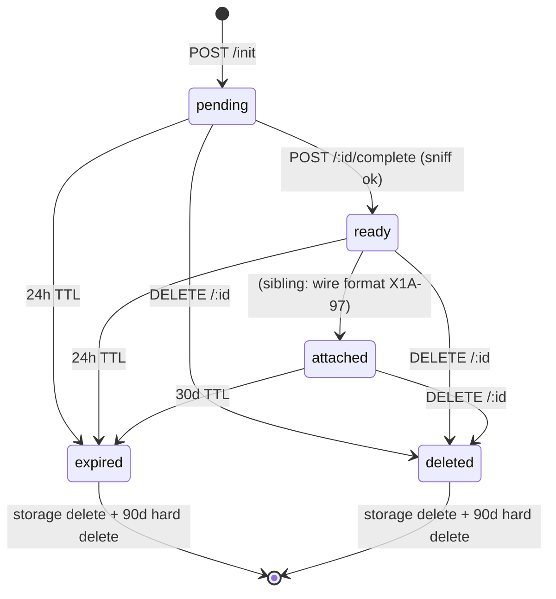

Users can drag-and-drop image files into the message composer. This page documents the **backend foundation** that accepts those bytes, stores them in block storage, exposes them by id, and reclaims them on a schedule. The wire format (`[image: <id>]` tokens in messages) and the sidecar's "sync into the agent container" path are sibling features documented elsewhere.

Companion tickets:

- [X1A-8](https://linear.app/x1agent/issue/X1A-8) — parent epic.
- X1A-96 — this page (storage adapter + API + cleanup + security).
- X1A-97 — wire format / parser.
- X1A-100 — Case A sidecar push.

## Boundary

| Concern | Owned by |
|---|---|
| Block storage, presigned URLs, MIME sniff, TTL state machine | `packages/domains/uploads` (this page) |
| `[image: <id>]` parsing + chat rendering | X1A-97 (separate package) |
| Pushing bytes into the agent container | X1A-100 (sidecar) |
| Workspace-wide sharing of uploads | Out of scope (v1 = creator-only) |
| Virus scanning, non-image MIMEs | Out of scope (v1) |

## Lifecycle

- **pending** — row created at `POST /api/uploads/init`. Bytes not yet uploaded. `expires_at = now() + UPLOAD_PENDING_TTL_HOURS` (default 24h).
- **ready** — `POST /api/uploads/:id/complete` verified the bytes + MIME-sniff. Still subject to the 24-hour unattached TTL.
- **attached** — the upload was attached to a message/session (sibling ticket). TTL rolls forward to `now() + UPLOAD_ATTACHED_TTL_DAYS` (default 30d).
- **expired** — cleanup sweep observed `expires_at < now()`. Storage object is deleted on the same sweep; row hard-deleted 90 days later.
- **deleted** — user soft-deleted via `DELETE /api/uploads/:id`. Storage object removed on the next cleanup tick.

## Storage adapter

`packages/domains/uploads/src/ports/upload-storage.ts` declares `UploadStorage`, the swappable contract. Adapters in v1:

| Adapter | Backend | When to use |
|---|---|---|
| `LocalDiskStorage` | Filesystem under `UPLOAD_STORAGE_PATH` | Dev + on-prem deploys without S3/GCS |
| `S3Storage` | AWS S3 (or any S3-compatible store, including minio) | Production |
| `GcsStorage` | _stub_ — throws on every method | Future (interface is shaped to drop in `@google-cloud/storage`) |

Every key is the time-bucketed `uploads/YYYY/MM/DD/<upload_id>.<ext>` (UTC) — the prefix is what makes the cleanup sweep cheap regardless of backend.

`LocalDiskStorage` issues HMAC-signed PUT URLs scoped to a single (key, content-type, content-length) tuple with a 15-minute TTL. The api process verifies the signature before writing bytes. `S3Storage` uses `@aws-sdk/s3-request-presigner` for the same shape; the SDK is loaded lazily at composition time so the `local` path doesn't pay the SDK boot cost.

## API surface

All endpoints are mounted at `/api/uploads`.

| Method | Path | Auth | Purpose |
|---|---|---|---|
| `POST` | `/init` | session cookie | Create pending row + issue upload URL |
| `PUT` | `/raw/:id` _(local backend)_ | HMAC token | Signed-URL ingress |
| `POST` | `/:id/complete` | session cookie | MIME-sniff + mark ready |
| `GET` | `/:id` | session cookie | Metadata |
| `GET` | `/:id/raw` | session cookie | Stream bytes (owner only) |
| `DELETE` | `/:id` | session cookie | Soft-delete |

## Security boundary

| Surface | Guardrail |
|---|---|
| `user_id` provenance | Always derived from the authenticated session — never read from the request body. |
| MIME authority | Server-side magic-byte sniff. Client `mime_hint` is advisory only and must match the sniff result. |
| Filename safety | Path separators, null bytes, control chars stripped server-side. Capped at 255. |
| Id smuggling | `:id` parameter parses through `UploadId()`, which rejects non-UUID values before any DB / storage hit. |
| ACL | Every authenticated route resolves the upload via `getOwnedUpload`, which 404s on cross-user hits (no existence leak). |
| Presigned URL scope | Bound to a single PUT, exact `Content-Type`, exact `Content-Length`. Tampering breaks the signature. |
| Bucket exposure | No public bucket access. All reads go through `/api/uploads/:id/raw` so the ACL is enforced. |
| Rate limit | 60 `init` per minute per user (configurable via `UPLOAD_RATE_INIT_PER_MIN`). |
| Size cap | 10 MB by default; configurable via `UPLOAD_MAX_BYTES`. |

## Configuration

| Env | Default | Purpose |
|---|---|---|
| `UPLOAD_STORAGE_BACKEND` | `local` | `local` \| `s3` |
| `UPLOAD_STORAGE_PATH` | `./data/uploads` | Filesystem root (local backend) |
| `UPLOAD_S3_BUCKET` | _(unset)_ | Required for s3 backend |
| `UPLOAD_S3_REGION` | `us-east-1` | s3 backend |
| `UPLOAD_MAX_BYTES` | `10485760` | 10 MB cap |
| `UPLOAD_ALLOWED_MIMES` | `image/png,image/jpeg,image/gif,image/webp` | Comma-separated allow list |
| `UPLOAD_PENDING_TTL_HOURS` | `24` | TTL for `pending`/`ready` |
| `UPLOAD_ATTACHED_TTL_DAYS` | `30` | TTL for `attached` |
| `UPLOAD_RATE_INIT_PER_MIN` | `60` | Per-user init rate limit |
| `UPLOADS_CLEANUP_INTERVAL_MS` | `3600000` | Cleanup sweep cadence (1h) |
| `UPLOADS_CLEANUP_DISABLED` | `false` | Operator escape hatch |

## What v1 deliberately doesn't ship

- **No virus scanning.** Bytes go straight to storage. Operators with stricter requirements can add a hook in the cleanup sweep later.
- **Images only.** PDF, video, etc. are deferred — the MIME sniff would need a richer table and the size cap would need to be per-MIME.
- **No workspace sharing.** Uploads are creator-only in v1; the ACL is a single `user_id` equality check.
