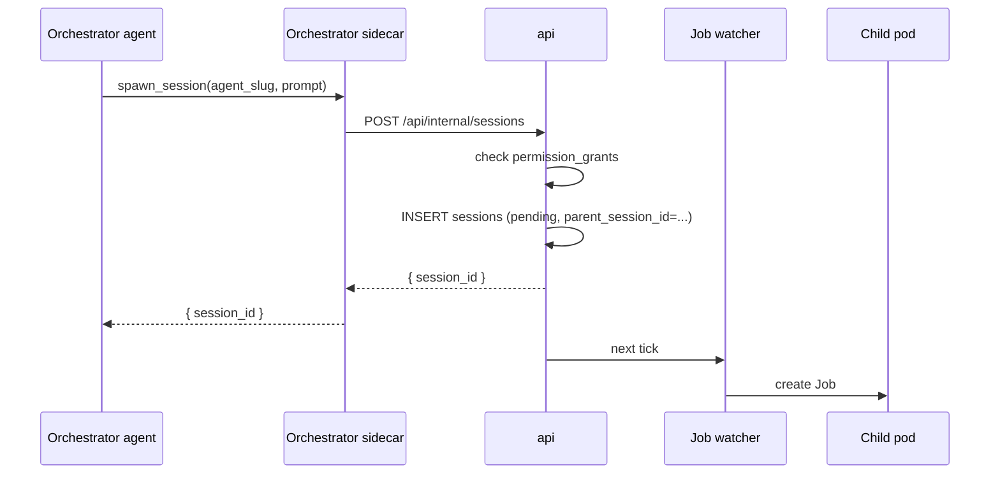

An orchestrator is an agent that runs other agents. It picks a task, spawns a worker session to do the work, reads the worker's output, injects follow-up messages when needed, and keeps a record of what it started and why. The platform treats an orchestrator as a long-lived session: it doesn't time out while its workers are busy, and it survives pod crashes.

This page describes the data model, the six tools an orchestrator calls, and the failure modes. Spawn permission is one kind of permission grant; the grant model itself lives in [Permission grants](../security/permission-grants). Session fundamentals live in [Sessions and the scheduler](./sessions); execution details (pod spec, sidecar) live in [Architecture Overview](./overview).

## Capability is per-agent, not a role

There is no binary orchestrator/worker distinction. Every agent starts as a worker. An agent becomes an orchestrator by holding one or more `spawn` grants — a row in `permission_grants` whose subject is the agent, whose `grant_type` is `spawn`, and whose `details` names a child agent:

```json
{
  "agent_subject_id": "<parent agent>",
  "grant_type": "spawn",
  "details": { "child_agent_id": "<child agent>" },
  "scope": "persistent" | "session"
}
```

An agent with zero active `spawn` grants is a pure worker. An agent with one or more is an orchestrator with respect to exactly the named children. Spawning anything else returns `agent_not_permitted`.

Persistent grants come from the agent edit screen. Session grants come from the runtime `request_grant` dialog. Both flow through the same `POST /api/workspaces/:slug/grants` endpoint, which is user-authenticated — no agent can grant itself anything.

### Edit screen

A "Can spawn" card on the agent edit page lists every other agent in the workspace with a checkbox. Toggling a box writes or revokes a `spawn` grant with `scope='persistent'`. The card sits below the repos card and above the schedule card.

Self-grant is rejected: the `details.child_agent_id` must not equal the `agent_subject_id`.

### Auto-injected system prompt

When an agent has at least one active `spawn` grant at session creation, the Job watcher appends a fixed block to the agent's system prompt. The agent doesn't have to be told to read the block; it's there on every session the orchestrator runs.

The exact text the orchestrator sees:

```
## Other agents you can spawn

You can start and supervise sessions of these agents:

- <agent-slug-1> — <agent-name-1>
- <agent-slug-2> — <agent-name-2>

If you need another agent not on this list, call request_grant with
grant_type='spawn' and the child_agent_id you want. The user will see
a dialog and can approve or deny.

Tools:
- spawn_session(agent_slug, prompt) → session_id. Starts a new session
  of an agent you're permitted to spawn.
- read_session(session_id, after_seq?) → { events, status, last_seq }.
  Pulls the child's event log. Pass after_seq to read only newer
  events.
- message_session(session_id, text). Sends text to a child as if it
  were a user message.
- cancel_session(session_id). Terminates a child you spawned. Must be
  followed by a `share` with a structured post-mortem in the same turn.

Control flow:
- You do not need to poll or block for child progress. The platform
  will re-wake you by injecting a `user.message` whenever a wake
  event fires (child reports, child finishes, child goes silent,
  scheduled tick). End your turn after each decision; do not loop.
- Wakes carry a `driverless: true` flag when no human is watching.
  In driverless mode, do not ask clarifying questions — if a
  decision genuinely needs a human, emit a `share` titled
  "Needs human review: <summary>" and end the turn.

Rules:
- Children run in this workspace. Cross-workspace spawning is not
  allowed.
- Do not spawn children in a loop. If you need many similar tasks,
  write them as one prompt to a single child.
- Children inherit this workspace's git installations. They can clone
  and push the same repos this agent can.
```

The Job watcher interpolates the bullet list from the current set of active persistent `spawn` grants at pod creation time. The list is snapshotted to the pod env — adding a new `spawn` grant while a session is running does not change what the agent sees until the session restarts. Session-scope grants approved during the run don't appear in the prompt either; the orchestrator discovers those by calling `spawn_session` and seeing it succeed. The "if you need another agent" line tells the agent to try anyway.

## Parent and child

Every session has an optional parent.

```sql
ALTER TABLE sessions
  ADD COLUMN parent_session_id UUID
    REFERENCES sessions(id) ON DELETE SET NULL,
  ADD COLUMN parent_tool_use_id TEXT;
```

- `parent_session_id` is `NULL` for top-level sessions.
- `parent_tool_use_id` records which specific tool call spawned the child, so a parent with several open children can route messages back to the right conversation turn.
- A child inherits the parent's workspace. Cross-workspace spawning is rejected at the api layer.
- Cycles are rejected at spawn time: a session cannot spawn an ancestor.

## Agent kind — the discriminator

Whether an agent is a worker or an orchestrator is an explicit property on the agent record, not inferred. The discriminator is `agents.kind`:

```sql
ALTER TABLE agents
  ADD COLUMN kind TEXT NOT NULL DEFAULT 'worker'
    CHECK (kind IN ('worker', 'orchestrator', 'scheduled'));
```

Three values, three pod-shape families. The enum is finite and binding — adding a fourth kind (say, `ingest` for long-lived no-spawn data pumps) is a schema change, deliberately.

| kind | Intended use |
|---|---|
| `worker` | Default. Short-lived per-task invocation. One session per triggering event. |
| `orchestrator` | Long-lived singleton that plans and commissions. One session per agent, resumed across pod restarts. |
| `scheduled` | Periodic invocation. Starts on a cron trigger, runs one pass of the agent's heartbeat, exits. Same pod shape as `worker`; differs only in how sessions are triggered (the scheduler, not a human). |

`kind` is orthogonal to [permission grants](../security/permission-grants) and to `runtime_type` (the SDK / runtime image — Claude Code, Codex, Gemini, etc.). An orchestrator agent can drive any supported runtime; permissions (spawn, git, etc.) are granted separately. The three are layered:

- `runtime_type` — which agent SDK runs inside the container
- `kind` — how the pod lives and dies
- `permission_grants` — what the agent is allowed to do

## One agent, one session (orchestrators only)

For a `worker`, the mapping is familiar: agent is a class, each session is an instance. Many sessions per agent, disposable.

For an `orchestrator`, the agent **is** the session. At most one non-terminal session exists per orchestrator agent, and every trigger — a user message, a child signal, a scheduled wake, a pod restart — routes to that same session. Starting a session for an orchestrator is "find or create": if a session with `status IN ('pending', 'running')` already exists, return that id. Don't create a second row.

```sql
-- Enforce the singleton at the database layer (simplest: application-level
-- "find or create" in the session-start use case, which already looks up
-- the agent to read its kind and can short-circuit for orchestrators).
```

Consequences the rest of the system is built around:

- **Restart means resume, not recreate.** When the orchestrator pod dies, `restartPolicy: OnFailure` brings it back. The new pod uses the same `SESSION_ID` (from the Job's labels) and calls `query({ resume: SESSION_ID, ... })`. The Claude Agent SDK rehydrates the transcript from the PVC. The session row's `status` stays `running` through the restart; pod failure is invisible at the session layer.
- **Triggers inject, not create.** A scheduled wake for an orchestrator doesn't create a session — it injects a user message (e.g. "heartbeat tick") into the existing session. A "Run" click on an orchestrator that already has a live session opens that session; it doesn't start a new one.
- **Terminal states are noteworthy.** A worker reaching `complete` is success. An orchestrator reaching `complete` or `failed` is a real end — deliberate shutdown, or an unrecoverable crash. The UI surfaces this clearly rather than burying it in a history list.
- **Children remain disparate.** An orchestrator spawns many children over its lifetime. Each child is a normal worker session with its own memory, bound to the orchestrator via `parent_session_id`. The tree has one permanent root and many transient branches.

## Orchestrator idle model

An orchestrator spends most of its wall-clock time idle, and **pausing is the right shape**. Each turn is one short reasoning cycle: receive an input, decide, act (commit, spawn, share), end the turn. Between turns the pod is alive (the transcript sits on the PVC, the sidecar holds its NATS subscription), but the agent process is parked waiting for the next user message. No polling, no blocking primitives, no tight loops that keep the container hot.

Three states worth naming:

1. **Active** — reasoning, calling tools, writing to its repo, responding to a message. Ends when the model produces a terminal text response.
2. **Attentive idle** — turn has ended cleanly; the orchestrator has active commissioned work in flight. Next input will arrive from the platform (child finished, watchdog fired, scheduled tick) or from a human.
3. **Quiescent** — no active children, no pending work. Nothing to do until the next scheduled tick, a user message, or some external event the platform watches for.

State 3 is most of the time. That shapes the pod's resource requests: an idle orchestrator holding 1GB + 0.5 CPU as the scheduler books is wasteful. The request/limit split matters — request is what gets booked by the K8s scheduler, limit is the ceiling when active.

### Why the control flow lives in the platform, not the agent

An earlier draft of this design proposed a `wait_for_child_signal` MCP tool that the orchestrator would call to block within a turn waiting for events. That pushes the control-flow responsibility onto the agent's reasoning — every orchestrator CLAUDE.md has to encode how to loop, how to thread watermarks, how to distinguish wake reasons. Small prompting mistakes strand the orchestrator. Tokens burn on polling that does no work. Human-in-the-loop moments become workarounds.

The revised model: **the orchestrator always ends its turn after each decision.** Whatever needs to happen next — wait for a child, act on a report, handle a tick, escalate to a human — is expressed as a `user.message` the platform injects into the session when the triggering event fires. The orchestrator's CLAUDE.md only has to describe *what to do when woken*, not *how to keep yourself woken*. Operators who aren't expert prompt authors can still land a working orchestrator.

## Server-driven wakes

The platform auto-injects a `user.message` into an orchestrator's session whenever an event arrives that warrants reasoning. Five wake kinds, all delivered as structured user messages the agent can parse the same way it reads a human typing:

| kind | Triggered by | Inserted payload shape |
|---|---|---|
| `message` | A child emits `agent.message_to_caller` (explicit signal from child to parent) | `{ kind: "message", from_session_id, from_agent_slug, body, needs_response }` |
| `state_change` | The platform observes a child's `sessions.status` transitioning to `complete` or `failed` | `{ kind: "state_change", from_session_id, from_agent_slug, new_status, completed_at, error_message? }` |
| `watchdog` | Server timer detects no events from a child for `activity_timeout_seconds` — possibly stuck | `{ kind: "watchdog", from_session_id, from_agent_slug, seconds_since_last_event, last_status_message? }` |
| `checkup` | Server timer fires on a cadence regardless of child activity — "just checking in" heartbeat | `{ kind: "checkup", snapshot: [{ session_id, slug, seconds_since_last_event, last_status }, …] }` |
| `heartbeat` | Scheduler fires for the orchestrator (per-agent cron) | `{ kind: "heartbeat", driverless: true, text: <agent.heartbeat_md content> }` |

Each wake is a complete, self-contained turn boundary. The orchestrator reads the payload, decides, acts, and ends its turn — possibly without any tool calls if nothing warrants action. The wake payload carries everything the agent needs; no out-of-band state, no remembered watermarks.

### The publisher mechanics

All wakes flow through the same internal path: `POST /api/internal/sessions/:id/messages` with a `source: "platform"` tag and the structured payload. The api publishes to `x1.session.<parent_id>.input`; the parent's sidecar picks it up and injects it as a `user.message` event, identical in shape to messages typed by a human in the UI — just marked with a source flag the UI can render as a platform-originated wake rather than a human prompt.

Four small server-side watchers produce these:

1. **Session status watcher.** Listens on `x1.session.*.events` for `session.completed` / `session.failed`. Looks up the session's `parent_session_id`. If set, emits a `state_change` wake to the parent.
2. **Activity watchdog.** Periodic sweep (say every 60s) of running sessions whose `parent_session_id` is not null. If `NOW() - last_event_at > activity_timeout_seconds`, emits a `watchdog` wake to the parent. Uses exponential backoff per child to avoid spam (5 / 10 / 20 / 40 / 60 min cap; resets on any real event).
3. **Checkup timer.** Per-orchestrator setting; fires on cadence even when no child is silent. Emits a `checkup` wake with a lightweight snapshot of all active children.
4. **Scheduler integration.** When cron fires for an orchestrator agent, the scheduler checks for a live session. If one exists, it injects a `heartbeat` wake rather than creating a second session (which would fail the DB singleton trigger). If no live session exists, it creates one with the heartbeat content as the first message.

### Driverless mode (heartbeats and platform wakes)

Every server-injected wake carries a `driverless: true` flag. That tells the orchestrator "no human is watching this turn in real time — don't ask clarifying questions." If the orchestrator genuinely needs a human decision, it emits a `share` titled `Needs human review: <summary>` with the tradeoffs and ends the turn; the UI surfaces unresolved human-review shares so an operator can respond when they next check in.

Human-typed messages in the UI land in the session as ordinary `user.message` events without the `driverless` flag — the orchestrator knows a person is present and can be more conversational.

### Pause is a first-class state

Because the orchestrator always ends its turn after acting, pausing is not an error or an anomaly. If the orchestrator reviews its state and concludes there's no work that can progress without human input, it emits a `share` (or just an `agent.status` with `status: "quiescent"`) and ends. The next wake — scheduled or human — resumes it. No tokens burned in the meantime.

This is what makes the platform habitable for users who aren't expert prompt authors. They don't have to write a bulletproof polling loop into their CLAUDE.md. They write "here's what to do when you're woken for X," and the platform takes care of the *when*.

## Pod-shape by kind

The Job watcher reads `agents.kind` when building the session Job:

| Property                     | `worker`                  | `orchestrator`                      | `scheduled`               |
|------------------------------|---------------------------|--------------------------------------|---------------------------|
| `activeDeadlineSeconds`      | 3600                      | **unset** (no hard deadline)         | 3600                      |
| `restartPolicy`              | `Never`                   | `OnFailure`                          | `Never`                   |
| `backoffLimit`               | 0                         | 6                                    | 0                         |
| Idle timeout                 | 15 min default → exit     | 7 days → exit (effectively "never"; see below) | tight (next cron wake)    |
| Resources (requests)         | cpu 500m, mem 1Gi         | cpu 50m, mem 512Mi                   | cpu 500m, mem 1Gi         |
| Resources (limits)           | cpu 1, mem 2Gi            | cpu 1, mem 2Gi                       | cpu 1, mem 2Gi            |
| Workspace volume             | `emptyDir`                | per-session `PersistentVolumeClaim`  | `emptyDir`                |
| Session model                | one per trigger           | one singleton, resumed               | one per cron tick         |
| Extra MCP tools exposed      | none                      | spawn / read / message / cancel / report | none                      |
| System prompt addition       | none                      | "Other agents you can spawn" block   | none                      |
| Wake mechanism               | n/a (one-shot)            | Server-injected `user.message` per wake kind (see § Server-driven wakes) | scheduler creates a fresh session per tick |

The orchestrator's 7-day idle cap is a safety net, not a working duration. Real usage looks like "end turn, wait for next server-injected wake, process it." Between wakes the Claude Code process is parked but alive, spending zero tokens. The cap only fires if the orchestrator is genuinely abandoned — in which case the session ends cleanly (exit 0) and a future scheduler tick or human action starts a fresh one via the singleton find-or-create path.

All kinds share the same agent container image and the same wire event schema. The difference is the lifetime contract, the pod's resource footprint, and which tools the agent sees.

## Five operations

Everything an orchestrator-flavored action reduces to five MCP tool calls. The sidecar translates each call into a platform action. These are what the orchestrator *does*; the [server-driven wakes](#server-driven-wakes) are what arrives *to* the orchestrator between calls.

### 1. Spawn a child

```
spawn_session({
  agent_slug: "code-writer",
  prompt: "Refactor the checkout module to extract the validation logic",
  request_id: "t_042"
})
```

The sidecar POSTs:

```
POST /api/internal/sessions
{
  "workspace_slug": "...",
  "agent_slug": "code-writer",
  "parent_session_id": "...",
  "parent_tool_use_id": "t_042",
  "triggered_by": "orchestrator",
  "initial_prompt": "Refactor the checkout module..."
}
```

The api looks up the parent agent's active `spawn` grants and checks that one names the requested child agent (either as `scope='persistent'` or as `scope='session'` with the current session id). If not, the call returns `agent_not_permitted`. Otherwise it creates a pending session and the Job watcher picks it up on the next tick.



### 2. Read a child's events

```
read_session({
  session_id: "019d...",
  after_seq: 42       // optional cursor
})
```

Returns:

```
{
  status: "pending" | "running" | "complete" | "failed",
  last_seq: 57,
  events: [
    { seq, type, payload, timestamp }, ...
  ]
}
```

The sidecar handles the call by querying the api's internal endpoint `GET /api/internal/sessions/:id/events?after_seq=N`. Events come back oldest-first, up to a server-side cap of 1000 per call. The orchestrator uses `last_seq` as the next `after_seq` cursor.

`read_session` is the pull-based inspection path. It complements `report_to_parent` (below), which is push-based: workers voluntarily send messages when they need attention. An orchestrator can read at any time without the child having to do anything special.

Permission: the parent can read any session in its own workspace whose `parent_session_id` is the caller's session id — nothing else. No reading of other orchestrators' children.

### 3. Report to parent (called by the child)

The child agent calls:

```
report_to_parent({
  text: "I found three call sites that use the old validator. Should I update all of them?",
  options: ["yes, update all", "list them first"]
})
```

The child sidecar publishes to `x1.session.{parent_session_id}.input` with the caller tagged:

```json
{
  "text": "I found three call sites...",
  "from_session_id": "019d...",
  "from_agent_slug": "code-writer",
  "request_id": "parent_tool_use_id_from_spawn",
  "options": ["yes, update all", "list them first"]
}
```

The parent sidecar injects the message into its agent. The orchestrator sees it as a user message; the UI renders it with a chip showing the child agent's name and a link to the child session. The `request_id` matches the `parent_tool_use_id` from the spawn, so the SDK routes the answer to the right tool call when the orchestrator responds.

`report_to_parent` is always enabled for a child that has a parent — it doesn't need a grant.

### 4. Message a child

```
message_session({
  session_id: "019d...",
  text: "Yes, update all three. Commit after each file so we can review."
})
```

The sidecar POSTs to the api's internal endpoint, which publishes to `x1.session.{child_id}.input`. The child treats the orchestrator's message exactly like a human operator's.

Permission check is the same as `read_session`: the target session must have `parent_session_id = orchestrator's session id`.

### 5. Cancel a child

```
cancel_session({ session_id: "019d..." })
```

Flips the child's session row to `failed` and terminates its pod. The orchestrator can call this on any child it spawned. The platform does not auto-cancel children when the parent completes — orphaned children run until they finish or the reaper catches them. An orchestrator that invokes `cancel_session` should follow it in the same turn with a structured post-mortem `share` — see [post-mortem convention](#post-mortem-convention).

### Why no `await_children` or `wait_for_child_signal`

Both were proposed in earlier drafts as blocking primitives the orchestrator could call to wait for events within a turn. They're intentionally absent: waiting is the platform's job, not the agent's. The orchestrator ends its turn after acting; the [server-driven wake](#server-driven-wakes) path reawakens it when something meaningful happens. This keeps the orchestrator's prompt simpler and removes a class of bugs where the blocking tool holds a turn open for hours while consuming reasoning budget.

## Post-mortem convention

When an orchestrator calls `cancel_session`, the next action in the same turn must be a `share` with a structured post-mortem. The share's title starts `Post-mortem: ` followed by the child session's slug or a short summary; the body uses these sections in order:

- **Root cause** — one sentence
- **What happened** — 2–4 sentences, narrative
- **Evidence** — seq numbers from the child's event stream, or excerpts from `read_session`
- **Lessons** — what to change in the next attempt's brief
- **Next steps** — respawn with narrower scope / defer / block on human input

The `share` is a first-class artifact already persisted in the workspace's Shares page (via `agent.share` events). No new table, no new MCP primitive. Discipline is enforced in the orchestrator's CLAUDE.md, not in code — but the convention is strict enough that future shared tooling (summaries, dashboards) can query for post-mortems by title prefix.

## Resume after crash

Orchestrators pin their SDK session id to the platform session id. On pod restart, the agent container reads `SESSION_ID` from env, passes it to `query({ resume: SESSION_ID, ... })`, and the Claude Agent SDK rehydrates the conversation from the transcript on the pod's persistent volume.

Orchestrator pods use per-session PVCs:

```yaml
volumes:
  - name: workspace
    persistentVolumeClaim:
      claimName: x1-session-{sessionId}
```

The PVC is created by the Job watcher when the agent has any active persistent `spawn` grant. The `restartPolicy: OnFailure` + `backoffLimit: 6` combination lets the pod come back on node failure without the watcher noticing.

Worker pods do not use PVCs. They're short-lived; a crashed worker is a failed session, not a restart.

## What's persisted

| Kind                         | Location                                          |
|------------------------------|---------------------------------------------------|
| "Agent X can spawn Y"        | `permission_grants` (grant_type='spawn')         |
| "I spawned X"                | `sessions.parent_session_id` on the child        |
| "X told me Y"                | `session_events` on the parent (user message with `from_session_id`) |
| "I told X Y"                 | `session_events` on X (user message)             |
| "X finished"                 | `session_events.type = 'session.completed'` on X |
| "My conversation so far"     | Claude Agent SDK transcript on the PVC            |

No separate "orchestration log" table. Recovery on restart: re-enumerate children of this session id via `SELECT * FROM sessions WHERE parent_session_id = ?`, resume the SDK transcript, carry on.

## UI rendering

A session detail page shows:

- Its own events in the main stream.
- A **Children** panel listing direct child sessions with status pills, linking to each child's detail page.
- In the event stream, `user.message` events whose payload carries `from_session_id` render with a child-session chip (agent name, short session id, clickable). They still sort by `seq` with everything else.

The child session detail page has a breadcrumb back to its parent. No nested stream rendering — the parent's page is the index, the child's page is the full log.

## Failure modes

**Orchestrator pod dies mid-spawn.** The child's `sessions` row either doesn't exist yet (transaction rolled back) or exists with `status='pending'` and no pod. The resumed orchestrator re-enumerates children; the Job watcher picks up the pending row and starts a pod. Idempotency on `parent_tool_use_id` prevents duplicate spawns — the api rejects a second spawn with the same `(parent_session_id, parent_tool_use_id)`.

**Child sidecar dies while running.** The parent stops receiving `report_to_parent` messages. A reaper in the api flips children whose pod has been gone more than N minutes to `status='failed'` and emits a synthetic `session.failed` event — which the session-status watcher picks up and turns into a `state_change` wake for the parent. The parent gets the same wake it would have gotten from a clean exit; from its perspective, the child finished.

**Orchestrator dies with children still running.** Children keep running; their events keep flowing to NATS and landing in `session_events`. When the orchestrator's pod restarts via `restartPolicy: OnFailure`, it resumes the SDK transcript from the PVC. Any wake events that fired while it was down were buffered as `user.message` rows in `session_events`; the resumed agent processes them in order on its next turn.

**Infinite spawn loop.** Depth is capped at one for now: `spawn_session` rejects calls from any session whose `parent_session_id` is non-null. Deep nesting is out of scope until we have a use case.

**Cross-workspace spawn.** Rejected at the api layer. `spawn_session` returns `workspace_mismatch` if the requested agent's workspace doesn't match the orchestrator's.

**Grant revoked mid-session.** The allowlist is snapshotted into pod env when the Job is created. Revoking a `spawn` grant while a session is running does not retroactively disallow spawns already enumerated in the agent's system prompt. It does gate future `spawn_session` calls at the api — the next spawn returns `agent_not_permitted` even if the agent's prompt still lists the now-removed child. The agent may be confused. Documented, not fixed.

**Dangling grant references.** If the child agent named in a `spawn` grant's `details` is deleted, the `agent_subject_id` or `child_agent_id` foreign key (depending on which is referenced in the details schema — `child_agent_id` is not an FK because it lives inside jsonb) will not cascade. A daily sweep in the permissions domain flips those to `revoked_at`.

## Out of scope

Intentional non-goals:

- **Multi-level nesting.** Orchestrators cannot spawn orchestrators. Two levels only.
- **Cross-workspace orchestration.** A worker spawned by an orchestrator lives in the same workspace.
- **Broadcast messaging.** No "message all children" primitive. Orchestrators loop over session ids.
- **Automatic child cancellation on parent completion.** The orchestrator explicitly calls `cancel_session` if it wants children stopped.

## Permission model

Orchestrators run with the same identity as the user who started them. Spawning a child uses the same `installation_id` resolution as any other session — the child's pod gets git credentials via the same sidecar → api → GitHub App path. There is no separate "orchestrator service account."
