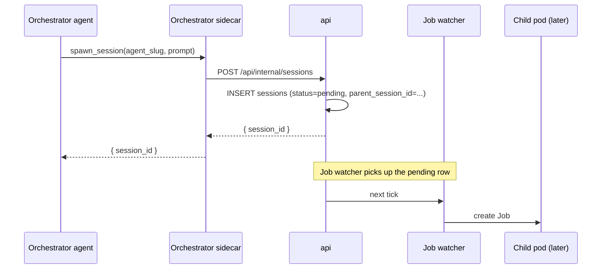

An orchestrator is an agent whose job is to run other agents. It picks a task, spawns a worker session to do the work, watches the worker's output, injects follow-up messages when needed, and keeps a record of what it started and why. The platform treats an orchestrator as a long-lived session: it doesn't time out while its workers are busy, and it survives pod crashes.

This page describes the data model, the tools an orchestrator calls, and the failure modes. Execution details (pod spec, sidecar) live in [Architecture Overview](./overview); session fundamentals live in [Sessions and the scheduler](./sessions).

## Parent and child

Every session has an optional parent. The parent is another session — the one whose agent called a spawn tool to create this session.

```sql
ALTER TABLE sessions
  ADD COLUMN parent_session_id UUID
    REFERENCES sessions(id) ON DELETE SET NULL,
  ADD COLUMN parent_tool_use_id TEXT;
```

- `parent_session_id` is `NULL` for top-level sessions.
- `parent_tool_use_id` records which specific tool call spawned the child, so a parent with several open children can route messages back to the right conversation turn.
- A child inherits the parent's workspace. Cross-workspace spawning is out of scope.
- Cycles are rejected at spawn time: a session cannot spawn an ancestor.

## Roles

A new column on `agents` captures intent:

```sql
ALTER TABLE agents
  ADD COLUMN role TEXT NOT NULL DEFAULT 'worker'
  CHECK (role IN ('worker', 'orchestrator'));
```

The role changes how the Job watcher provisions the pod:

| Property                     | Worker             | Orchestrator            |
|------------------------------|--------------------|--------------------------|
| `activeDeadlineSeconds`      | 3600               | unset (no hard deadline) |
| `restartPolicy`              | `Never`            | `OnFailure`              |
| `backoffLimit`               | 0                  | 6                        |
| Idle timeout                 | 15 min default     | paused when children are active |
| Spawn tools exposed          | no                 | yes                      |

Both roles share the same agent container image and the same wire event schema. The difference is the lifetime contract and which MCP tools the agent sees.

## Five operations

Everything an orchestrator does reduces to five operations. Each one is a single MCP tool call; the sidecar translates the call into a platform action.

### 1. Spawn a child

The orchestrator calls `x1agent.spawn_session`:

```
spawn_session({
  agent_slug: "code-writer",
  prompt: "Refactor the checkout module to extract the validation logic",
  request_id: "t_042"
})
```

The sidecar POSTs to the api's internal endpoint:

```
POST /api/internal/sessions
{
  "workspace_slug": "...",
  "agent_slug": "code-writer",
  "parent_session_id": "...",
  "parent_tool_use_id": "t_042",
  "triggered_by": "orchestrator",
  "initial_prompt": "Refactor the checkout module..."
}
```

The api creates a new `sessions` row with `status='pending'` and `parent_session_id` set. The Job watcher picks it up on the next tick. The tool call returns the child's `session_id` — that's the handle the orchestrator uses for the next four operations.



### 2. Child reports to parent

The child agent calls `x1agent.report_to_parent`:

```
report_to_parent({
  text: "I found three call sites that use the old validator. Should I update all of them?",
  suggested_response_options: ["yes, update all", "list them first"]
})
```

The child sidecar publishes to `x1.session.{parent_session_id}.input` with a payload tagged `from_session_id`:

```json
{
  "text": "I found three call sites...",
  "from_session_id": "019d...",
  "from_agent_slug": "code-writer",
  "request_id": "parent_tool_use_id_from_spawn",
  "options": ["yes, update all", "list them first"]
}
```

The parent sidecar injects the message into its agent. The orchestrator sees it as a user message; the UI renders it like a user bubble but with a chip showing the child agent's name and a link to the child session. The `request_id` matches the `parent_tool_use_id` from the spawn so the SDK routes the answer to the right tool call when the orchestrator responds.

### 3. Parent messages child

The orchestrator calls `x1agent.message_session`:

```
message_session({
  session_id: "019d...",
  text: "Yes, update all three. Commit after each file so we can review."
})
```

The sidecar POSTs to the api's internal endpoint, which publishes to `x1.session.{child_id}.input`. The child agent sees it as a user message. No special routing — the child treats the orchestrator exactly like a human operator.

### 4. Keep-alive while children run

A session's idle timer is paused whenever it has at least one non-terminal child. The pause is enforced in the sidecar:

- Every event flowing through `x1.session.{child_id}.events` that belongs to a child of this session calls `/keepalive` on the parent agent.
- `session.completed` and `session.failed` from a child decrement an internal active-children counter. When it reaches zero, the idle timer resumes.

If the orchestrator wants to block explicitly instead of polling, it calls `x1agent.await_children({ session_ids: [...] })`. The tool returns only when every listed child has reached a terminal status. The sidecar implements this by subscribing to the children's event subjects and resolving the tool call on the first terminal event per child.

### 5. Resume after crash

Orchestrators pin their SDK `session_id` to the platform session id. On pod restart, the agent container reads `SESSION_ID` from env, passes it to `query({ resume: SESSION_ID, ... })`, and the Claude Agent SDK rehydrates the conversation from the SDK's own transcript on the pod's persistent volume.

For the pod to have a persistent volume, orchestrator session pods switch from `emptyDir` to a per-session `PersistentVolumeClaim`:

```yaml
volumes:
  - name: workspace
    persistentVolumeClaim:
      claimName: x1-session-{sessionId}
```

The PVC is created by the Job watcher when `role='orchestrator'`. The `restartPolicy: OnFailure` + `backoffLimit: 6` combination lets the pod come back on node failure without the watcher noticing.

Worker pods do not use PVCs. They're short-lived; a crashed worker is a failed session, not a restart.

## What's persisted

Every orchestration signal lives in one of two places:

| Kind                         | Location                                          |
|------------------------------|---------------------------------------------------|
| "I spawned X"                | `sessions.parent_session_id` on the child        |
| "X told me Y"                | `session_events` on the parent (as a user message) |
| "I told X Y"                 | `session_events` on X (as a user message)         |
| "X finished"                 | `session_events.type = 'session.completed'` on X  |
| "My conversation so far"     | Claude Agent SDK transcript on the PVC            |

The api has no separate "orchestration log" table. Everything an orchestrator knows is recoverable from `sessions` plus `session_events` plus the SDK transcript. Recovery on restart is: re-enumerate pending/running children of this session id, resume the SDK transcript, carry on.

## UI rendering

A session detail page shows:

- Its own events in the main stream.
- A **Children** panel listing direct child sessions with status pills and links to their detail pages.
- In the event stream, `user.message` events whose payload carries `from_session_id` render with a child-session chip (agent name, short session id, clickable). They still sort by `seq` with everything else.

The child session detail page has a breadcrumb back to its parent. No nested stream rendering — the parent's page is the index, the child's page is the full log.

## Failure modes

**Orchestrator pod dies mid-spawn.** The child's `sessions` row either doesn't exist yet (transaction rolled back) or exists with `status='pending'` and no pod. The resumed orchestrator re-enumerates children; the Job watcher picks up the pending row and starts a pod. Idempotency on `parent_tool_use_id` prevents duplicate spawns — the api rejects a second spawn with the same `(parent_session_id, parent_tool_use_id)`.

**Child sidecar dies while running.** The parent stops receiving events. The active-children counter doesn't decrement. The parent's idle timer stays paused indefinitely. A reaper job in the api flips children whose pod has been gone more than N minutes to `status='failed'` and emits a synthetic `session.failed` event, which decrements the parent's counter through the normal path.

**Orchestrator dies with children still running.** Children keep running; their events keep flowing to NATS and landing in `session_events`. When the orchestrator resumes, it catches up on child events and sees any terminal ones as already-completed `await_children` returns.

**Infinite spawn loop.** An orchestrator that spawns children that spawn grandchildren. Depth is capped at 1 for now: `spawn_session` rejects calls from any session whose `parent_session_id` is non-null. Deep nesting is deliberately out of scope until we have a use case that needs it.

**Cross-workspace spawn.** Rejected at the api layer. `spawn_session` returns `workspace_mismatch` if the requested agent's workspace doesn't match the orchestrator's.

## Out of scope

These are design decisions taken intentionally and documented here so they aren't re-opened casually:

- **Multi-level nesting.** Orchestrators cannot spawn orchestrators. Two levels (orchestrator → worker) only.
- **Cross-workspace orchestration.** A worker spawned by an orchestrator lives in the same workspace.
- **Broadcast messaging.** There is no "message all children" primitive. Orchestrators loop over session ids.
- **Child cancellation from the parent.** The cancellation path still flows through `POST /sessions/:id/cancel` on the HTTP surface. The orchestrator can call `cancel_session`; the platform does not auto-cancel children when the parent completes. Orphaned children run until they finish or the reaper catches them.

## Permission model

Orchestrators run with the same identity as the user who started them. Spawning a child uses the same `installation_id` resolution as any other session — the child's pod gets git credentials via the same sidecar → api → GitHub App path. There is no separate "orchestrator service account."
