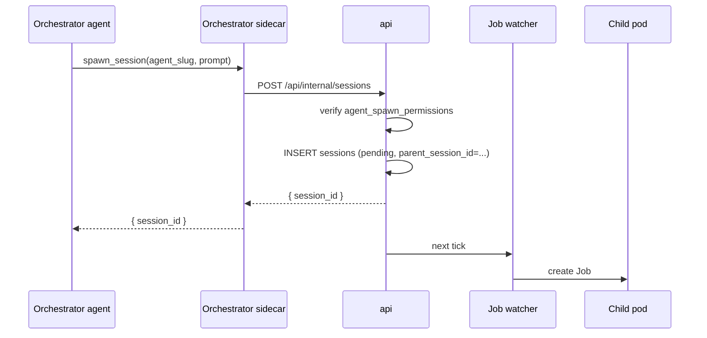

An orchestrator is an agent that runs other agents. It picks a task, spawns a worker session to do the work, reads the worker's output, injects follow-up messages when needed, and keeps a record of what it started and why. The platform treats an orchestrator as a long-lived session: it doesn't time out while its workers are busy, and it survives pod crashes.

This page describes the data model, the six tools an orchestrator calls, how the capability is configured per agent, and the failure modes. Execution details (pod spec, sidecar) live in [Architecture Overview](./overview); session fundamentals live in [Sessions and the scheduler](./sessions).

## Capability is per-agent, not a role

There is no binary orchestrator/worker distinction. Every agent starts as a worker. An agent becomes an orchestrator by being granted permission to spawn one or more specific other agents — always referenced by slug, always within the same workspace.

The permission lives in a join table:

```sql
CREATE TABLE agent_spawn_permissions (
  parent_agent_id UUID NOT NULL REFERENCES agents(id) ON DELETE CASCADE,
  child_agent_id  UUID NOT NULL REFERENCES agents(id) ON DELETE CASCADE,
  created_at TIMESTAMPTZ NOT NULL DEFAULT now(),
  PRIMARY KEY (parent_agent_id, child_agent_id),
  CHECK (parent_agent_id <> child_agent_id)
);
```

An agent with zero rows in this table is a pure worker. An agent with one or more rows is an orchestrator with respect to exactly those child agents; spawning anything else returns `agent_not_permitted`.

### Edit screen

A "Can spawn" card on the agent edit page lists every other agent in the workspace with a checkbox. Selected agents are written to `agent_spawn_permissions`; unchecked ones are removed. The card sits below the repos card and above the schedule card.

An agent granting itself permission to spawn itself is rejected by the DB-layer CHECK constraint.

### Auto-injected system prompt

When an agent has at least one row in `agent_spawn_permissions`, the Job watcher appends a fixed block to the agent's system prompt. The agent doesn't have to be told to read the block; it's there on every session the orchestrator runs.

The exact text the orchestrator sees:

```
## Other agents you can spawn

You can start and supervise sessions of these agents:

- <agent-slug-1> — <agent-name-1>
- <agent-slug-2> — <agent-name-2>

Tools:
- spawn_session(agent_slug, prompt) → session_id. Starts a new session
  of one of the agents listed above. Returns immediately; the child
  pod boots in the background.
- read_session(session_id, after_seq?) → { events, status, last_seq }.
  Pulls the child session's event log. Pass after_seq to read only
  events newer than a cursor.
- message_session(session_id, text). Sends text to a child as if it
  were a user message. The child receives it the same way a human
  operator would.
- await_children(session_ids) → { <session_id>: { status, result } }.
  Blocks until every listed child has reached `complete` or `failed`.

Rules:
- Only the agents listed above can be spawned. Anything else returns
  `agent_not_permitted`.
- Children run in this workspace. Cross-workspace spawning is not
  allowed.
- Do not spawn children in a loop. If you need many similar tasks,
  write them as one prompt to a single child.
- Children inherit this workspace's git installations. They can clone
  and push the same repos this agent can.
```

The Job watcher interpolates the bullet list from the permissions table at pod creation time. The list is snapshotted to the pod env — adding or removing permissions while a session is running does not change what the agent sees until the session restarts.

## Parent and child

Every session has an optional parent. The parent is another session — the one whose agent called `spawn_session` to create this one.

```sql
ALTER TABLE sessions
  ADD COLUMN parent_session_id UUID
    REFERENCES sessions(id) ON DELETE SET NULL,
  ADD COLUMN parent_tool_use_id TEXT;
```

- `parent_session_id` is `NULL` for top-level sessions.
- `parent_tool_use_id` records which specific tool call spawned the child, so a parent with several open children can route messages back to the right conversation turn.
- A child inherits the parent's workspace. Cross-workspace spawning is rejected at the api layer.
- Cycles are rejected at spawn time: a session cannot spawn an ancestor.

## Runtime differences for orchestrator sessions

The Job watcher checks whether the session's agent has any `agent_spawn_permissions` rows. If yes, the pod spec changes:

| Property                     | Worker             | Orchestrator            |
|------------------------------|--------------------|--------------------------|
| `activeDeadlineSeconds`      | 3600               | unset (no hard deadline) |
| `restartPolicy`              | `Never`            | `OnFailure`              |
| `backoffLimit`               | 0                  | 6                        |
| Idle timeout                 | 15 min default     | paused while children are active |
| Workspace volume             | `emptyDir`         | per-session `PersistentVolumeClaim` |
| Extra MCP tools exposed      | none               | spawn / read / message / await |
| System prompt addition       | none               | "Other agents you can spawn" block |

Both shapes share the same agent container image and the same wire event schema. The difference is the lifetime contract and which tools the agent sees.

## Six operations

Everything an orchestrator does reduces to six operations. Each is a single MCP tool call; the sidecar translates the call into a platform action.

### 1. Spawn a child

```
spawn_session({
  agent_slug: "code-writer",
  prompt: "Refactor the checkout module to extract the validation logic",
  request_id: "t_042"
})
```

The sidecar POSTs:

```
POST /api/internal/sessions
{
  "workspace_slug": "...",
  "agent_slug": "code-writer",
  "parent_session_id": "...",
  "parent_tool_use_id": "t_042",
  "triggered_by": "orchestrator",
  "initial_prompt": "Refactor the checkout module..."
}
```

The api checks `agent_spawn_permissions` — if the parent agent has no row for the requested child agent, the call returns `agent_not_permitted`. Otherwise it creates a pending session and the Job watcher picks it up on the next tick.



### 2. Read a child's events

```
read_session({
  session_id: "019d...",
  after_seq: 42        // optional cursor
})
```

Returns:

```
{
  status: "pending" | "running" | "complete" | "failed",
  last_seq: 57,
  events: [
    { seq, type, payload, timestamp }, ...
  ]
}
```

The sidecar handles the call by querying the api's internal endpoint `GET /api/internal/sessions/:id/events?after_seq=N`. Events are returned oldest-first, up to a server-side cap of 1000 per call. The orchestrator uses `last_seq` as the next `after_seq` cursor.

`read_session` is the pull-based inspection path. It complements `report_to_parent` (below), which is push-based: workers voluntarily send messages when they need the orchestrator's attention. An orchestrator can read at any time without the child having to do anything special.

Permission: the parent can read any session in its own workspace whose `parent_session_id` is the caller's session id — nothing else. No reading of other orchestrators' children.

### 3. Report to parent (called by the child)

The child agent calls:

```
report_to_parent({
  text: "I found three call sites that use the old validator. Should I update all of them?",
  options: ["yes, update all", "list them first"]
})
```

The child sidecar publishes to `x1.session.{parent_session_id}.input` with the caller tagged:

```json
{
  "text": "I found three call sites...",
  "from_session_id": "019d...",
  "from_agent_slug": "code-writer",
  "request_id": "parent_tool_use_id_from_spawn",
  "options": ["yes, update all", "list them first"]
}
```

The parent sidecar injects the message into its agent. The orchestrator sees it as a user message; the UI renders it with a chip showing the child agent's name and a link to the child session. The `request_id` matches the `parent_tool_use_id` from the spawn, so the SDK routes the answer to the right tool call when the orchestrator responds.

`report_to_parent` is always enabled for a child that has a parent — it doesn't need a capability row.

### 4. Message a child

```
message_session({
  session_id: "019d...",
  text: "Yes, update all three. Commit after each file so we can review."
})
```

The sidecar POSTs to the api's internal endpoint, which publishes to `x1.session.{child_id}.input`. The child treats the orchestrator's message exactly like a human operator's.

Permission check is the same as `read_session`: the target session must have `parent_session_id = orchestrator's session id`.

### 5. Await children

```
await_children({ session_ids: ["019d...", "019e..."] })
```

Blocks until every listed child has reached `complete` or `failed`. The sidecar subscribes to each child's event subject and resolves the tool call on the first terminal event per child. Returns a map of `session_id → { status, result }`.

Useful for "spawn N, wait for all, then aggregate." For a push-based alternative, the orchestrator can sit idle and let `report_to_parent` messages drive it; the idle timer is paused while children are active either way.

### 6. Cancel a child

```
cancel_session({ session_id: "019d..." })
```

Flips the child's session row to `failed` and terminates its pod. The orchestrator can call this on any child it spawned. The platform does not auto-cancel children when the parent completes — orphaned children run until they finish or the reaper catches them.

## Resume after crash

Orchestrators pin their SDK session id to the platform session id. On pod restart, the agent container reads `SESSION_ID` from env, passes it to `query({ resume: SESSION_ID, ... })`, and the Claude Agent SDK rehydrates the conversation from the transcript on the pod's persistent volume.

For the pod to have a persistent volume, orchestrator pods switch from `emptyDir` to a per-session `PersistentVolumeClaim`:

```yaml
volumes:
  - name: workspace
    persistentVolumeClaim:
      claimName: x1-session-{sessionId}
```

The PVC is created by the Job watcher when the agent has any `agent_spawn_permissions` rows. The `restartPolicy: OnFailure` + `backoffLimit: 6` combination lets the pod come back on node failure without the watcher noticing.

Worker pods do not use PVCs. They're short-lived; a crashed worker is a failed session, not a restart.

## What's persisted

Every orchestration signal lives in one of three places:

| Kind                         | Location                                          |
|------------------------------|---------------------------------------------------|
| "Agent X can spawn Y"        | `agent_spawn_permissions(X, Y)`                  |
| "I spawned X"                | `sessions.parent_session_id` on the child        |
| "X told me Y"                | `session_events` on the parent (as a user message with `from_session_id`) |
| "I told X Y"                 | `session_events` on X (as a user message)        |
| "X finished"                 | `session_events.type = 'session.completed'` on X |
| "My conversation so far"     | Claude Agent SDK transcript on the PVC            |

The api has no separate "orchestration log" table. Everything an orchestrator knows is recoverable from `sessions` plus `session_events` plus the SDK transcript. Recovery on restart: re-enumerate children of this session id via `SELECT * FROM sessions WHERE parent_session_id = ?`, resume the SDK transcript, carry on.

## UI rendering

A session detail page shows:

- Its own events in the main stream.
- A **Children** panel listing direct child sessions with status pills, linking to each child's detail page.
- In the event stream, `user.message` events whose payload carries `from_session_id` render with a child-session chip (agent name, short session id, clickable). They still sort by `seq` with everything else.

The child session detail page has a breadcrumb back to its parent. No nested stream rendering — the parent's page is the index, the child's page is the full log.

## Failure modes

**Orchestrator pod dies mid-spawn.** The child's `sessions` row either doesn't exist yet (transaction rolled back) or exists with `status='pending'` and no pod. The resumed orchestrator re-enumerates children; the Job watcher picks up the pending row and starts a pod. Idempotency on `parent_tool_use_id` prevents duplicate spawns — the api rejects a second spawn with the same `(parent_session_id, parent_tool_use_id)`.

**Child sidecar dies while running.** The parent stops receiving `report_to_parent` messages. `read_session` still works — it reads from DB — so the orchestrator can poll until it sees a terminal status. A reaper in the api flips children whose pod has been gone more than N minutes to `status='failed'` and emits a synthetic `session.failed` event.

**Orchestrator dies with children still running.** Children keep running; their events keep flowing to NATS and landing in `session_events`. When the orchestrator resumes, it reads past events via `read_session` and sees terminal ones as already-completed `await_children` returns.

**Infinite spawn loop.** Depth is capped at one for now: `spawn_session` rejects calls from any session whose `parent_session_id` is non-null. Deep nesting is out of scope until we have a use case.

**Cross-workspace spawn.** Rejected at the api layer. `spawn_session` returns `workspace_mismatch` if the requested agent's workspace doesn't match the orchestrator's.

**Permission revoked mid-session.** The allowlist is snapshotted into pod env when the Job is created. Removing a row in `agent_spawn_permissions` while a session is running does not retroactively disallow spawns already enumerated in the agent's system prompt. It does gate future `spawn_session` calls at the api — the next spawn returns `agent_not_permitted` even if the agent's prompt still lists the now-removed child. The agent may be confused. Documented, not fixed.

## Out of scope

Intentional non-goals:

- **Multi-level nesting.** Orchestrators cannot spawn orchestrators. Two levels only.
- **Cross-workspace orchestration.** A worker spawned by an orchestrator lives in the same workspace.
- **Broadcast messaging.** No "message all children" primitive. Orchestrators loop over session ids.
- **Automatic child cancellation on parent completion.** The orchestrator explicitly calls `cancel_session` if it wants children stopped.

## Permission model

Orchestrators run with the same identity as the user who started them. Spawning a child uses the same `installation_id` resolution as any other session — the child's pod gets git credentials via the same sidecar → api → GitHub App path. There is no separate "orchestrator service account."
