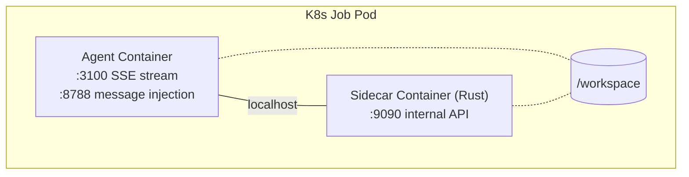
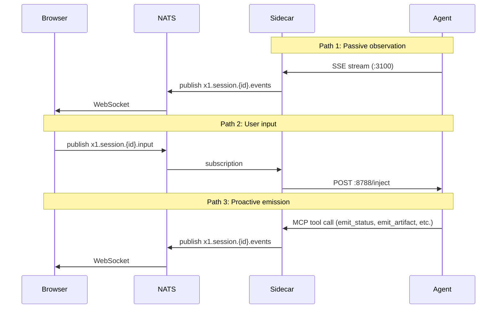

x1agent runs LLM agents in Kubernetes pods with a sidecar-based security model. Each agent session is a short-lived Job. Long-running infrastructure (API, NATS, Postgres, provider services) runs as standard Deployments.

## Session pod

Every agent session runs as a 2-container Kubernetes Job:



**Agent container** -- Runs the LLM runtime (Claude Agent SDK, Mastra, or custom). Exposes an SSE stream on `:3100` for event output and an inject endpoint on `:8788` for user message input. Receives zero secrets. Talks only to the sidecar on localhost.

**Sidecar container** -- Rust (Axum + async-nats). Bridges the agent to NATS, enforces permissions, manages the workspace volume, proxies credential-bearing API calls, and logs all operations. This is the trust boundary.

**Shared resources** -- Localhost network within the pod. A `/workspace` volume for agent file I/O.

Pod security context: `runAsNonRoot`, `seccompProfile: RuntimeDefault`, all capabilities dropped, resource limits enforced, `activeDeadlineSeconds` for hard session timeout.

## Communication paths

Three paths handle all data flow between agents, clients, and the platform:



**Path 1 (passive observation)** -- The agent runtime produces a stream of typed events (thinking, text, tool calls, results). The sidecar consumes this SSE stream, wraps each event in the [X1Message envelope](/reference/protocol), and publishes to NATS. Clients subscribe via WebSocket.

**Path 2 (user input)** -- The client publishes a message to the session's input subject on NATS. The sidecar subscribes, validates the message, and POSTs to the agent's inject endpoint. The agent runtime feeds this into the conversation as a new user turn.

**Path 3 (proactive emission)** -- The agent calls MCP tools (`emit_status`, `emit_artifact`, `request_input`, `request_permission`) that produce structured events. The sidecar publishes these to NATS. This gives the LLM deliberate control over what it communicates, with typed payloads rather than parsed stdout.

## System components

| Component | Type | Purpose |
|-----------|------|---------|
| API server | Deployment | REST API. Session orchestration, auth, workspace management. |
| NATS | Deployment | Event bus. Session events, user input, provider communication. |
| PostgreSQL | StatefulSet | Relational state. Users, agents, sessions, workspaces. |
| Frontend | Deployment | Astro + React SPA. Agent management, session viewer, admin. |
| Provider services | Deployments | Pluggable integrations. Graph, files, messaging, calendar, etc. |
| Session pods | Jobs (dynamic) | One per active session. Agent + sidecar, short-lived. |
| Operator (optional) | Deployment | Reconciles X1Session CRDs into Jobs. |

## NATS subject conventions

All session messages use a standard subject hierarchy:

```
x1.session.{session_id}.events    -- sidecar publishes, clients subscribe
x1.session.{session_id}.input     -- clients publish, sidecar subscribes
x1.session.{session_id}.proxy.*   -- provider credential proxy requests

x1.provider.{domain}.*            -- provider request/reply (graph, files, etc.)
x1.session.{id}.lifecycle.*       -- session lifecycle events (started, completed)
```

## Agent runtimes

The platform treats agent runtimes as pluggable. A runtime must expose two HTTP interfaces from the agent container:

| Endpoint | Purpose |
|----------|---------|
| `GET :3100/stream` | SSE stream of agent events |
| `POST :8788/inject` | Accept user messages mid-session |

Built-in runtimes:

- **claude_code** -- Claude Agent SDK (TypeScript). Multi-turn via `streamInput()`. MCP servers for tools and proactive emission.
- **mastra** -- Generic runner that clones any Mastra agent repo at startup. Postgres-backed memory for thread persistence.

Custom runtimes can be added by implementing these two endpoints in any language.
