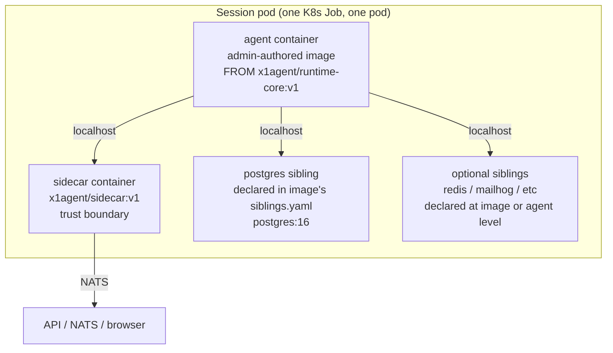
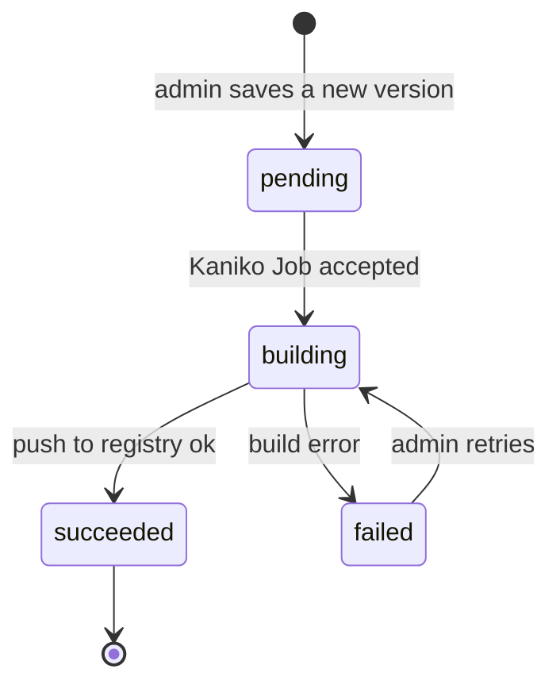

Every agent session runs as a Kubernetes Job that spawns exactly one pod. This doc specifies what goes into that pod, where the pieces come from, and the contract between the platform and an admin-authored agent image.

Three companion docs cover the related concerns:

- [Siblings](/architecture/siblings) — the service containers that run alongside the agent (Postgres, Redis, etc.).
- [Runtime services](/architecture/runtime-services) — mid-session service requests when the pod's pre-declared siblings aren't enough.
- [In-cluster registry](/deployment/in-cluster-registry) — where images live and how they're built.

## Design principles

1. **One fat container for the agent.** The LLM's shell tools (Pi's `Bash`, Claude Code's `bash`) run in a real local shell with real PIDs, real TTYs, and real file descriptors. No RPC between the agent and its shell. Background jobs, pipes, REPLs, and TTY-aware tools work exactly as they do on a developer's laptop. This is non-negotiable — proxying shell access breaks every productivity pattern these agents rely on.
2. **Services co-run in the pod, not inside the agent container.** Postgres, Redis, and similar run as sibling containers in the same pod. They share the pod's network namespace; the agent connects to them at `localhost:<port>`. This is the K8s-native equivalent of `docker-compose up` and requires no privileged containers, no Docker socket mounts, and no DIND.
3. **Admins author images with a Dockerfile.** The Dockerfile `FROM`s a platform-maintained base (`x1agent/runtime-core`) and adds whatever language toolchain and system packages the agent needs. Admins never have to think about the agent runtime bits themselves.
4. **Secrets never transit the pod spec.** Every secret reference in a pod spec is a `valueFrom.secretKeyRef`. Plaintext is never materialized into the pod's declarative form. See [permission-grants](/security/permission-grants) and [MCP servers](/providers/mcp-servers) for the same rule applied in the other directions of the system.
5. **No DIND.** Under any guise — host-socket mount, privileged DIND, rootless podman. The agent container has no way to spawn a Docker daemon, and any future need for nested containers is addressed at the cluster runtime-class level (Sysbox, Kata) rather than by weakening pod security.

## The pod shape



At session start the API generates one pod spec containing:

- One **agent container**, from the image selected on the agent config.
- One **sidecar container**, from the platform-maintained `x1agent/sidecar`.
- Zero or more **sibling containers**, contributed by the image's `siblings.yaml` and optionally overridden or extended by the agent's own siblings config.
- Shared volumes: `/workspace` (emptyDir) for code the agent edits, `/run/x1` (emptyDir) for unix sockets used by any MCP servers the image or agent attaches.

All containers share the pod's network namespace, so every sibling is reachable from the agent at `localhost:<port>`.

Pod teardown is governed by the session lifecycle documented in [Sessions](/architecture/sessions). When the session completes or times out, the Job terminates the pod and every sibling with it. emptyDir volumes disappear; secrets unmount; persistent data, if any, lives on a PersistentVolumeClaim (see [Siblings — persistence](/architecture/siblings#persistence)).

## runtime-core and the overlay pattern

`x1agent/runtime-core` is the single agent-runtime image the platform maintains. It's a node:22-slim image with everything the agent session loop needs:

| Layer | What it contains | Why |
|-------|------------------|-----|
| Base OS | `node:22-slim` (Debian bookworm, glibc) | Smallest viable surface that carries a working Node. |
| System packages | `git`, `curl`, `ca-certificates` | Required by runtime components. |
| Node + tsx | Prebuilt in `node:22-slim` | Runs the agent entrypoint script. |
| `gh` CLI | Installed from GitHub's apt source | GitHub operations in-session via the credential proxy. |
| Git credential helper | `git-credential-x1` shim | Routes git credentials through the sidecar; see [GitHub credential proxy](/security/credential-proxy). |
| Agent entrypoint | `/x1/bin/entrypoint` | Launches the LLM runtime, wires events to the sidecar, accepts user inject on `:8788`. |
| User | `agent` at uid 1000, gid 1000, home at `/home/agent` | Every x1agent runtime image — runtime-core and all presets — exposes the same user identity. The name is runtime-agnostic (Claude today, Codex / Gemini / Pi later) and decoupled from the base image's default user. uid 1000 satisfies Claude Code's refusal to run as root with `--dangerously-skip-permissions`, and is the gid the pod spec's `fsGroup` targets for shared volumes. |
| Workspace dir | `/workspace` with agent-owned permissions | Where the cloned repo and agent scratch files live. |
| `/x1/` tree | Self-contained agent overlay | Exists so language presets can `COPY --from=runtime-core /x1 /x1` rather than inheriting the whole image as a base. See below. |

### Why not `FROM runtime-core`?

The naive pattern — a Python preset that does `FROM x1agent/runtime-core` and `apt install python3.13` on top — works, and early drafts of this doc described it. It has two real problems:

1. **It throws away the language's canonical image.** `python:3.13-slim-bookworm`, `golang:1.24-bookworm`, `rust:1-bookworm` are maintained by each language's team. They ship multi-arch, they set GOPATH / PYTHONPATH / CARGO_HOME the way the ecosystem expects, they include the right native deps, and they get security updates on the upstream cadence. A preset that bolts a language into a Node image loses every one of those benefits. Admins who already know how to author a `FROM python:3.13-slim` Dockerfile have to learn a parallel ladder of apt names, env vars, and user ids.
2. **It couples x1 runtime bumps to language Dockerfile churn.** Every time the agent runtime changes (SDK version, entrypoint tweak, gh CLI bump), every admin-authored image inherits it through the base. That's good for security rollups but bad when a preset needs to stay on a specific language minor: the only way to get a new runtime is to also get whatever upstream python:* did on the same day.

### Why not split agent and language into separate containers?

This was considered and rejected. The agent's shell runs `bash -c 'go build ./...'`; `bash` must reach `go` through the normal file-system PATH with no RPC hop, because the [native-shell principle](#design-principles) is non-negotiable. Two containers breaks that — the agent would have to proxy every shell invocation into the language container. That's the shape modern IDEs use for remote development and it's fine there; it's wrong for an agent whose entire tool surface is `Bash`.

Nested containers (DIND, sidecar runtime classes) would technically let each role live in its own layer but are rejected upstream for PSA / CIS compliance — see the *No DIND* principle.

### The solution: `COPY --from=runtime-core /x1`

Runtime-core packages its entire contribution under a single `/x1/` directory and publishes itself as a **source of files**, not a base to extend. Language presets start from whichever canonical language image the author prefers and copy the overlay in:

```dockerfile
ARG AGENT_OVERLAY=x1agent/runtime-core:v1
FROM ${AGENT_OVERLAY} AS x1

FROM python:3.13-slim-bookworm

# --- x1 agent overlay ---
COPY --from=x1 /x1 /x1

# --- language-agnostic dev tooling ---
RUN apt-get update && apt-get install -y --no-install-recommends \
      git curl ca-certificates ripgrep jq build-essential \
  && rm -rf /var/lib/apt/lists/*

# Plus: uv, or pip, or whatever this preset needs.
RUN curl -LsSf https://astral.sh/uv/install.sh | \
      env UV_INSTALL_DIR=/usr/local/bin sh

# --- user + workspace + entrypoint wiring ---
# Create uid 1000 (python:3.13-slim runs as root by default), link
# gitconfig, hand /workspace to the agent.
RUN id -u 1000 >/dev/null 2>&1 \
    || ( groupadd --system --gid 1000 agent \
      && useradd --system --uid 1000 --gid 1000 --home /home/agent \
           --create-home --shell /bin/bash agent ) \
  && ln -sf /x1/etc/gitconfig /etc/gitconfig \
  && mkdir -p /workspace \
  && chown -R 1000:1000 /x1 /workspace

USER 1000
ENV HOME=/home/agent
ENV PATH="/x1/bin:${PATH}"
WORKDIR /workspace

ENTRYPOINT ["/x1/bin/entrypoint"]
```

### Contents of `/x1/`

```
/x1/
  bin/
    entrypoint         launcher: exec node + tsx + /x1/app/src/run.ts
    gh                 gh CLI
    git-credential-x1  sidecar credential shim
  app/                 agent SDK (src/ + package.json + node_modules)
  runtime/
    bin/node           bundled Node 22 binary
    lib/node_modules/  tsx + its deps
  etc/
    gitconfig          git config linked into /etc/gitconfig by the preset
```

Everything is self-contained. The overlay uses absolute paths (`/x1/runtime/bin/node …`), ignores `$PATH`, and expects nothing from the base image except a POSIX `/bin/sh`.

### Preset contract

A valid preset Dockerfile following the overlay pattern:

1. Declares an `ARG AGENT_OVERLAY` defaulting to the current runtime-core tag.
2. Adds `FROM ${AGENT_OVERLAY} AS x1` as the first named stage.
3. Starts from a bookworm-based language image (see *libc compatibility* below).
4. `COPY --from=x1 /x1 /x1` brings in the overlay.
5. **Creates the canonical `agent` user.** Every runtime image must provide a single uid 1000 / gid 1000 user named `agent` with a home at `/home/agent` — no exceptions, even when the base image ships its own uid 1000 user (node:slim's `node`, etc.). If a conflicting uid 1000 exists in the base, the preset deletes or renames it so the image has exactly one uid 1000 identity and that identity is unambiguously the agent.
6. `ln -sf /x1/etc/gitconfig /etc/gitconfig`.
7. `chown -R agent:agent /x1 /workspace /home/agent`.
8. Sets `ENV PATH="/x1/bin:${PATH}"` and `ENV HOME=/home/agent`.
9. `USER agent`.
10. `ENTRYPOINT ["/x1/bin/entrypoint"]`.

The `agent` convention is deliberate: it's runtime-agnostic (the same uid and home apply whether the container is running Claude Code, Codex, opencode, Gemini, or a future SDK), decoupled from base-image defaults, and makes home-directory-based platform artifacts (`/home/agent/.claude/`, `/home/agent/.codex/`, `/home/agent/bin/`, `/home/agent/.gitconfig`) predictable across the whole image catalog. The platform's hostPath mounts, credential injections, and `$HOME`-relative lookups all target `/home/agent` — a preset that diverges will silently fail those paths.

The save-time validator rejects images that end `USER 0`, name their uid 1000 user anything other than `agent`, omit the `/x1/bin/entrypoint` entrypoint, or `RUN rm` against `/x1/`.

### libc compatibility

The bundled Node + tsx links against glibc. Presets **must** use a glibc base image. In practice this means the `*-bookworm` or `*-bookworm-slim` flavor of each language image. `alpine` / musl-based bases won't work until runtime-core publishes an `alpine` variant. The shipped presets are all bookworm-based for this reason.

This is the one real tradeoff. Revisiting later: the agent runtime is a candidate for `bun build --compile` into a static binary, which would dissolve the libc constraint and let presets use any base.

### When to still use `FROM runtime-core`

Direct-use is kept for two narrow cases:

- Smoke-testing the agent runtime itself in isolation — spin up runtime-core with no language layer and verify the entrypoint works.
- A non-language agent whose only job is to drive the SDK (a summarization bot, a PR review agent, a Slack responder). These agents don't need Go or Python; runtime-core is already everything they want.

For any language-using agent, the overlay pattern is the shipped path.

### The registry path

Images are stored at:

```
<in-cluster-registry>/ws/<workspace-id>/<image-name>:<version>
```

Platform-maintained images (runtime-core and any x1 presets) are at:

```
<in-cluster-registry>/x1agent/<image-name>:<version>
```

See [In-cluster registry](/deployment/in-cluster-registry) for how the registry is deployed and how RBAC is scoped.

### Build lifecycle



Each image has many versions; each version has a status, a content-hash of its Dockerfile + siblings.yaml, a `built_ref` (the pulled ref, e.g. `reg.x1/ws/abc/python-django@sha256:...`), and a log blob. Agents reference an image by `image_id` and always run the `current_version_id` unless explicitly pinned. Rollback is a matter of pointing `current_version_id` at a prior row.

### What an admin image must not do

Validated at save time and at pod-spec generation. Violations reject the image:

- `USER 0` (running as root at pod start). The final `USER` directive must be `agent`.
- Listening on privileged ports. Bind to anything `≥ 1024`.
- Replacing `/app` or the agent entrypoint. The platform controls `ENTRYPOINT` and `CMD` via pod-spec `command`/`args` override, but stomping on `/app` contents can break the runtime.
- Baking in secrets. Admins who attempt to embed an API key in the Dockerfile text see a warning; runtime secrets flow through the workspace secret store instead (see [MCP servers — Workspace secrets](/providers/mcp-servers#workspace-secrets)).

## Relationship to other runtimes

runtime-core is intentionally runtime-agnostic above the node-plus-shell layer. It ships whichever LLM runtime the platform has adopted (currently the Claude Agent SDK; Pi is the planned successor — see the Next-pickups section of the project memory). Swapping runtimes is a runtime-core bump, not an admin-image change. Admins don't rewrite Dockerfiles when the platform changes LLM engines.

Custom runtimes beyond the built-in set expose themselves the same way every runtime does: an SSE stream on `:3100` and an inject endpoint on `:8788`. See [Architecture Overview](/architecture/overview#runtime-interface) for the interface.

## Summary

- One pod per session, containing the agent container + the sidecar + any sibling services.
- Agent container is built `FROM x1agent/runtime-core:<version>` with workspace-specific toolchain layered on top.
- Agent's `Bash` runs locally — no RPC, no proxy, no productivity penalty.
- Siblings are declared per-image (defaults) and per-agent (overrides); see [Siblings](/architecture/siblings).
- Images live in the in-cluster registry; see [In-cluster registry](/deployment/in-cluster-registry).
- Secrets flow through the workspace secret store; see [MCP servers](/providers/mcp-servers#workspace-secrets).
- Mid-session service requests are routed through the permission-grant flow; see [Runtime services](/architecture/runtime-services).
