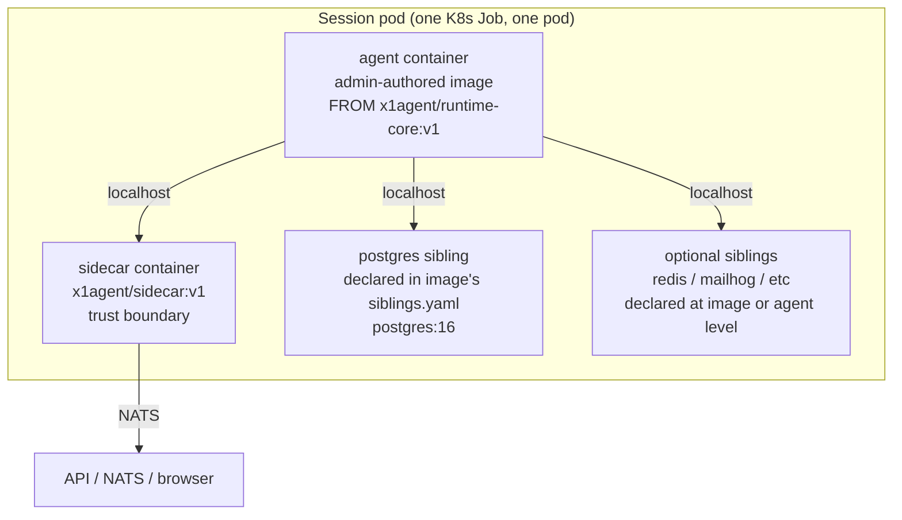
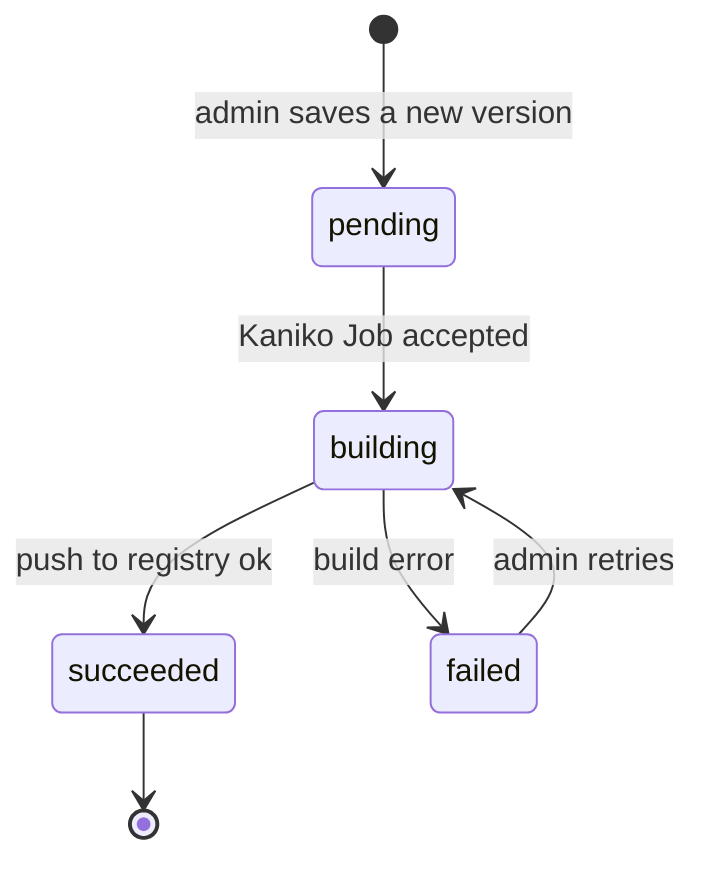

Every agent session runs as a Kubernetes Job that spawns exactly one pod. This doc specifies what goes into that pod, where the pieces come from, and the contract between the platform and an admin-authored agent image.

Three companion docs cover the related concerns:

- [Siblings](/architecture/siblings) — the service containers that run alongside the agent (Postgres, Redis, etc.).
- [Runtime services](/architecture/runtime-services) — mid-session service requests when the pod's pre-declared siblings aren't enough.
- [In-cluster registry](/deployment/in-cluster-registry) — where images live and how they're built.

## Design principles

1. **One fat container for the agent.** The LLM's shell tools (Pi's `Bash`, Claude Code's `bash`) run in a real local shell with real PIDs, real TTYs, and real file descriptors. No RPC between the agent and its shell. Background jobs, pipes, REPLs, and TTY-aware tools work exactly as they do on a developer's laptop. This is non-negotiable — proxying shell access breaks every productivity pattern these agents rely on.
2. **Services co-run in the pod, not inside the agent container.** Postgres, Redis, and similar run as sibling containers in the same pod. They share the pod's network namespace; the agent connects to them at `localhost:<port>`. This is the K8s-native equivalent of `docker-compose up` and requires no privileged containers, no Docker socket mounts, and no DIND.
3. **Admins author images with a Dockerfile.** The Dockerfile `FROM`s a platform-maintained base (`x1agent/runtime-core`) and adds whatever language toolchain and system packages the agent needs. Admins never have to think about the agent runtime bits themselves.
4. **Secrets never transit the pod spec.** Every secret reference in a pod spec is a `valueFrom.secretKeyRef`. Plaintext is never materialized into the pod's declarative form. See [permission-grants](/security/permission-grants) and [MCP servers](/providers/mcp-servers) for the same rule applied in the other directions of the system.
5. **No DIND.** Under any guise — host-socket mount, privileged DIND, rootless podman. The agent container has no way to spawn a Docker daemon, and any future need for nested containers is addressed at the cluster runtime-class level (Sysbox, Kata) rather than by weakening pod security.

## The pod shape



At session start the API generates one pod spec containing:

- One **agent container**, from the image selected on the agent config.
- One **sidecar container**, from the platform-maintained `x1agent/sidecar`.
- Zero or more **sibling containers**, contributed by the image's `siblings.yaml` and optionally overridden or extended by the agent's own siblings config.
- Shared volumes: `/workspace` (emptyDir) for code the agent edits, `/run/x1` (emptyDir) for unix sockets used by any MCP servers the image or agent attaches.

All containers share the pod's network namespace, so every sibling is reachable from the agent at `localhost:<port>`.

Pod teardown is governed by the session lifecycle documented in [Sessions](/architecture/sessions). When the session completes or times out, the Job terminates the pod and every sibling with it. emptyDir volumes disappear; secrets unmount; persistent data, if any, lives on a PersistentVolumeClaim (see [Siblings — persistence](/architecture/siblings#persistence)).

## The runtime-core base image

`x1agent/runtime-core` is the single base image the platform maintains. Every admin-authored agent image is built `FROM x1agent/runtime-core:<version>`. Its contents:

| Layer | What it contains | Why |
|-------|------------------|-----|
| Base OS | `node:22-slim` (Debian bookworm, glibc) | Compatible with most upstream language images; smallest viable surface. |
| System packages | `git`, `curl`, `ca-certificates` | Required by runtime components and nearly every admin-authored image. |
| Node + tsx | Prebuilt in `node:22-slim` | Runs the agent entrypoint script. |
| `gh` CLI | Installed from GitHub's apt source | GitHub operations in-session via the credential proxy. |
| Git credential helper | `git-credential-x1` shim | Routes git credentials through the sidecar; see [GitHub credential proxy](/security/credential-proxy). |
| Agent entrypoint | `/app/src/run.ts` (or the Pi equivalent once runtime swap lands) | Starts the LLM runtime, wires the event stream to the sidecar, accepts user inject on `:8788`. |
| User | `agent` at uid 1000, home at `/home/agent` | Non-root; Claude Code refuses `--dangerously-skip-permissions` as root. |
| Workspace dir | `/workspace` with agent-owned permissions | Where the cloned repo and agent scratch files live. |

When the platform bumps Pi, the agent entrypoint script, or an x1 extension, it publishes a new `runtime-core:<version>`. Admin images need to be rebuilt against the new base to pick up the change. The admin UI surfaces this as a "rebuild against latest runtime" action per image.

**What runtime-core deliberately does not contain:** language toolchains. Python, Go, Rust, Java, Ruby — none of them are in runtime-core. Those belong in admin-authored images. Keeping the base image lean makes version bumps cheap and isolates toolchain churn from runtime churn.

## Admin-authored images

An agent image is an admin-authored Dockerfile that starts with `FROM x1agent/runtime-core:<version>` and adds whatever the agent needs. The admin writes and saves the Dockerfile in the workspace's image catalog; the platform builds it with Kaniko and pushes the result to the in-cluster registry.

Minimal Python/Django example:

```dockerfile
FROM x1agent/runtime-core:v1

USER root
RUN apt-get update && apt-get install -y --no-install-recommends \
      python3.12 python3.12-dev python3.12-venv \
      build-essential libpq-dev postgresql-client \
  && rm -rf /var/lib/apt/lists/*
RUN curl -LsSf https://astral.sh/uv/install.sh | env UV_INSTALL_DIR=/usr/local/bin sh
USER agent
```

The image catalog record stores this Dockerfile alongside a `siblings.yaml` (the companion manifest declaring Postgres or any other pod-level services this image expects; see [Siblings](/architecture/siblings)).

### The registry path

Images are stored at:

```
<in-cluster-registry>/ws/<workspace-id>/<image-name>:<version>
```

Platform-maintained images (runtime-core and any x1 presets) are at:

```
<in-cluster-registry>/x1agent/<image-name>:<version>
```

See [In-cluster registry](/deployment/in-cluster-registry) for how the registry is deployed and how RBAC is scoped.

### Build lifecycle



Each image has many versions; each version has a status, a content-hash of its Dockerfile + siblings.yaml, a `built_ref` (the pulled ref, e.g. `reg.x1/ws/abc/python-django@sha256:...`), and a log blob. Agents reference an image by `image_id` and always run the `current_version_id` unless explicitly pinned. Rollback is a matter of pointing `current_version_id` at a prior row.

### What an admin image must not do

Validated at save time and at pod-spec generation. Violations reject the image:

- `USER 0` (running as root at pod start). The final `USER` directive must be `agent`.
- Listening on privileged ports. Bind to anything `≥ 1024`.
- Replacing `/app` or the agent entrypoint. The platform controls `ENTRYPOINT` and `CMD` via pod-spec `command`/`args` override, but stomping on `/app` contents can break the runtime.
- Baking in secrets. Admins who attempt to embed an API key in the Dockerfile text see a warning; runtime secrets flow through the workspace secret store instead (see [MCP servers — Workspace secrets](/providers/mcp-servers#workspace-secrets)).

## Relationship to other runtimes

runtime-core is intentionally runtime-agnostic above the node-plus-shell layer. It ships whichever LLM runtime the platform has adopted (currently the Claude Agent SDK; Pi is the planned successor — see the Next-pickups section of the project memory). Swapping runtimes is a runtime-core bump, not an admin-image change. Admins don't rewrite Dockerfiles when the platform changes LLM engines.

Custom runtimes beyond the built-in set expose themselves the same way every runtime does: an SSE stream on `:3100` and an inject endpoint on `:8788`. See [Architecture Overview](/architecture/overview#runtime-interface) for the interface.

## Summary

- One pod per session, containing the agent container + the sidecar + any sibling services.
- Agent container is built `FROM x1agent/runtime-core:<version>` with workspace-specific toolchain layered on top.
- Agent's `Bash` runs locally — no RPC, no proxy, no productivity penalty.
- Siblings are declared per-image (defaults) and per-agent (overrides); see [Siblings](/architecture/siblings).
- Images live in the in-cluster registry; see [In-cluster registry](/deployment/in-cluster-registry).
- Secrets flow through the workspace secret store; see [MCP servers](/providers/mcp-servers#workspace-secrets).
- Mid-session service requests are routed through the permission-grant flow; see [Runtime services](/architecture/runtime-services).
