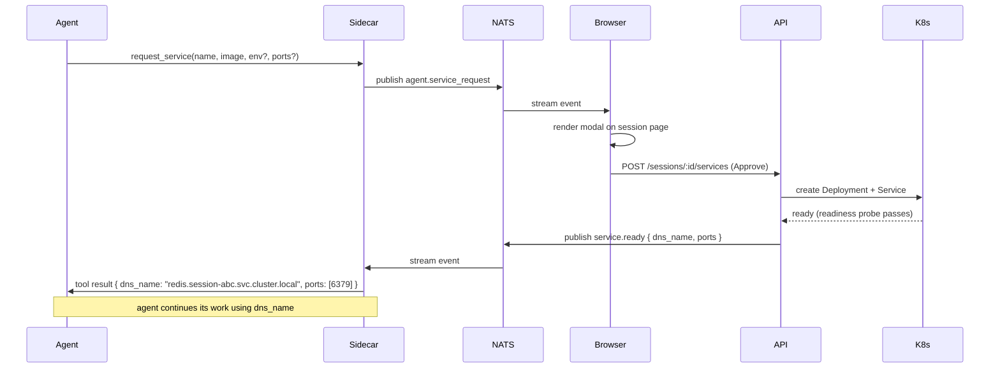
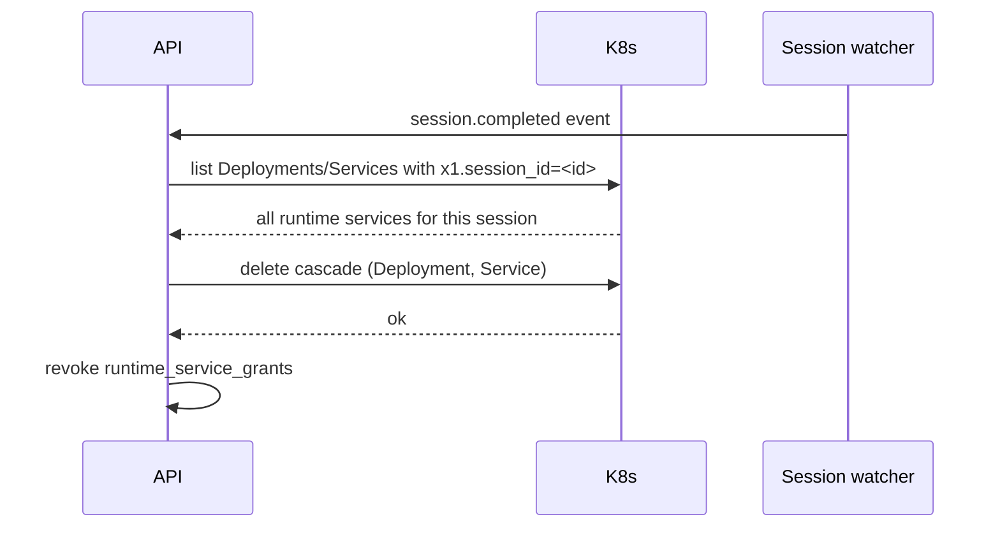

:::caution[Status: proposal — not implemented]
The `request_service` MCP tool, the `runtime_service_grants` table, the
approval modal, the Deployment + Service creation, and the
`allow_runtime_service_requests` workspace setting are **not present in
the code today**. Today, mid-session service needs cannot be added; an
agent that needs a service it didn't pre-declare must ask the user to
restart the session with an updated [siblings](/architecture/siblings)
config. This page specifies the flow we want to land. Tracked in
[`ROADMAP.md`](https://github.com/x1agent/x1agent/blob/main/ROADMAP.md).
:::

A session pod's containers are decided at pod creation and cannot be changed while the pod is running. This is a Kubernetes invariant, not an x1 design choice. If an agent pre-declares Postgres in its [siblings](/architecture/siblings) and mid-session decides it also needs Redis, the pod cannot mutate to add it.

This doc specifies the out-of-pod escape valve for that case: the `request_service` flow, a mid-session pattern that creates an ephemeral Deployment + Service accessible from the session pod via in-cluster DNS, and that tears down with the session.

Companion docs:

- [Siblings](/architecture/siblings) — the static, pre-declared service containers that run in the session pod itself. Use these whenever the need can be pre-declared.
- [Permission grants](/security/permission-grants) — the approval model this flow extends.

## When to use this vs siblings

| Concern | Use siblings | Use runtime services |
|---------|--------------|----------------------|
| "Every session for this agent will need Postgres" | ✓ | |
| "This image always needs Postgres" | ✓ | |
| "The agent decided mid-session that it needs Redis for this one task" | | ✓ |
| "The agent is building an app and wants to add a queue now" | | ✓ |
| "The agent hit an error and realized it needs a different service" | | ✓ |

**Prefer siblings.** They're faster (local to the pod, no cluster-network hop), they don't require an approval round-trip, and they don't consume additional workspace namespace resources. Runtime services exist for the genuine "the agent didn't know until now" case.

## The flow



The shape is identical to the [request_grant flow for permission-grants](/security/permission-grants#runtime-request-flow). Same "agent asks → user approves → agent is told" round-trip, same NATS subjects pattern, same UI modal treatment. One mental model for everything that needs human approval at runtime.

## The `request_service` tool

Exposed to the agent as an x1 runtime tool — an [`x1agent` MCP](/providers/mcp-servers) tool that the platform registers automatically into every session. Signature:

```
request_service(
  name:     string,    // agent-chosen local name; scoped to this session
  image:    string,    // OCI reference; must be pullable by the cluster
  env?:     Record<string, string>,  // ${SECRET_NAME} refs allowed
  ports?:   number[],  // ports the service listens on
  reason?:  string     // justification shown in the approval modal
) → { dns_name: string, ports: number[] } | { denied: true, reason: string }
```

Behavior:

- The tool does not write to any K8s resource directly. It publishes `agent.service_request` to NATS, surfaces the modal, and waits.
- On approve, the API creates a `Deployment` + `Service` in the session's namespace and returns a stable DNS name.
- On deny, the tool returns `{ denied: true, reason }`. The agent is expected to recover (fall back to an in-process alternative, change plan, or ask the user directly).
- On timeout (default: 10 minutes with no user action), the tool returns a denied result with `reason: "timeout"`.

## What the API creates

A minimal Deployment and Service pair, scoped to the session:

```yaml
apiVersion: apps/v1
kind: Deployment
metadata:
  name: svc-<session-id>-<name>
  namespace: ws-<workspace-id>
  labels:
    x1.session_id: <session-id>
    x1.runtime_service: <name>
    x1.agent_id: <agent-id>
spec:
  replicas: 1
  selector:
    matchLabels: { x1.session_id: <session-id>, x1.runtime_service: <name> }
  template:
    metadata:
      labels: { x1.session_id: <session-id>, x1.runtime_service: <name> }
    spec:
      containers:
      - name: main
        image: <from request>
        env: [...]   # with ${} refs hydrated to secretKeyRef
        ports: [...]
        resources: { requests: { memory: 256Mi, cpu: 100m }, limits: { memory: 1Gi } }
        readinessProbe: <inferred by image type, overridable by request>
---
apiVersion: v1
kind: Service
metadata:
  name: <name>.session-<session-id>
  namespace: ws-<workspace-id>
  labels: { x1.session_id: <session-id>, x1.runtime_service: <name> }
spec:
  selector: { x1.session_id: <session-id>, x1.runtime_service: <name> }
  ports: [...]
  type: ClusterIP
```

The DNS name returned to the agent is:

```
<name>.session-<session-id>.ws-<workspace-id>.svc.cluster.local
```

From inside the session pod, the shorter form `<name>.session-<session-id>` resolves thanks to the namespace search path. The API returns the longer form; the agent can use either.

## Approval and the permission model

Runtime services extend the "only humans grant" invariant from [permission-grants](/security/permission-grants#the-only-humans-grant-invariant) to runtime resources. Key rules:

- Only a user authenticated to the API can approve a runtime service request. `X-Internal-Token` is not accepted on the approve endpoint.
- Orchestrator agents cannot approve services on behalf of their children. A child agent that needs a service asks through its own `report_to_parent` → orchestrator → `request_service` chain, which still surfaces a modal to the user.
- Each approval is scoped to one `session_id`. The same service request in a new session requires a new approval. This is a deliberate choice to prevent a drive-by approval from leaking forward across time.
- A workspace setting `allow_runtime_service_requests = false` disables the flow entirely. When off, `request_service` returns `runtime_services_disabled`; services can only come from siblings declared at image or agent edit time.

Approval records are stored with the same schema as other grants (a dedicated `runtime_service_grants` table, scoped per-session, revocable), but because they are tied to ephemeral resources their lifetime is always bounded by the session.

## Resource limits

Runtime services count against the same workspace budget as siblings. Before the API creates the Deployment + Service it checks:

- Total containers in the session's pod + active runtime-service pods ≤ workspace limit.
- Total memory/CPU requests ≤ workspace budget.
- Image matches the workspace's pull policy (some workspaces may restrict to the in-cluster registry; public registries can be explicitly allowed).

A request that would exceed budget is denied with a structured reason shown in the modal. The user sees why and can adjust (remove other siblings, raise budget, or deny).

## Teardown



The session completion watcher reaps every runtime-service resource labeled with the session id. Labels are authoritative; the reaper does not rely on in-process state and will catch leaks from crashed API replicas or half-completed creates.

A daily reaper sweep also catches stale resources whose sessions ended without a clean completion event (pod OOM-killed, node evicted, watcher missed the event). Any resource labeled with a `session_id` that no longer corresponds to a `running` session row is deleted.

## Audit

Every runtime service decision emits an audit event. Events:

- `session.service.requested` — image, env field names (not values), requested by, session id.
- `session.service.approved` — approver, timestamp, dns name.
- `session.service.denied` — approver, timestamp, reason.
- `session.service.reaped` — whether by clean session end or by the stale-sweep.

Same audit table shape as permission grants; same privacy rule: no secret values in events.

## Failure modes

| Failure | Behavior |
|---------|----------|
| Image pull fails | Deployment stays in `ImagePullBackOff`. API waits on readinessProbe up to a timeout (60s by default); if not ready, returns `pull_failed` to the agent and reaps the resources. |
| Image has no readiness probe and doesn't converge | API falls back to a generic `tcp` probe on the first declared port after 30s. If no ports are declared and no probe is configured, the service is considered ready once the pod reaches `Running`. |
| Workspace budget exceeded | Request is denied at approve time with `budget_exceeded`. No K8s resources created. |
| NATS disconnect mid-flow | Agent's request times out locally. Sidecar reconnects to NATS and republishes; the API deduplicates on a request idempotency key. |
| User closes the browser before approving | Request remains pending until timeout. The modal reappears if the user returns before the timeout fires. |

## Not supported in v1

- **PersistentVolumeClaims on runtime services.** Ephemeral only. If the service needs persistent data, declare it as a sibling with a PVC plan — see [Siblings — persistence](/architecture/siblings#persistence).
- **Multi-replica services.** Always `replicas: 1`. If an agent needs a scaled service it should be declared in the workspace as a shared deployment, not requested at runtime.
- **Cross-session services.** Each approval is session-scoped. There is no "give me the Postgres the last session used."
- **Services that outlive the session.** If a service needs to persist past session end, it belongs in the workspace as a managed resource, not as a runtime request.

## Summary

- Static needs → siblings; dynamic needs → runtime services.
- Flow: `request_service` → NATS event → user modal → API creates Deployment + Service → DNS returned to agent.
- Same approval model as [permission grants](/security/permission-grants): only humans approve, scoped per session, revocable, workspace-disable-able.
- Resources labeled by `session_id` and reaped on session end; a daily sweep catches stragglers.
- emptyDir only (no PVCs), single-replica, session-scoped lifetime.
