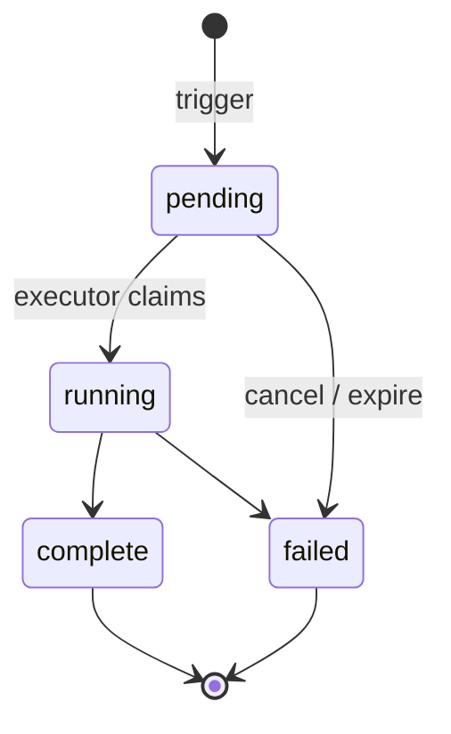
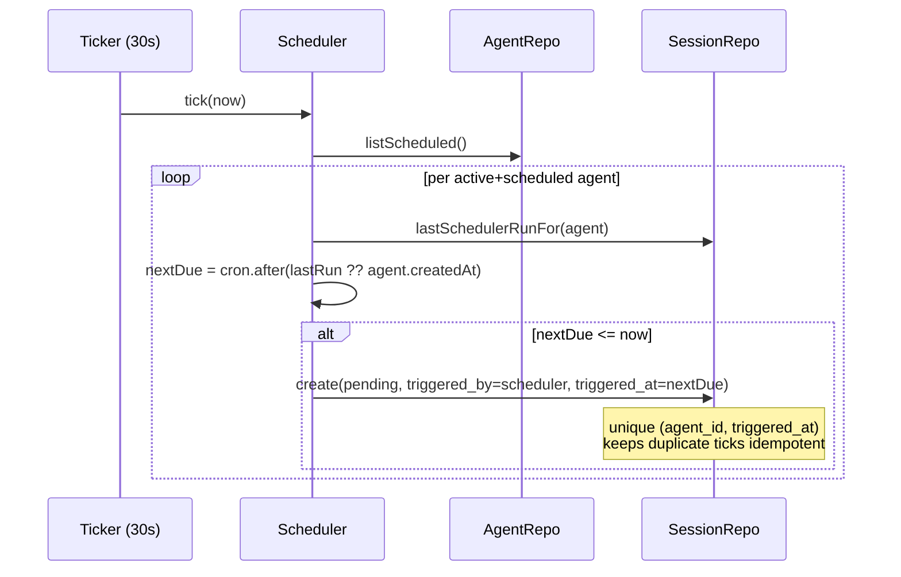

A session is a single run of an agent. Every time an agent starts — whether a user clicked "Run now" or the platform scheduler fired a cron tick — x1agent records a row in the `sessions` table and drives it through a small state machine until it completes or fails.

This page describes the sessions domain and the scheduler that feeds it. It deliberately stops at the database boundary: execution (the Kubernetes Job, the sidecar, the agent container) is covered in the [Architecture Overview](./overview).

## Lifecycle



- `pending` — the row exists and awaits an executor. This is the handoff state between the sessions domain and the execution layer.
- `running` — an executor has claimed the row and is driving the Job forward.
- `complete` — the agent exited cleanly.
- `failed` — the agent exited non-zero, the Job timed out, or the session was cancelled before it started.

A session never moves backwards. Once it reaches a terminal state (`complete` or `failed`), `completed_at` is set and the row is immutable.

## Trigger sources

Every session has a `triggered_by` discriminator:

| triggered_by | triggered_by_user_id | Meaning                                                         |
|--------------|----------------------|-----------------------------------------------------------------|
| `user`       | populated            | Someone clicked Run now or hit the API.                         |
| `scheduler`  | null                 | The platform scheduler fired a cron tick.                       |
| `agent`      | null                 | An orchestrator session called `spawn_session` (parent_session_id is set on the resulting row). |

Storing the distinction explicitly lets the UI show who fired the run and lets the scheduler reason about its own history without guessing.

## The scheduler

The scheduler is a single loop inside the API process. By default it ticks every 30 seconds (configurable via `SCHEDULER_INTERVAL_MS`, with a built-in 10% jitter to avoid thundering-herd across api replicas) and, for each active agent with a cron schedule, decides whether a new run is due. The scan cadence is independent of per-agent run cadence — an agent on `@hourly` still runs once an hour regardless of how often the scan ticks.



Three properties matter and are worth spelling out:

**Idempotency.** The unique index on `(agent_id, triggered_at)` means two ticks that compute the same `nextDue` will not both succeed. The second insert fails with a duplicate key error; the scheduler swallows it and moves on. This keeps a briefly-flapping API pod from creating duplicate runs.

**Catch-up, not replay.** `nextDue` is computed once per tick from the last scheduler-triggered row. If the process was down for an hour, the next tick fires *one* run (the next one after `now`), not sixty. Missed runs are missed; we do not want a backlog of stale runs stampeding when the API comes back up.

**No leader election.** The scheduler is safe to run from multiple API replicas because the unique index is the lock. Whichever replica inserts first wins; the rest get a duplicate-key error and continue. We do not need Redlock, leases, or `FOR UPDATE SKIP LOCKED` at this scale.

## Cron syntax

The scheduler accepts any expression that `cron-parser` accepts — 5-field cron, plus the named macros `@hourly`, `@daily`, `@weekly`, `@monthly`, `@yearly`. One extra local form is supported: `@every <n>(m|h|d)` for "every N minutes, hours, or days." Validation happens in the domain layer; invalid schedules are rejected at agent-create time, not at tick time.

## API surface

Sessions are addressed under an agent. The list is scoped to the agent; the trigger endpoint requires workspace admin.

```
GET  /api/workspaces/:slug/agents/:agentId/sessions
     → { sessions: [...last 50 rows, newest first...] }

POST /api/workspaces/:slug/agents/:agentId/sessions
     → { session: {...pending row...} }
     Creates a pending session with triggered_by=user.

POST /api/workspaces/:slug/agents/:agentId/sessions/:sessionId/cancel
     → { session: {...failed row...} }
     Only valid while status=pending. Running sessions are cancelled through
     the execution layer, not here.
```

## Transient WebSocket events

A small set of session events flow over the existing `x1.session.{id}.events` NATS subject but are deliberately **not** persisted to `session_events`. They exist purely to drive UI affordances that have no meaning across a page refresh.

| Type                                | Direction      | Purpose                                                                 |
|-------------------------------------|----------------|-------------------------------------------------------------------------|
| `session.agent_thinking`            | pod → browser  | Pod just received a wake; render a typing indicator.                    |
| `session.agent_thinking_cancelled`  | pod → browser  | Pod is shutting down without producing a real reply for an earlier wake — clear the indicator. |

Payload shape for `session.agent_thinking` (locked):

```json
{
  "type": "session.agent_thinking",
  "session_id": "<uuid>",
  "share_id":   "<uuid> | null",
  "thread_id":  "<uuid> | null",
  "event_id":   "<uuid>",
  "wake_source": "user | share_comment | child_message | scheduler | platform",
  "started_at": "<iso8601>"
}
```

`event_id` originates with the wake-triggering party (browser-stamped UUID, comment id, or wake msgId) and is propagated through to the agent's first reply emission so the frontend can deterministically clear the matching indicator. `share_id` and `thread_id` are populated only on `share_comment` wakes; the indicator renders inside the comment thread, not on the main timeline.

The `api` NATS subscriber drops both transient types on the floor before they hit Postgres — see `TRANSIENT_EVENT_TYPES` in `packages/api/src/nats/subscriber.ts`.

## Reaper

A periodic in-process job in the api walks for cleanup work:

- **Stuck-pending reaper.** Sessions with `status='pending'` whose Job
  never materialized are aged out and flipped to `failed`.
- **Orphaned-pod reaper.** Children whose pod has been gone for more than
  N minutes are flipped to `status='failed'` and emit a synthetic
  `session.failed` event so wake-publishers can react.
- **Per-session secret cleanup.** On session terminal state, the per-
  session credentials Secret is deleted from the workspace namespace.
- **Preview-claim release** (when preview-environments lands): walks
  open claims whose owning session is terminal and releases them.

The reaper lives at `packages/api/src/orchestration/` (and in the
periodic-scheduler registrations in `packages/api/src/index.ts`). It is
not a separate Deployment.

## Why it lives in a domain package

The sessions domain owns four things: the session entity, the status state machine, the scheduler-tick logic, and the HTTP surface. It does *not* own the executor — that is a separate concern that will land with the Kubernetes Job watcher. Keeping scheduling and execution in separate packages means we can ship and test the scheduler against a real database today, and swap in the executor later without changing the scheduling contract.
