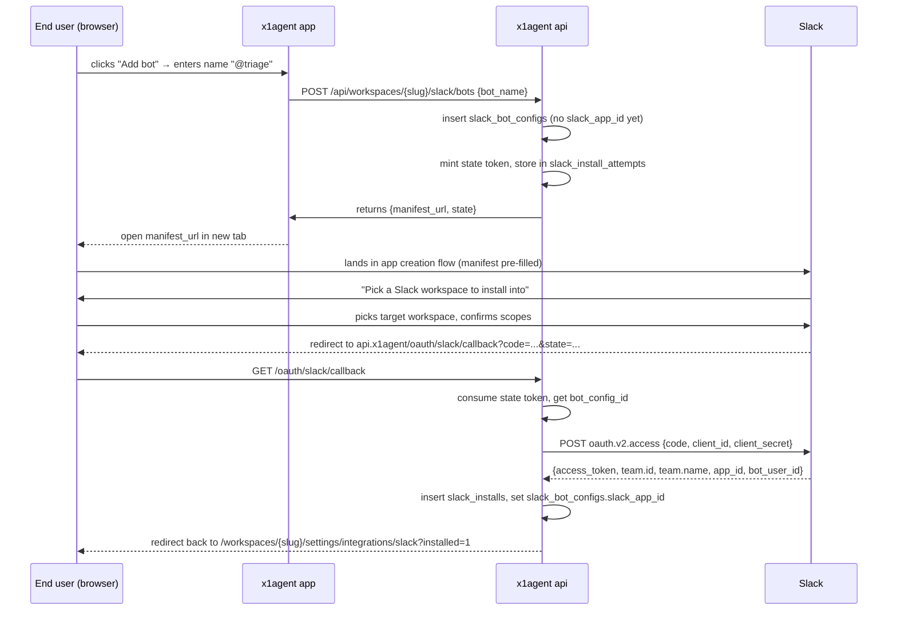

The messaging provider domain has Slack as its reference implementation. End users configure named bots inside a workspace; each bot is its own Slack app, generated at runtime via Slack's manifest URL pattern. This page documents the data model, the OAuth flow, and how inbound events route to agents.

For operator setup (registering the platform Slack app), see [Providers: Slack](/providers/slack).

## Concepts

Three nouns to keep separate. The names are loaded — "workspace" means two different things — so the data model uses explicit prefixes (`x1_workspace`, `slack_team`).

| Concept | Lives in | Identifier | Notes |
|---|---|---|---|
| **x1agent workspace** | x1agent Postgres | `workspaces.id` (uuid) | A tenant inside x1agent. Has agents, members, billing. |
| **Slack workspace** (a.k.a. team) | Slack | `team_id` (e.g. `T01ABCD`) | A Slack tenant. Disjoint from any x1agent concept. |
| **Slack bot config** | x1agent Postgres | `slack_bot_configs.id` | A bot defined inside an x1agent workspace. Owns one Slack app. |

A bot config in x1agent maps to one Slack app on Slack's side. The Slack app is installed into one or more Slack workspaces. Each install is a row in `slack_installs`.

```mermaid
erDiagram
  x1_workspace ||--o{ slack_bot_config : owns
  slack_bot_config ||--o| agent : "paired with (optional)"
  slack_bot_config ||--o{ slack_install : "installed into N Slack teams"
  slack_install ||--o{ slack_connected_channel : "has channels"

  x1_workspace { uuid id PK string slug }
  slack_bot_config { uuid id PK uuid workspace_id FK uuid agent_id FK_nullable string bot_name string slack_app_id }
  slack_install { uuid id PK uuid bot_config_id FK string team_id string team_name string bot_user_id bytea bot_token_enc }
  slack_connected_channel { uuid id PK uuid install_id FK string channel_id string channel_name }
  agent { uuid id PK string name }
```

### Cardinality rules

- **x1agent workspace → bot configs**: one to many. An operator running two x1agent workspaces (one per brand they manage) gets independent bot pools; bots in workspace A are not visible from workspace B.
- **Bot config → Slack app**: one to one. A bot config corresponds to exactly one app registered on Slack.
- **Bot config → installs**: one to many. The same bot can be installed into multiple Slack workspaces (rare but allowed).
- **Bot config → agent**: zero or one. A bot is paired with at most one agent. Pairing is set or cleared from the agent edit page; bots created in workspace settings start unpaired and appear in the agent edit page's bot picker.
- **Install → connected channels**: one to many. Channels are auto-registered the first time the bot is mentioned or DM'd in them.

## OAuth flow

The platform Slack app holds the OAuth callback URL. Every per-bot Slack app reuses that callback. State carries the bot config id and the initiating user id, so the callback knows which install to write.



### State token

State is a 32-byte random hex string with a 10-minute TTL. The `slack_install_attempts` row carries:

- `state_token` (primary key, single-use)
- `bot_config_id` — which bot config this install belongs to
- `initiating_user_id` — for re-checking workspace membership on callback
- `expires_at` — past which the row is rejected
- `consumed_at` — set on first use, prevents replay

The callback rejects on missing state, expired state, already-consumed state, or workspace-membership mismatch. All four cases redirect to the settings page with an `?error=` flag the UI renders.

### Open-redirect protection

The `state` row carries an optional `return_to` path. The callback validates it the same way the GitHub install callback does — leading slash, no protocol-relative `//`, no backslash escape. Anything else is silently dropped to the default landing page.

## Inbound events

Slack delivers events to one URL per platform app. The handler:

1. Verifies Slack's signing secret (request signing, replay window 5 minutes).
2. Looks up the install by `app_id` + `team_id`.
3. Fans out by event type:
   - `app_mention`, `message.im` → agent invocation.
   - `member_joined_channel` (bot is the member) → channel auto-register.
4. For agent invocations, looks up the bot config's paired agent. If unpaired, replies with a hint: `"This bot is not yet paired with an agent. Connect one in x1agent settings."`

### Channel auto-registration

There is no channel picker. The first time the bot receives an event from a channel — `app_mention`, a DM, or a `member_joined_channel` event — the handler upserts a `slack_connected_channels` row. Channels disappear from the list when the bot is removed from them (`member_left_channel`).

This pattern avoids the entire `conversations.list` permission rabbit hole. The channels visible to the agent are exactly the channels that have proven to deliver events, no more.

### Cost-bounded by default

The handler **only** forwards `app_mention` and `message.im` events to the agent. Channel-wide message firehose is dropped at the wire. A per-channel `ambient: true` flag (future) can opt a channel into forwarding all messages, but the default is explicit invocation.

This is a deliberate departure from the assumption that "the bot reads everything in the channel". Slack delivers everything; we filter before LLM context.

## Agent pairing

Bot configs are workspace-level resources. Pairing happens from the agent edit page:

- The agent edit form has a "Slack bot" picker.
- The picker lists bot configs in the same workspace where `agent_id IS NULL` (unpaired) plus the currently-paired bot if any.
- Selecting a bot writes `agent_id` on the bot config. Selecting "none" clears it.
- A bot can be paired with at most one agent at any time. To re-pair, unpair first.

This split — bots configured at workspace level, paired at agent level — lets a workspace admin pre-provision bots their org will need without requiring agents to exist yet.

## What lives where

| Layer | Package | Files |
|---|---|---|
| Domain | `packages/domains/messaging` | `domain/slack-bot-config.ts`, `domain/slack-install.ts` |
| Ports | `packages/domains/messaging` | `ports/slack-*.ts` |
| Adapters | `packages/domains/messaging` | `adapters/postgres/`, `adapters/slack/` |
| Routes | `packages/domains/messaging` | `adapters/hono/routes.ts` |
| Migration | `deploy/migrations` | `031_slack_bots.sql` |
| App store | `packages/app/src/stores` | `slackStore.ts` |
| App UI | `packages/app/src/features` | `workspaces/WorkspaceSlackPanel.tsx`, `agents/AgentSlackBotCard.tsx` |

## What's not in this design

- **Per-channel ambient mode** — the data model has room for it, the handler doesn't yet honor it. Default is explicit invocation only.
- **Posting as the user** (`xoxp` user tokens) — the bot posts in its own name. Posting on behalf of a specific user requires a separate user OAuth flow and is not in v1.
- **Slash commands** — the per-bot manifest does not subscribe to slash commands by default. Adding one is a manifest change plus a route.
- **Token rotation** — disabled in the manifest. Slack's rotated tokens require background refresh logic that isn't justified at small bot counts.
