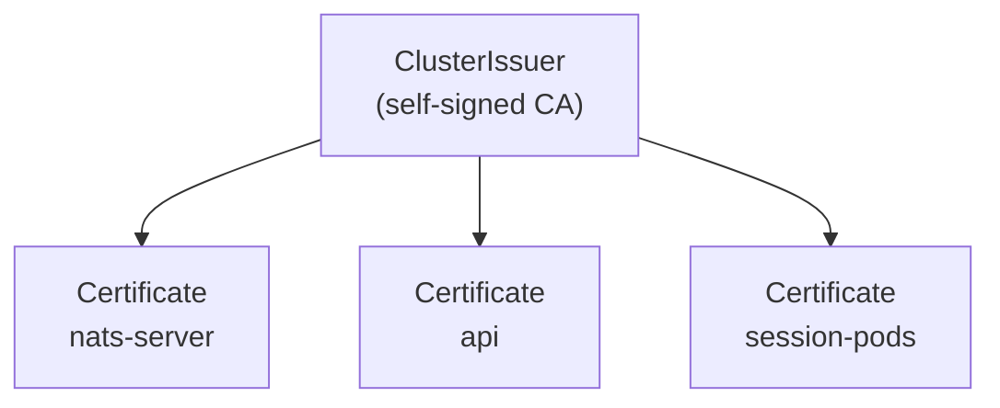

NATS is the trust boundary between session pods, the api, and any browser
watching a session. The chart ships **mTLS on by default** for both dev
(OrbStack) and prod — `mise run dev:setup` runs `bootstrap-nats-tls.sh`
against OrbStack to provision the local CA + per-workload certs via
cert-manager, and the prod chart's `templates/nats.yaml` always renders the
TLS config. Browsers never speak NATS directly: the api hosts an
authenticated WebSocket bridge at `wss://api.<base-domain>/api/ws` that
relays to NATS server-side. NATS itself stays ClusterIP-only.

## What mTLS buys

- **Server authentication.** Sidecars and the api refuse to talk to a NATS that doesn't present the expected cert.
- **Client authentication.** NATS refuses publishes/subscribes from callers that don't present a cert signed by the same CA.
- **Subject-level ACLs.** Once callers are authenticated, NATS restricts which subjects they can publish to and subscribe from. A sidecar can only talk about its own session.

Browser auth lives at a different layer. Browsers can't hold client certificates, so they talk to the api's WebSocket bridge over a normal session cookie. The bridge authenticates the upgrade, authorizes each subscribe / publish against the same primitives the REST routes use, then relays whitelisted messages to NATS using the api's own mTLS-authenticated connection.

## Certificate material via cert-manager

The simplest deployment path is [cert-manager](https://cert-manager.io) with a self-signed `ClusterIssuer`. cert-manager creates a root CA once, then issues per-workload certs with annotations on Secrets. Rotation is automatic.



The four certs:

| Certificate        | Used by                          | Mode            |
|--------------------|----------------------------------|-----------------|
| `nats-server`       | NATS server on `:4222`           | server cert     |
| `api`               | api → NATS connection            | client cert     |
| `session-pods`      | sidecar → NATS connection         | client cert (per session or shared) |

Whether each session gets its own client cert or all sessions share one is a tradeoff: per-session lets NATS ACLs pin a sidecar to its own subjects; shared is simpler. Per-session wins when the session pods are the trust boundary they claim to be. cert-manager handles per-pod issuance via a small controller or a CSI driver.

## NATS server config

The chart-rendered `nats.conf` (matches dev and prod):

```
port: 4222
http_port: 8222

tls {
  cert_file: "/etc/nats/tls/server/tls.crt"
  key_file:  "/etc/nats/tls/server/tls.key"
  ca_file:   "/etc/nats/tls/server/ca.crt"
  verify:    true
  verify_and_map: true
}

authorization {
  users: [
    { user: "CN=x1agent-api"
      permissions: { publish:   { allow: ["x1.session.*.input", "x1.provider.>", "x1.providers.>", "x1.orchestration.>", "agent.>", "x1.image.>", "$JS.API.>"] }
                     subscribe: { allow: ["x1.session.*.events", "x1.session.*.audit", "agent.>", "x1.image.>", "_INBOX.>"] } } }
    { user: "CN=session-sidecar"
      permissions: { publish:   { allow: ["x1.session.*.events", "x1.session.*.audit", "x1.session.*.archive", "$JS.API.>", "$JS.ACK.>"] }
                     subscribe: { allow: ["x1.session.*.input", "x1.session.*.presence", "_INBOX.>"] } } }
    { user: "CN=x1agent-provider"
      permissions: { publish:   { allow: ["_INBOX.>", "x1.audit.>"] }
                     subscribe: { allow: ["x1.provider.>", "_INBOX.>"] } } }
  ]
}
```

NATS no longer serves a WebSocket listener. The chart's `nats.yaml` still
renders one bound to `:8080` for in-cluster diagnostics, but the public
Ingress that used to expose it as `wss://nats.<base-domain>` is gone (see
the [WS bridge](#browser-bridge) section below) and a NetworkPolicy in
`templates/nats-networkpolicy.yaml` denies traffic to NATS from any pod that
isn't api, provider, or session-pod.

`verify_and_map: true` extracts the full Subject DN from the client cert and uses it as the authenticated NATS user name. The chart issues certs with no email/URI SANs, so the username is the DN — for a cert with only `CN=x1agent-api`, that's literally `"CN=x1agent-api"` (matching the `users` block above).

## Sidecar changes

Rust-side, `async_nats::connect(url)` becomes:

```rust
let tls = async_nats::ConnectOptions::new()
    .add_root_certificates(Path::new("/etc/nats/tls/ca/ca.crt"))
    .add_client_certificate(
        Path::new("/etc/nats/tls/client/tls.crt"),
        Path::new("/etc/nats/tls/client/tls.key"),
    )
    .require_tls(true);
let nc = tls.connect(url).await?;
```

Env-gated on `NATS_TLS=true`. When unset, fall back to the existing plaintext connect so OrbStack dev still works.

## api changes

The `nats` npm client takes `tls` options:

```ts
const nc = await connect({
  servers: natsUrl,
  tls: {
    ca: readFileSync("/etc/nats/tls/ca/ca.crt"),
    cert: readFileSync("/etc/nats/tls/client/tls.crt"),
    key: readFileSync("/etc/nats/tls/client/tls.key"),
  },
});
```

Same env gate (`NATS_TLS=true`).

## Browser bridge

Browsers don't speak to NATS directly. The api hosts an authenticated
WebSocket bridge at `wss://api.<base-domain>/api/ws`
(`packages/api/src/ws-bridge/`). The session-detail page opens one
connection per tab using the operator's session cookie; the bridge handles
the upgrade, validates the JWT, then dispatches a small JSON-envelope
protocol with six ops:

| Op              | Maps to                                  | Authorization                                |
|-----------------|------------------------------------------|----------------------------------------------|
| `sub_session`   | Subscribe `x1.session.<id>.events`       | `resolveSessionVisibility` (owner / admin / share) |
| `sub_comments`  | Subscribe `agent.share_comment_*`        | Any authenticated user; per-message filtered by workspace membership |
| `pub_input`     | JetStream publish `x1.session.<id>.input` | Owner-only                                   |
| `pub_presence`  | NATS publish `x1.session.<id>.presence`  | Owner-only                                   |
| `unsub_session` | Drop subscription                        | n/a                                          |
| `ping`          | Liveness                                 | n/a                                          |

Every relayed message goes through `ws-bridge/whitelist.ts`:

- Session events: only the explicit set of ~22 event types passes; everything else (a future SDK-emitted type, an internal routing event) is dropped silently.
- Comment events: only the 15 browser-facing fields pass; server-routing fields (`producing_session_id`, `producing_agent_id`) are stripped.
- Every payload is recursively scrubbed for keys that look like credentials (`token`, `api_key`, `secret`, `password`, `credential`, `authorization`, `private_key`, `client_secret`) — the value is replaced with `"[REDACTED]"`. Defense-in-depth against a publisher forgetting to redact.

The bridge connects to NATS using the api's own mTLS-authenticated session, so subject-level ACLs still apply on the cluster side. The browser inherits a strictly narrower set of permissions than the api itself holds.

## Open questions

- **Per-session vs shared sidecar cert.** v1 ships a single `CN=session-sidecar` cert shared across all session pods. Per-session certs would let NATS ACLs pin a sidecar's publish/subscribe to its own session subjects.
