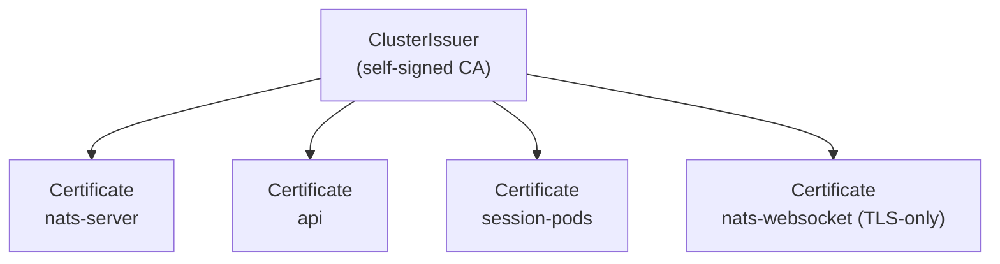

NATS is the trust boundary between session pods, the api, and any browser watching a session. In dev (OrbStack), NATS runs plaintext on `:4222` with an unauthenticated WebSocket gateway on `:8080` — acceptable because everything is on loopback. For any non-local deploy, NATS must run with mutual TLS and the browser WebSocket must be fronted by TLS with a bearer token.

This page describes the target state and the migration path. The current code defaults to plaintext; mTLS is a flip of env flags and a set of mounted certificates.

## What mTLS buys

- **Server authentication.** Sidecars and the api refuse to talk to a NATS that doesn't present the expected cert.
- **Client authentication.** NATS refuses publishes/subscribes from callers that don't present a cert signed by the same CA.
- **Subject-level ACLs.** Once callers are authenticated, NATS restricts which subjects they can publish to and subscribe from. A sidecar can only talk about its own session.

Browser auth is different — browsers can't hold client certificates. The NATS WebSocket gateway accepts a short-lived JWT instead, issued by the api and scoped to the sessions the user can see.

## Certificate material via cert-manager

The simplest deployment path is [cert-manager](https://cert-manager.io) with a self-signed `ClusterIssuer`. cert-manager creates a root CA once, then issues per-workload certs with annotations on Secrets. Rotation is automatic.



The four certs:

| Certificate        | Used by                          | Mode            |
|--------------------|----------------------------------|-----------------|
| `nats-server`       | NATS server (both `:4222` and `:8080`) | server cert     |
| `api`               | api → NATS connection            | client cert     |
| `session-pods`      | sidecar → NATS connection         | client cert (per session or shared) |
| `nats-websocket`    | browser-facing WSS endpoint       | server cert     |

Whether each session gets its own client cert or all sessions share one is a tradeoff: per-session lets NATS ACLs pin a sidecar to its own subjects; shared is simpler. Per-session wins when the session pods are the trust boundary they claim to be. cert-manager handles per-pod issuance via a small controller or a CSI driver.

## NATS server config

The dev `nats.conf` today:

```
port: 4222
http_port: 8222
websocket { port: 8080, no_tls: true }
```

The prod equivalent, once certs are mounted at `/etc/nats/tls/`:

```
port: 4222
http_port: 8222

tls {
  cert_file: "/etc/nats/tls/server/tls.crt"
  key_file:  "/etc/nats/tls/server/tls.key"
  ca_file:   "/etc/nats/tls/ca/ca.crt"
  verify:    true
  verify_and_map: true
}

# Derive NATS user identity from the client cert's Subject CN.
authorization {
  users: [
    {
      user: "session-sidecar"
      permissions: {
        publish:   { allow: ["x1.session.{{session_id}}.events"] }
        subscribe: { allow: ["x1.session.{{session_id}}.input",
                             "x1.session.{{session_id}}.presence"] }
      }
    }
    {
      user: "x1agent-api"
      permissions: {
        subscribe: { allow: ["x1.session.*.events"] }
        publish:   { allow: ["x1.session.*.input"] }
      }
    }
  ]
}

websocket {
  port: 8080
  tls {
    cert_file: "/etc/nats/tls/websocket/tls.crt"
    key_file:  "/etc/nats/tls/websocket/tls.key"
  }

  # Browsers authenticate with a short-lived JWT the api mints when the
  # session detail page loads. The token encodes the session ids the
  # viewer is allowed to subscribe to.
  authorization {
    auth_callout {
      issuer: "x1agent-api"
      auth_users: ["browser"]
    }
  }
}
```

`verify_and_map: true` is the important line for sidecars. NATS extracts the client cert's CN and uses it as the authenticated user name, so the `authorization.users` block can grant per-subject permissions without a separate auth server. The `{{session_id}}` placeholder is NATS's built-in template substitution against the cert CN.

## Sidecar changes

Rust-side, `async_nats::connect(url)` becomes:

```rust
let tls = async_nats::ConnectOptions::new()
    .add_root_certificates(Path::new("/etc/nats/tls/ca/ca.crt"))
    .add_client_certificate(
        Path::new("/etc/nats/tls/client/tls.crt"),
        Path::new("/etc/nats/tls/client/tls.key"),
    )
    .require_tls(true);
let nc = tls.connect(url).await?;
```

Env-gated on `NATS_TLS=true`. When unset, fall back to the existing plaintext connect so OrbStack dev still works.

## api changes

The `nats` npm client takes `tls` options:

```ts
const nc = await connect({
  servers: natsUrl,
  tls: {
    ca: readFileSync("/etc/nats/tls/ca/ca.crt"),
    cert: readFileSync("/etc/nats/tls/client/tls.crt"),
    key: readFileSync("/etc/nats/tls/client/tls.key"),
  },
});
```

Same env gate (`NATS_TLS=true`).

## Browser / WebSocket

Browsers can't present client certs. The session detail page asks the api for a short-lived NATS JWT scoped to the sessions the user is a member of, then connects with it:

```ts
const { nats_jwt } = await apiFetch("/api/nats/token", { method: "POST" });
const nc = await connect({
  servers: "wss://nats.example.com",
  token: nats_jwt,
});
```

The api's `/api/nats/token` mints a JWT with the user's session ids in the `sub` claim set. NATS's `auth_callout` callback verifies the JWT signature and maps the session ids into subject-level permissions for that connection.

## Migration path

Minimum viable switch to mTLS on a fresh cluster:

1. Install cert-manager (`helm install cert-manager jetstack/cert-manager`).
2. Apply the `ClusterIssuer` + `Certificate` manifests for the four certs above.
3. Update the NATS deployment to mount the server cert + CA and switch to the TLS-enabled `nats.conf`.
4. Set `NATS_TLS=true` + cert paths on the api and session pods (via the Job watcher's env builder).
5. Mint browser JWTs from a new `/api/nats/token` endpoint; update the session detail page to request one before connecting.

None of the above requires a data migration. The `x1.session.{id}.events` wire format is unchanged; only transport changes.

## What stays plaintext

OrbStack dev stays plaintext. The gate is `NATS_TLS` on the api and sidecar, plus a `nats-config` ConfigMap choice at deploy time. Developers who want to exercise the mTLS path locally can apply the production manifests against OrbStack — cert-manager runs there fine.

## Open questions

- **Per-session vs shared sidecar cert.** Per-session is the purer model; shared is simpler to issue. Decide when the first real deploy happens.
- **JWT expiry.** Browser tokens last how long? Probably the session's `activeDeadlineSeconds` — no reason to refresh mid-session. For orchestrators (no deadline), the browser re-fetches on expiry.
- **NATS JetStream.** Not enabled today. When it is — for event replay or durable consumers — the mTLS setup still holds, but JetStream has its own account model that needs to be slotted in.
