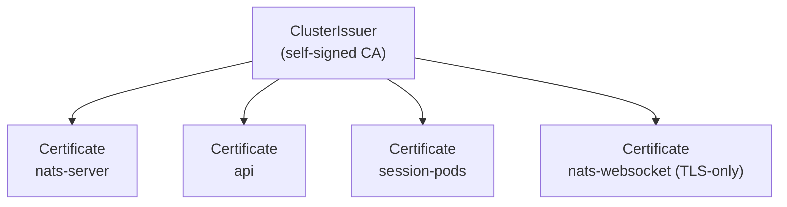

NATS is the trust boundary between session pods, the api, and any browser
watching a session. The chart ships **mTLS on by default** for both dev
(OrbStack) and prod — `mise run dev:setup` runs `bootstrap-nats-tls.sh`
against OrbStack to provision the local CA + per-workload certs via
cert-manager, and the prod chart's `templates/nats.yaml` always renders the
TLS config. The browser WebSocket gateway uses TLS at the ingress; in v1 the
inner WS listener is anonymous (mapped to the api identity) — see
[Future: per-session browser JWTs](#future-per-session-browser-jwts).

## What mTLS buys

- **Server authentication.** Sidecars and the api refuse to talk to a NATS that doesn't present the expected cert.
- **Client authentication.** NATS refuses publishes/subscribes from callers that don't present a cert signed by the same CA.
- **Subject-level ACLs.** Once callers are authenticated, NATS restricts which subjects they can publish to and subscribe from. A sidecar can only talk about its own session.

Browser auth is different — browsers can't hold client certificates. The NATS WebSocket gateway accepts a short-lived JWT instead, issued by the api and scoped to the sessions the user can see.

## Certificate material via cert-manager

The simplest deployment path is [cert-manager](https://cert-manager.io) with a self-signed `ClusterIssuer`. cert-manager creates a root CA once, then issues per-workload certs with annotations on Secrets. Rotation is automatic.



The four certs:

| Certificate        | Used by                          | Mode            |
|--------------------|----------------------------------|-----------------|
| `nats-server`       | NATS server (both `:4222` and `:8080`) | server cert     |
| `api`               | api → NATS connection            | client cert     |
| `session-pods`      | sidecar → NATS connection         | client cert (per session or shared) |
| `nats-websocket`    | browser-facing WSS endpoint       | server cert     |

Whether each session gets its own client cert or all sessions share one is a tradeoff: per-session lets NATS ACLs pin a sidecar to its own subjects; shared is simpler. Per-session wins when the session pods are the trust boundary they claim to be. cert-manager handles per-pod issuance via a small controller or a CSI driver.

## NATS server config

The chart-rendered `nats.conf` (matches dev and prod):

```
port: 4222
http_port: 8222

tls {
  cert_file: "/etc/nats/tls/server/tls.crt"
  key_file:  "/etc/nats/tls/server/tls.key"
  ca_file:   "/etc/nats/tls/server/ca.crt"
  verify:    true
  verify_and_map: true
}

authorization {
  users: [
    { user: "CN=x1agent-api"
      permissions: { publish:   { allow: ["x1.session.*.input", "x1.provider.>", "x1.providers.>", "x1.orchestration.>", "$JS.API.>"] }
                     subscribe: { allow: ["x1.session.*.events", "x1.session.*.audit", "_INBOX.>"] } } }
    { user: "CN=session-sidecar"
      permissions: { publish:   { allow: ["x1.session.*.events", "x1.session.*.audit", "$JS.API.>", "$JS.ACK.>"] }
                     subscribe: { allow: ["x1.session.*.input", "x1.session.*.presence", "_INBOX.>"] } } }
    { user: "CN=x1agent-provider"
      permissions: { publish:   { allow: ["_INBOX.>", "x1.audit.>"] }
                     subscribe: { allow: ["x1.provider.>", "_INBOX.>"] } } }
  ]
}

websocket {
  port: 8080
  no_tls: true            # TLS terminates at the ingress (Let's Encrypt cert browsers trust)
  no_auth_user: "CN=x1agent-api"   # v1: anonymous WS clients map to api identity
}
```

`verify_and_map: true` extracts the full Subject DN from the client cert and uses it as the authenticated NATS user name. The chart issues certs with no email/URI SANs, so the username is the DN — for a cert with only `CN=x1agent-api`, that's literally `"CN=x1agent-api"` (matching the `users` block above).

## Sidecar changes

Rust-side, `async_nats::connect(url)` becomes:

```rust
let tls = async_nats::ConnectOptions::new()
    .add_root_certificates(Path::new("/etc/nats/tls/ca/ca.crt"))
    .add_client_certificate(
        Path::new("/etc/nats/tls/client/tls.crt"),
        Path::new("/etc/nats/tls/client/tls.key"),
    )
    .require_tls(true);
let nc = tls.connect(url).await?;
```

Env-gated on `NATS_TLS=true`. When unset, fall back to the existing plaintext connect so OrbStack dev still works.

## api changes

The `nats` npm client takes `tls` options:

```ts
const nc = await connect({
  servers: natsUrl,
  tls: {
    ca: readFileSync("/etc/nats/tls/ca/ca.crt"),
    cert: readFileSync("/etc/nats/tls/client/tls.crt"),
    key: readFileSync("/etc/nats/tls/client/tls.key"),
  },
});
```

Same env gate (`NATS_TLS=true`).

## Browser / WebSocket

Browsers can't present client certs. The session detail page asks the api for a short-lived NATS JWT scoped to the sessions the user is a member of, then connects with it:

```ts
const { nats_jwt } = await apiFetch("/api/nats/token", { method: "POST" });
const nc = await connect({
  servers: "wss://nats.example.com",
  token: nats_jwt,
});
```

The api's `/api/nats/token` mints a JWT with the user's session ids in the `sub` claim set. NATS's `auth_callout` callback verifies the JWT signature and maps the session ids into subject-level permissions for that connection.

## Future: per-session browser JWTs

v1 maps anonymous WebSocket clients to the api identity (`no_auth_user: "CN=x1agent-api"`). The follow-up uses NATS `auth_callout` with short-lived JWTs minted by a new `/api/nats/token` endpoint scoped to the session ids the viewer can see. Tracked but not yet implemented.

## Open questions

- **Per-session vs shared sidecar cert.** v1 ships a single `CN=session-sidecar` cert shared across all session pods. Per-session certs would let NATS ACLs pin a sidecar's publish/subscribe to its own session subjects.
- **Browser JWT expiry.** Likely scoped to the session's `activeDeadlineSeconds`; orchestrators (no deadline) re-fetch on expiry.
