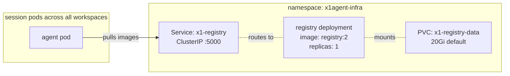
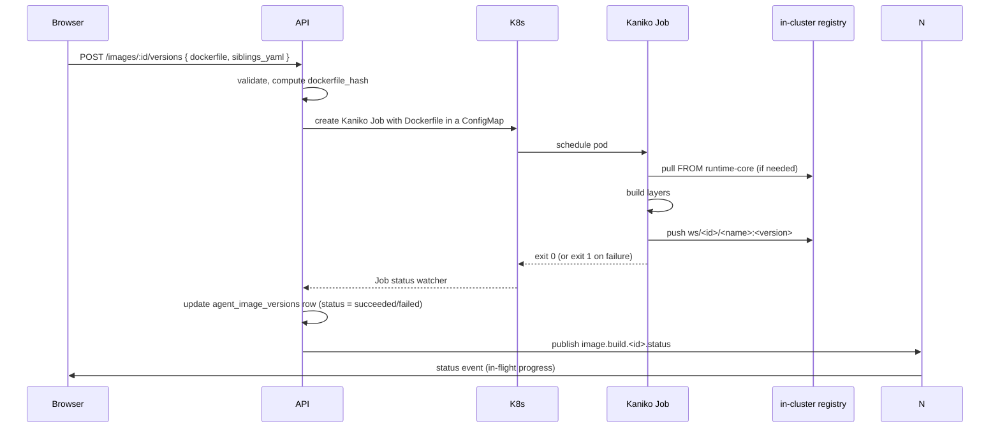

Every agent image — the platform's runtime-core, the shipped presets, and the workspace-authored images admins create in the image catalog — lives in a container registry running inside the same cluster as the x1agent control plane. This doc specifies the deployment, the namespacing scheme, how images are built, and the boundary between public-registry pulls and in-cluster pushes.

Companion docs:

- [Runtime images](/architecture/runtime-images) — what runtime-core is and how admin images `FROM` it.
- [Siblings](/architecture/siblings) — images reference sibling images, which are typically pulled from public registries through the registry's pull-through cache.

## Why in-cluster

Three reasons it is not optional:

1. **Startup latency.** Session pods are short-lived and spawn frequently. Pulling an admin-authored image from Docker Hub on every session start is a visible user-perceived delay. A node-local registry pulls once and serves to every subsequent pod.
2. **No external dependency.** x1agent is deployable in air-gapped environments. The registry exists in-cluster so no image pull ever depends on outbound internet access.
3. **Push target for Kaniko builds.** When a workspace admin saves a new image version, the Kaniko build Job pushes the result somewhere. That somewhere is the in-cluster registry.

## Deployment

v1 ships with `registry:2` (the official CNCF Distribution image). Minimal and sufficient.



Deployment shape:

- One `Deployment` with `replicas: 1` (registry:2 does not support multi-replica scale-out without shared storage + coordination; single replica is fine for a single cluster).
- One `PersistentVolumeClaim` for storage. Default 20Gi; sizing guidance below.
- One `Service` (ClusterIP) exposing `:5000`.
- One `ConfigMap` with the registry's `config.yml`, which configures pull-through mirrors for `docker.io`, `ghcr.io`, and `quay.io`.
- No `Ingress`. The registry is never exposed outside the cluster.

The registry runs in a `x1agent-infra` namespace alongside Postgres and NATS. Helm values land under `deploy/helm/registry/` (see the repository's `deploy/` tree once Phase 1 is built). devspace picks it up automatically during `mise run dev`.

## Storage

Images grow without bound unless actively managed. Sizing:

- Platform images (runtime-core + presets): ~500 MB compressed per version. Expect 3–5 versions retained at any time → ~2.5 GB.
- Workspace images: depend heavily on language. A python-django image FROM runtime-core is typically 250–400 MB compressed; a full-stack polyglot image can hit 800 MB. Expect 5–10 versions per image.
- A 20-workspace cluster with 5 images per workspace at 5 versions each at 400 MB = 200 GB. Pick a PVC size that matches your expected scale; 20 GB is enough for single-workspace dev, 100+ GB is the right ballpark for a production cluster.

Garbage collection runs as a weekly CronJob that invokes `registry garbage-collect` against the registry's config. Blob GC frees space by deleting blobs no longer referenced by any manifest. Before GC runs, the Job deletes manifests older than the per-image retention policy (retain last N versions, where N is configurable per workspace; default 5).

## Namespacing

Images are named with a two-level namespace that maps to authorization:

```
<service>/x1agent/<name>:<version>         — platform-maintained images
<service>/ws/<workspace-id>/<name>:<version>  — workspace-authored images
<service>/mirror/<upstream-registry>/<path>:<tag> — pull-through cache
```

Where `<service>` is the in-cluster address (`x1-registry.x1agent-infra.svc.cluster.local:5000` internally; resolved via the cluster's DNS).

**Platform images.** Written only by the platform's CI pipeline. Read by every session pod.

**Workspace images.** Written only by the API's image build controller on behalf of admins of that workspace. Read only by session pods running in that workspace. Cross-workspace pull is blocked at the API/authz level; the registry itself treats workspaces as plain path prefixes. See [Access control](#access-control) below.

**Pull-through mirror.** Public images (e.g. `postgres:16` declared as a sibling) are not re-pushed; they are fetched from their upstream registry by the in-cluster registry and cached at `<service>/mirror/docker.io/library/postgres:16`. The first session that uses a given public image pays the upstream pull cost; every subsequent session on the same cluster hits the cache.

The admin UI and the API always present the short form (`postgres:16`); the pod-spec translator rewrites it to the mirror form at pod-spec generation time so pulls stay in-cluster.

## Access control

In v1, auth on the registry itself is intentionally minimal — the registry's ClusterIP is only reachable from inside the cluster, and K8s `NetworkPolicy` restricts which pods can talk to it. Fine-grained RBAC (per-workspace push/pull tokens) is a follow-up once a second cluster is stood up and cross-cluster replication becomes relevant.

Until then:

- The **API** has write credentials (mounted as a K8s Secret) for the registry. It uses them to push built images and to write retention metadata.
- **Session pods** have read credentials. They use a workspace-scoped image pull secret bound into the pod spec.
- **Workspaces cannot read each other's images.** Enforced at the API (image catalog endpoints are workspace-scoped) and at the pod-spec level (a session's pull secret only includes its workspace's namespace).
- **Workspaces cannot write directly.** Image writes always go through the Kaniko build controlled by the API; no endpoint lets a user push a raw image.

Admission controllers (OPA/Kyverno) in x1agent deployments can further restrict which registries session pods can pull from. The default policy permits only the in-cluster registry and its mirror prefix.

## Build pipeline

Images are built by Kaniko — the standard K8s-native builder. Kaniko runs as an unprivileged container, reads a Dockerfile, builds the image layer-by-layer, and pushes to a registry. No Docker daemon, no privileged containers, no host socket.



Key properties:

- **One Kaniko Job per build.** Jobs are not reused. Each version's build is its own pod; logs are kept as the Job's pod logs plus a copy in Postgres's `agent_image_versions.log_ref` pointer to a blob store.
- **ConfigMap holds the Dockerfile.** Kaniko mounts it from a ConfigMap that's created per-build and deleted on success. No build-context tarball is shipped around; the Dockerfile is the entire context in v1 (admins cannot `COPY` local files from their laptop). If `COPY` from the repo becomes a need, we ship a git-context fetcher at Phase 3 follow-up — sidestepping it for v1 keeps the surface small.
- **Log streaming.** The API subscribes to the Kaniko pod's logs and forwards lines to NATS subject `x1.image.build.<version_id>.logs`. The admin UI's build-log viewer subscribes the same way the session event viewer subscribes to session events — same pattern, same infrastructure.
- **Concurrency.** Per workspace, one build at a time by default; global concurrency cap prevents runaway clusters during a mass rebuild. Configurable in the platform config.
- **Cache.** Kaniko supports layer cache on a shared volume; in v1 we run without cache (every build is clean). Cached builds are a follow-up optimization.

## Scenarios

### Admin creates a new Python/Django image

1. Admin clicks **Images → New**, fills in name, Dockerfile, siblings YAML. Save.
2. API validates, creates an `agent_images` row and a first `agent_image_versions` row with `status: pending`.
3. API creates a Kaniko Job and a ConfigMap containing the Dockerfile.
4. Kaniko pulls `x1agent/runtime-core:v1` from the registry, builds the image, pushes to `ws/<id>/python-django:v1`.
5. API watcher updates the row to `status: succeeded` and sets `built_ref` to the registry reference with digest.
6. Admin's UI flips from "building" to "ready" — the image is now selectable on agent edit screens.

### Admin edits the Dockerfile

1. Edit the Dockerfile text. Save.
2. API computes the new hash, creates a new `agent_image_versions` row with `status: pending`. Previous version stays around.
3. Kaniko builds, pushes as `ws/<id>/python-django:v2`.
4. Admin flips `current_version_id` to v2 (or does so automatically depending on workspace policy).

Rollback is changing `current_version_id` back. The built image is still in the registry; no rebuild needed.

### Session uses a shipped preset

1. Workspace admin assigns `x1agent/preset-python-django:v1` to an agent. No Dockerfile authored by the admin.
2. Preset images are owned by the platform team and pushed by CI; workspaces can consume them but not edit.

### Session references a public image as a sibling

1. Agent's siblings declare `image: postgres:16`.
2. API rewrites to `<reg>/mirror/docker.io/library/postgres:16` in the pod spec.
3. Registry's pull-through cache fetches `postgres:16` from Docker Hub on first use; subsequent sessions hit the cache.

## Future

- **Harbor** for multi-cluster replication, RBAC, vulnerability scanning. Migration path: push images to Harbor, change the registry Service to point at it. Clients (session pods, Kaniko) don't care which OCI registry sits behind the Service.
- **Cosign signing** for platform-maintained images. `x1agent/runtime-core` gets signed by a keyless GitHub Actions workflow; admission policy verifies signatures on pull.
- **Layer cache for Kaniko builds.** Shared cache volume, content-addressed. Cuts incremental build times from 30s–3min to seconds.
- **Image provenance (SLSA).** Build attestations recorded alongside each version.

None of these ship in v1. Plain `registry:2` + Kaniko + a namespacing scheme that maps to workspace authorization is enough to prove the architecture.

## Summary

- One in-cluster `registry:2` Deployment, one PVC, one Service.
- Namespacing: `x1agent/<name>` for platform, `ws/<id>/<name>` for workspaces, `mirror/*` for pull-through.
- Admin-authored images built by Kaniko Jobs; pushed to the workspace namespace; read-only by session pods.
- Pull-through cache serves public sibling images.
- No external exposure, no cross-workspace reads, no direct user writes.
