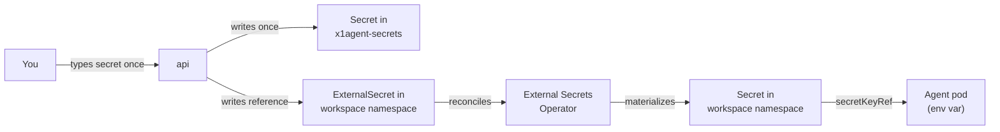

This guide stands up a fully functional x1agent stack on your laptop using OrbStack Kubernetes. You'll end up with a running cluster, one seeded admin account, the secrets your sessions need, and a browser tab showing your first agent session.

## Prerequisites

You need these on your machine. No other assumptions.

- **OrbStack** with Kubernetes enabled. The `orbstack` kube context is what x1agent targets in local dev. (`orbctl start k8s` if it isn't already up.)
- **mise** (`brew install mise` or equivalent). Every task runs through `mise run`.
- **Docker** — OrbStack provides the daemon.
- **kubectl** — the repo's `mise.toml` pins your `KUBECONFIG` to OrbStack so nothing targets the wrong cluster.

No Google Cloud account, no AWS credentials, no Vault, no SMTP server. The local quickstart runs entirely on your machine.

## What you'll need to know before you start

You'll be asked for a few things during setup. Have them ready:

- **An email address and a password** for the admin account x1agent seeds. Any valid email works — it's never sent anywhere.
- **An Anthropic API key** (`sk-ant-...`) — required. Agents run Claude via the Anthropic SDK; without the key they won't respond.
- An **OpenAI API key** (optional) — only needed if you want to use collections with vector embeddings.
- A **GitHub personal access token** (optional) — only needed if you want agents to clone private repos. For public repos, skip it.

## Run the quickstart

```bash
git clone https://github.com/x1agent/x1agent.git
cd x1agent
mise run quickstart
```

`mise run quickstart` launches a small terminal wizard that walks you through the setup. The wizard is idempotent — rerun it any time to add more secrets or reset the admin password.

### What the wizard does, screen by screen

**1. Preflight checks.** Verifies OrbStack is running, `kubectl` points at the `orbstack` context, and the Postgres + NATS pods are either up or can be stood up by `devspace`. If anything is red, it tells you what to run and stops. No partial installs.

**2. Admin account.** Email + password (masked). The wizard hashes the password with argon2id before it ever touches the database. You'll use these credentials to sign in to the web UI.

**3. Required secrets.** You're prompted for your Anthropic API key. Paste it once; the wizard writes it as a Kubernetes Secret in the dedicated `x1agent-secrets` namespace and creates an `ExternalSecret` reference so agent pods can mount it on demand. The plaintext never lands anywhere else — not in the wizard's config file, not in the repo, not in any log.

**4. Optional secrets.** OpenAI and GitHub PAT are offered next. You can skip either and add them later through the web UI. The wizard flags which features won't work without each: "Vector collections will be inactive without OpenAI", "Agents can only clone public repos without GitHub".

**5. Install + apply.** The wizard:
- Installs the [External Secrets Operator](https://external-secrets.io/) via Helm.
- Creates the `x1agent-secrets` namespace with a restrictive RBAC policy — only the x1agent api service account can read/write there.
- Applies a `ClusterSecretStore` named `x1-local` using ESO's `kubernetes` provider. This makes ESO route every secret lookup through that privileged namespace.
- Runs database migrations.
- Seeds your admin user.
- Brings up the api, app, and supporting deployments via `devspace`.

**6. Finish.** Prints the login URL (`http://localhost:4322`) and the command to tail the cluster logs if something breaks.

Total time on a warm machine: about three minutes.

## Your first session

1. Open `http://localhost:4322`, sign in with the email and password from step 2.
2. The first workspace (`default`) is seeded empty. Click **Agents** in the sidebar → **New agent**. Give it a name and runtime (`claude_code` is the only option today), leave the schedule as "Manual only", save.
3. On the agent detail page, use the **Run** card at the top. Type something like "Write a markdown hello-world and share it" and hit **Run with prompt**.
4. You should see events stream in as the agent thinks, writes a file under `/workspace`, and emits a share card inline.

If no events arrive, see [Troubleshooting](#troubleshooting) below.

## How secrets flow at runtime

The wizard's work ends when the stack is up. What the quickstart actually delivers is a loop that looks like this:



The value transits the api exactly once — on the wizard's write. From then on, it lives inside the cluster and is delivered to pods by ESO, never re-read by x1agent code. You can verify with `kubectl -n x1agent-secrets get secrets` that the values are present and `kubectl -n x1agent-ws-<id> get externalsecret,secret` that the references and materialized copies look right.

This matches the production topology. When you later want to swap the in-cluster storage for Vault, AWS Secrets Manager, or another external backend, you change the `ClusterSecretStore`'s provider config — nothing in x1agent's code, and nothing in your workspaces or agent definitions, changes. See [Secrets management](/security/secrets) for the full model and [Production deployment](/deployment/kubernetes) for the upgrade path.

## Adding more secrets after setup

Two equivalent paths:

- **Web UI** — Workspace → Settings → Secrets. Paste the value; x1agent writes the Secret + ExternalSecret as described above.
- **CLI** — `mise run quickstart` again. Detects existing setup, skips everything already configured, offers the not-yet-set secrets.

## Re-running the wizard

`mise run quickstart` is idempotent. Rerun it to:

- Change the admin password.
- Add optional secrets you skipped.
- Reseed a secret whose value changed.
- Reapply Helm values after a repo upgrade.

It never destroys state. If you want a clean slate, delete the cluster namespaces (`kubectl delete namespace x1agent x1agent-secrets 'x1agent-ws-*'`) and rerun.

## What's not in the quickstart

The local install is a single-operator, single-machine configuration. It explicitly does not cover:

- **TLS / ingress** — everything runs on `localhost`. Production deployments need ingress + certs; see [Production deployment](/deployment/kubernetes).
- **External secrets backend** — local uses the K8s provider, keeping everything in etcd. Production usually points ESO at Vault, AWS Secrets Manager, GCP Secret Manager, or similar.
- **Password reset flow** — there's no SMTP dependency. If you forget the admin password, rerun the wizard.
- **High availability** — one replica of each service. Fine for local development, not for prod.
- **Backups** — etcd is the source of truth for all local state. Back up your cluster volumes if anything matters.

## Troubleshooting

**OrbStack API stalls.** Symptoms: `kubectl` hangs or times out. Fix: `orbctl stop k8s && orbctl start k8s`, or fully restart the OrbStack app. Do not fall back to raw Docker containers — local dev requires OrbStack.

**Postgres says "too many clients already".** Restart the api pod: `kubectl -n x1agent rollout restart deploy/api-devspace`. A known dev-mode issue when many hot reloads stack tick loops — the fix is a single restart.

**Agent pod stuck in "pending".** Usually a missing image. Rebuild from the repo: `devspace build -b agent,sidecar -n x1agent`. New sessions pick up the rebuild; in-flight sessions keep their old image.

**Session starts but agent says "Not logged in · Please run /login".** The Anthropic key wasn't set correctly. Rerun `mise run quickstart` and re-enter the key at the secrets step.

**Blank session viewer.** Usually Vite's pre-bundle cache is stale. Hard refresh the browser (`Cmd+Shift+R`); if it persists, restart the app pod.

## Next steps

- [Create your first agent](/getting-started/first-agent) — set a schedule, attach a repo, connect a collection.
- [Secrets management](/security/secrets) — the full model behind what the wizard just did.
- [Production deployment](/deployment/kubernetes) — take this stack to a real cluster.
- [Security model](/security/overview) — trust boundaries, credential isolation, permission grants.
