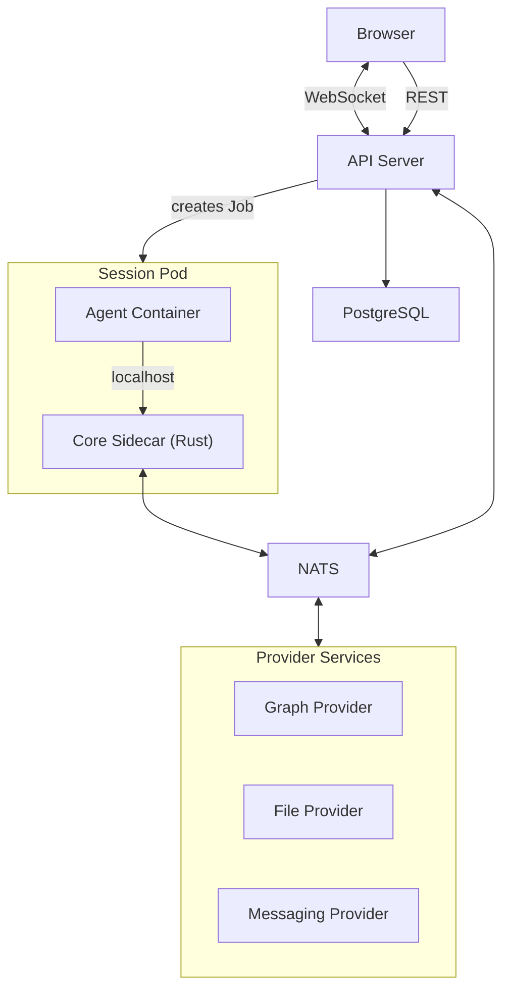

x1agent is a Kubernetes-native platform for running LLM agents in production. It provides a security-first container architecture, a pluggable provider system, and real-time bidirectional communication between agents and clients.

## Core ideas

**Agents run in isolated pods.** Each agent session is a Kubernetes Job with two containers: an agent container (untrusted, runs the LLM) and a sidecar container (trusted, holds credentials, enforces permissions). The agent container receives zero secrets — credentials live in the sidecar and are exchanged through the credential proxy. See [Quickstart](/getting-started/quickstart) for local-development setup.

**Providers are swappable.** Authentication, knowledge graphs, file storage, messaging, calendars, email -- all pluggable. Providers are standalone services that communicate over NATS. Switch from Google Drive to OneDrive by changing a Helm value.

**Security is structural, not aspirational.** Credential isolation, permission gates, and trust boundaries are enforced by container boundaries and network policy -- not application-level checks that can be bypassed.

## Architecture at a glance

## Next steps

- [Quickstart](/getting-started/quickstart) -- run x1agent locally in under 5 minutes
- [Architecture](/architecture/overview) -- understand the pod model, communication paths, and trust boundaries
- [Providers](/providers/overview) -- how the plugin system works
- [Security](/security/overview) -- the security model in detail
