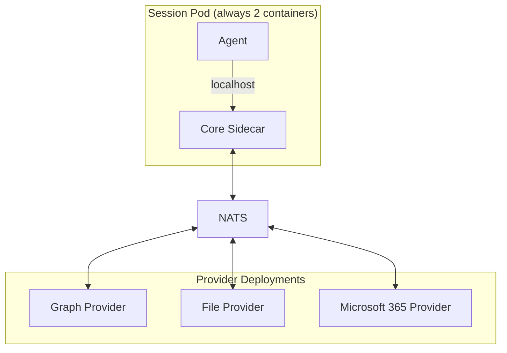

Providers are the pluggable parts of x1agent. Each provider implements a defined contract for a specific domain -- authentication, knowledge graphs, file storage, messaging, and so on. Providers are standalone services that communicate with the core sidecar over NATS.

## Provider domains

| Domain | What it controls | Reference provider |
|--------|-----------------|-------------------|
| `auth` | SSO, identity, token issuance | Google OAuth |
| `graph` | Knowledge graph storage and queries | SurrealDB |
| `files` | External file sync and browsing | Google Drive |
| `documents` | Structured document read/write (Docs, Sheets, Word Online, Excel Online) | Google Workspace |
| `messaging` | Chat platform integration | Slack |
| `calendar` | Calendar read/write | Google Calendar |
| `email` | Email send/read | Gmail |
| `ai` | LLM API routing and proxying | Anthropic (direct) |
| `storage` | Object storage for session artifacts | GCS |
| `vector` | Vector search backend | Turbopuffer |
| `preview` | Ephemeral deploy targets for E2E testing of agent-authored code | Local Kubernetes |

Each domain has a defined NATS request/reply contract. A provider implements one or more domains.

## How providers connect

Providers are Kubernetes Deployments that subscribe to NATS subjects. They are not containers in the session pod. This is a deliberate architectural choice -- see [Security: Provider isolation](/security/provider-isolation) for why.



The sidecar publishes requests to provider subjects (e.g., `x1.provider.graph.query`). The provider subscribes, handles the request, and replies. Standard NATS request/reply.

## Multi-domain providers

A single provider service can implement multiple domains. A Microsoft 365 provider could handle files (OneDrive), calendar (Outlook), email (Outlook), and messaging (Teams) -- all from one deployment. It subscribes to multiple NATS subject prefixes:

```
x1.provider.files.*       -- OneDrive file operations
x1.provider.calendar.*    -- Outlook calendar operations
x1.provider.email.*       -- Outlook email operations
x1.provider.messaging.*   -- Teams messaging operations
```

Domains are filled independently. You can use the Microsoft 365 provider for files and calendar, but Google for email. The sidecar routes each domain to whatever provider subscribes to that subject.

## Configuration

Provider selection is driven by Helm values:

```yaml
providers:
  graph:
    type: surrealdb
    config:
      url: "http://surrealdb:8000"

  files:
    type: gdrive
    # No extra config -- uses OAuth tokens via credential proxy

  messaging:
    type: slack
    config:
      clientId: "..."
      # clientSecret via K8s Secret

  calendar:
    type: google
```

Each provider type maps to a Deployment that gets created (or already exists) in the cluster. The provider reads its domain-specific config from environment variables.

## Provider discovery

Providers are discovered through NATS subscriptions. When the sidecar needs to make a graph query, it publishes to `x1.provider.graph.query`. If a provider is subscribed, the request is handled. If nothing is subscribed, the request times out and the sidecar returns an error to the agent.

This means:
- No central provider registry to maintain
- Providers can be added and removed without restarting the sidecar
- Health is observable -- if a provider stops responding, NATS request timeouts surface immediately

## Credential handling

Providers never receive user OAuth tokens directly. When a provider needs to call an external API (OneDrive, Google Calendar, etc.), it sends a proxy request through the sidecar. The sidecar fetches the user's token, injects it into the outbound request, and returns the response. The provider sees the data but never the credential.

See [Security: Credential proxy](/security/credential-proxy) for the full flow.

## Lifecycle hooks

Providers can subscribe to session lifecycle events:

```
x1.session.{id}.lifecycle.started     -- session pod is running
x1.session.{id}.lifecycle.completed   -- session finished normally
x1.session.{id}.lifecycle.failed      -- session errored
```

Multiple providers can subscribe to the same lifecycle events. A file provider might sync files on `started` and sync back on `completed`. A messaging provider might post a notification on `completed`. The sidecar publishes once; every interested provider receives it.

## Writing a provider

See [Provider authoring guide](/providers/authoring) for the full walkthrough. The short version:

1. Pick the domain(s) your provider implements.
2. Subscribe to the corresponding NATS subjects.
3. Implement the request/reply contract for each domain.
4. For external API calls, use the credential proxy.
5. Ship as an OCI image.
6. Document the config your provider needs.

Providers can be written in any language that has a NATS client library.
