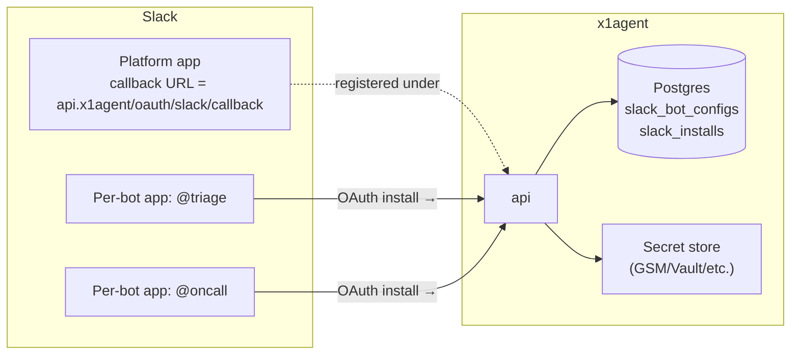

x1agent talks to Slack at two levels:

1. **Platform Slack app** — one per x1agent installation. Registered once by the operator. Owns the OAuth callback URL, the signing secret, and the request URL Slack delivers events to.
2. **Per-bot Slack apps** — one per bot configured by an end user inside an x1agent workspace. Each one has its own display name (`@triage`, `@oncall`), is generated at runtime via Slack's manifest URL pattern, and reuses the platform app's callback URL.

This page is the operator setup. End users creating bots inside the running platform see the per-bot UI under workspace settings — the platform app is invisible to them.

## Architecture at a glance



The platform app exists for one reason: end users need a public OAuth callback URL that Slack will deliver tokens back to. Every per-bot app the platform generates carries the same callback URL, so all installs flow into one handler.

## Platform app — register once

You need three values from Slack:

- `client_id`
- `client_secret`
- `signing_secret`

These live in the secret store (GSM on GCP, Secrets Manager on AWS, Vault on self-managed). They are read by the api service at startup.

The api looks up these env var names. On a Helm install, External Secrets syncs them from the GSM secret names below into the `x1agent-secrets` bundle that the api consumes via `envFrom`:

| Env var | GSM secret name |
|---|---|
| `SLACK_PLATFORM_CLIENT_ID` | `x1agent-slack-platform-client-id` |
| `SLACK_PLATFORM_CLIENT_SECRET` | `x1agent-slack-platform-client-secret` |
| `SLACK_PLATFORM_SIGNING_SECRET` | `x1agent-slack-platform-signing-secret` |

Until all three are populated, the workspace settings UI shows the bot creation flow but the OAuth callback returns 500 — the api can't redeem the install code without the platform credentials.

### Steps

1. Sign in to [api.slack.com/apps](https://api.slack.com/apps) under whichever Slack workspace you want to administer the app from. This is the **owning** Slack workspace — it is *not* a runtime constraint, it just gives an admin somewhere to edit the app definition. Most operators register under their own org's Slack.

2. Create an app **from manifest**. Paste the manifest below, substituting your install's base domain.

   ```yaml
   display_information:
     name: x1agent platform
     description: Platform Slack app for x1agent. Routes per-bot installs.
   oauth_config:
     redirect_urls:
       - https://api.YOUR-BASE-DOMAIN/oauth/slack/callback
     scopes:
       bot: []
   settings:
     org_deploy_enabled: false
     socket_mode_enabled: false
     token_rotation_enabled: false
   ```

   The bot scopes here are intentionally empty. The platform app does **not** install into any Slack workspace — it only owns the callback URL. Per-bot apps carry their own scopes.

3. After Slack creates the app, mark it **distributable** under "Manage Distribution" → "Public Distribution". This is required for end users in other Slack orgs to install bots that share the platform callback.

4. From the app's "Basic Information" page, copy:
   - Client ID
   - Client Secret
   - Signing Secret

5. Hand them to the installer:

   ```sh
   mise run slack:configure
   ```

   The configurator writes them to your secret store under the keys `slack/platform/client_id`, `slack/platform/client_secret`, `slack/platform/signing_secret`. Restart the api deployment so it picks them up.

That's the entire platform setup. You do it once per x1agent install. End users never touch this.

## How per-bot onboarding works

When an end user inside an x1agent workspace creates a bot, the api:

1. Generates a Slack app **manifest** with their chosen bot name, the explicit-invocation scopes (`app_mentions:read`, `chat:write`, `im:history`, `im:read`, `im:write`, `users:read`), and the platform's callback URL.
2. URL-encodes the manifest and constructs a one-click link:

   ```
   https://api.slack.com/apps?new_app=1&manifest_yaml=<encoded>
   ```

3. Returns the link to the browser. Clicking it opens Slack's app-creation flow with the manifest pre-filled. The user picks which Slack workspace to install into, confirms scopes, and is redirected back to your callback URL.
4. The api's `/oauth/slack/callback` exchanges the code for a bot token, persists `slack_installs` (team_id, bot_token, links to the bot config), and returns the user to x1agent.

### One paste-back step

Slack's OAuth response returns the bot token, the `app_id`, and the `bot_user_id` — but NOT the **signing secret** that's needed to verify inbound events. The settings UI surfaces an "Almost done" card after the install completes, asking the user to paste the signing secret from `api.slack.com/apps/<app_id>/general` → "Basic Information" → "Signing Secret". The string is encrypted at rest with the same master key as workspace secrets and stored in `slack_bot_configs.signing_secret_*`.

Without the signing secret, the events endpoint cannot HMAC-verify inbound events from Slack — `app_mention` and DM messages won't reach any agent.

No channel picker. Channel registration happens lazily — the first time the user `@mentions` the bot in a channel, or the bot is invited to a channel, the inbound event handler records the channel id against the install.

## Self-host vs hosted

| | Self-hosted | x1agent.com |
|---|---|---|
| Platform app owner | The operator's Slack workspace | x1agent's Slack workspace |
| Platform app registered | Once, at install time | Once, by us |
| Callback URL | `api.<your-domain>/oauth/slack/callback` | `api.x1agent.com/oauth/slack/callback` |
| Operator action required | Yes (above steps) | No |

Self-hosted operators carry their own platform app because the callback URL is on their domain. There is no shared platform app — every x1agent install has its own.

## Storage and revocation

- **Bot tokens** are encrypted at rest in `slack_installs.bot_token_enc`. The encryption key lives in the secret store; the api decrypts in-memory only when posting messages.
- **Uninstall** marks the install row revoked and zeroes the token. The bot config row stays for audit. Re-installing the same bot config produces a new install row.
- **Token rotation** is off by default. Slack's rotated tokens add complexity that pays off only at much larger fleet sizes — revisit when bot count crosses a threshold.

## What this page is not

This page does not document the inbound event handler, the per-bot manifest schema, or the agent-bot pairing UX. Those live under [Architecture: Messaging](/architecture/overview) and the in-app workspace settings.
