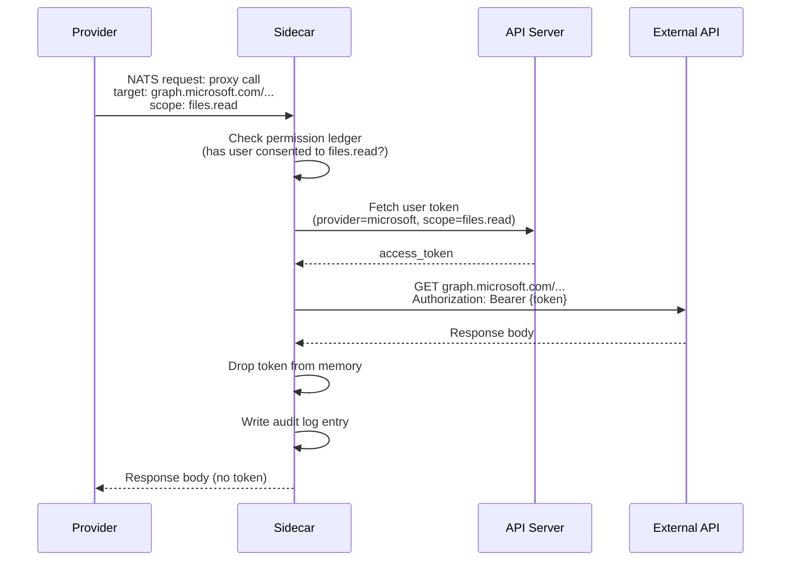

Providers need to call external APIs (OneDrive, Google Calendar, Slack, etc.) on behalf of users. These APIs require OAuth tokens. But providers are [untrusted](/security/overview) -- they must not hold user credentials.

The sidecar solves this by acting as a credential-injecting proxy.

## How it works



1. The provider sends a proxy request over NATS. The request contains the target URL, HTTP method, body, and the OAuth scope needed.
2. The sidecar checks the permission ledger. If the user hasn't consented to this scope, the request is rejected.
3. The sidecar fetches the user's OAuth token from the API server.
4. The sidecar makes the external API call with the token injected as an `Authorization` header.
5. The sidecar returns the response body to the provider. The token is dropped from memory.
6. The sidecar writes an audit log entry: who, what scope, which external API, when.

The provider sees the data (file listings, calendar events, email bodies) but never sees the token.

## Two classes of credentials

**User credentials** (OAuth tokens, user-scoped API keys) -- never leave the sidecar. Always proxied. This is the mechanism described above.

**Infrastructure credentials** (database passwords, provider-specific service API keys) -- belong to the provider's own backing service. Passed to the provider via Kubernetes Secrets as environment variables. The operator explicitly chooses to trust the provider with its own infrastructure credentials. This is the same trust model as any container in a Kubernetes cluster connecting to its own database.

```yaml
# Example: Neo4j provider receives its own DB credentials
containers:
  - name: neo4j-provider
    image: ghcr.io/x1agent/provider-neo4j:v1.0.0
    env:
      - name: NEO4J_URI
        valueFrom:
          secretKeyRef:
            name: neo4j-creds
            key: uri
      - name: NEO4J_PASSWORD
        valueFrom:
          secretKeyRef:
            name: neo4j-creds
            key: password
      # No user tokens. No JWT_SECRET. No ANTHROPIC_API_KEY.
```

## Scope enforcement

The proxy request includes a `scope` field (e.g., `files.read`, `calendar.write`, `email.send`). The sidecar checks this against the permission ledger before proceeding. If the user hasn't granted this scope for the current session, the request fails immediately.

Scopes are registered by providers at startup. Each provider declares the scopes it needs. The sidecar's scope catalog is built from these registrations. The permission consent UI uses the catalog to show human-readable descriptions of what each scope allows.
