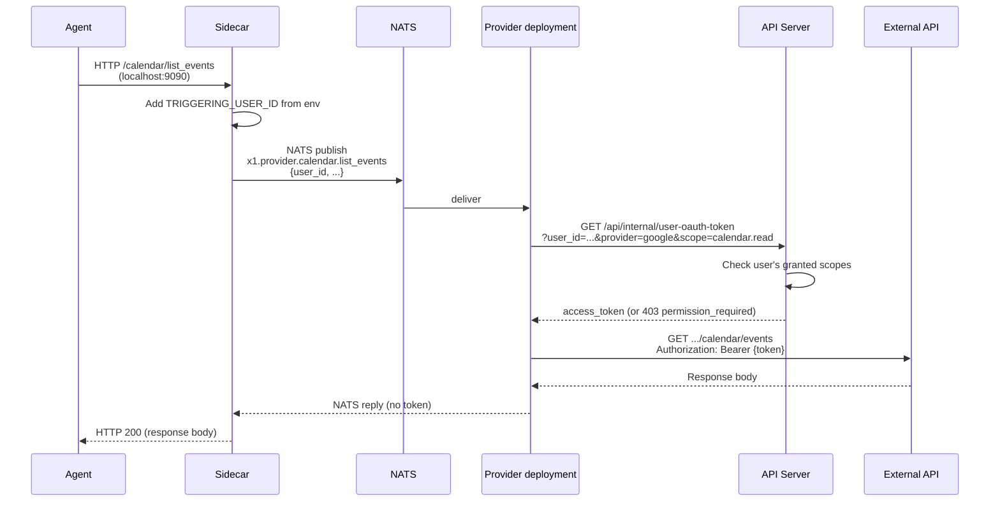

Providers need to call external APIs (OneDrive, Google Calendar, Slack, etc.) on behalf of users. These APIs require OAuth tokens. But providers are [untrusted](/security/overview) -- they must not hold user credentials.

The sidecar solves this by acting as a credential-injecting proxy.

## How it works



1. The agent calls a tool on its sidecar over localhost (e.g. `/calendar/list_events`).
2. The sidecar attaches the active user's id (from `TRIGGERING_USER_ID` env, set by the api at session-launch) and forwards the request to the provider over NATS.
3. The provider asks the api for a user-OAuth token via `/api/internal/user-oauth-token`, optionally including the scope being exercised.
4. The api enforces scope: if the user hasn't granted this scope, it returns 403 `permission_required`. Otherwise it returns a fresh access token (refreshed if near expiry).
5. The provider makes the external API call with the token in an `Authorization` header.
6. The provider returns the response body via NATS. The sidecar relays it to the agent.

The token is held by the provider for the duration of one outbound call. The agent never sees it.

### What this does not protect against

- **Compromised provider.** The provider deployment holds the user's
  access token transiently for each call it makes. A compromised provider
  can exfiltrate every token it's asked to use. NATS subject ACLs limit
  which providers can request which subjects but do not protect the token
  payload itself.
- **Sidecar-side scope check.** Per-tool sidecar handlers (calendar,
  email, files, sheets, docs) do not currently re-check scope before
  forwarding the agent's call. Scope enforcement lives at the api's
  `/api/internal/user-oauth-token` endpoint. A future hardening adds
  an in-pod ledger cache so the sidecar can fail-fast.

## Two classes of credentials

**User credentials** (OAuth tokens, user-scoped API keys) -- never leave the sidecar. Always proxied. This is the mechanism described above.

**Infrastructure credentials** (database passwords, provider-specific service API keys) -- belong to the provider's own backing service. Passed to the provider via Kubernetes Secrets as environment variables. The operator explicitly chooses to trust the provider with its own infrastructure credentials. This is the same trust model as any container in a Kubernetes cluster connecting to its own database.

```yaml
# Example: Neo4j provider receives its own DB credentials
containers:
  - name: neo4j-provider
    image: ghcr.io/x1agent/provider-neo4j:v1.0.0
    env:
      - name: NEO4J_URI
        valueFrom:
          secretKeyRef:
            name: neo4j-creds
            key: uri
      - name: NEO4J_PASSWORD
        valueFrom:
          secretKeyRef:
            name: neo4j-creds
            key: password
      # No user tokens. No JWT_SECRET. No ANTHROPIC_API_KEY.
```

## Scope enforcement

The proxy request includes a `scope` field (e.g., `files.read`, `calendar.write`, `email.send`). The sidecar checks this against the permission ledger before proceeding. If the user hasn't granted this scope for the current session, the request fails immediately.

Scopes are registered by providers at startup. Each provider declares the scopes it needs. The sidecar's scope catalog is built from these registrations. The permission consent UI uses the catalog to show human-readable descriptions of what each scope allows.

## Related: Git repository access

The same trust-boundary pattern applies to git credentials. GitHub App installs are installed once at broad scope; x1agent narrows per-attachment at the sidecar, not at GitHub. See [Repository Access](/security/repo-access) for the attachment model, the `allow_push` gate, and why the working tree is always agent-writable.
