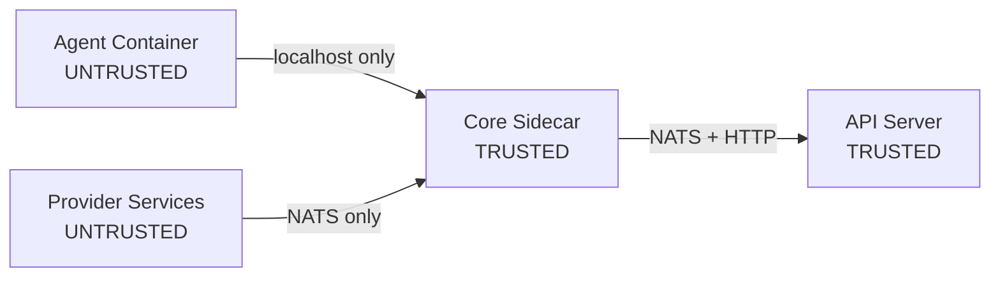

x1agent treats the agent container as fundamentally untrusted. LLMs can be prompt-injected. A compromised agent should not be able to exfiltrate credentials, access unauthorized data, or impersonate a user.

Security is enforced by container boundaries and network policy -- not by application-level checks that a compromised process could bypass.

## Trust levels

| Component | Trust level | What it can access |
|-----------|------------|-------------------|
| Agent container | Untrusted | Localhost sidecar, `/workspace` volume. Nothing else. |
| Provider services | Untrusted | NATS for x1agent traffic; egress to their own backing service / upstream API as configured. No user credentials at rest. |
| Core sidecar | Trusted | API internal token, NATS (mTLS), per-call user-OAuth tokens (transiently, on the gh/git path). |
| API server | Trusted | Database, credential store, K8s API. |

## Six principles

These are architectural invariants. Features that violate them are redesigned, not shipped.

### 1. Credentials never enter untrusted containers — by default

No API keys, OAuth tokens, or database credentials in the agent container or provider containers as the default posture. The sidecar fetches user tokens per-request, uses them, and drops them. The agent receives only a `SESSION_ID` and a localhost URL for the sidecar.

Three explicit exceptions exist, all operator-controlled:

- **MCP-mediated secrets** land in the MCP server's container, not the agent container. The agent calls MCP tools that internally use the credential. See [MCP servers](/providers/mcp-servers).
- **Zone-2 agent env** is an explicit operator grant — the workspace admin maps a workspace secret to an env var the agent container will see. Used when the agent itself needs to be the authenticated principal (its own API key, its own GitHub PAT). Threat model + UI signals: [Agent env injection](/security/agent-env).
- **Anthropic API key (api_key install path)** — when `anthropic.provider=api_key` (the default for non-Vertex installs), the platform Anthropic key is injected as `ANTHROPIC_API_KEY` directly on the agent container. Vertex installs avoid this via Workload Identity. Operators on the api_key path should treat the agent container's egress to `api.anthropic.com` as in-scope for their threat model.

Each pod sees only the variables we chose to inject — no wildcard mounts, no access to any other secret in its namespace. See [Secrets management](/security/secrets) for the underlying storage model.

### 2. The sidecar is the trust boundary

The sidecar is compiled Rust with no LLM, no dynamic code loading, and a small attack surface. All external API calls route through it. All permission checks happen in it. All operations are logged by it.

### 3. Sensitive operations require user consent

Sessions start with zero grants. When an agent needs calendar access, file access, or email -- it calls `request_permission`. The sidecar publishes a consent dialog to the user. The user approves or denies. Only then does the sidecar unlock the capability. Grants are per-session, per-user, per-scope.

### 4. Operations are attributed to users

Every tool call is attributed to the active user's verified identity. The sidecar tracks which user is active per conversation turn. Alice's permission grants do not apply to Bob's messages in the same session.

### 5. Signing keys stay in trusted components

`JWT_SECRET` lives only in the API server. The agent cannot forge
permission approvals: every grant is a row in `permission_grants`
written by the api in response to a user-authenticated POST, and
the runtime check joins on `consumed_at IS NULL AND revoked_at IS NULL`
in a single atomic UPDATE. See [Permission grants](/security/permission-grants).

### 6. Workspace secrets are AES-256-GCM ciphertext in Postgres

Workspace secrets entered through the x1agent UI are encrypted with a
per-install master key (`WORKSPACE_SECRETS_MASTER_KEY`) and stored as
ciphertext in Postgres. The api decrypts in-process at session-launch
and writes plaintext into a per-session Kubernetes Secret consumed by
the agent pod via `envFrom`.

Install-wide platform secrets (the platform Anthropic key, Sentry DSNs,
postgres password, JWT_SECRET) are bridged from a cloud KMS / Vault /
other backend via the External Secrets Operator into a single
`x1agent-secrets` Kubernetes Secret consumed by the api Deployment.

See [Secrets management](/security/secrets) for the full pipeline,
master-key handling, scoping rules, and rotation procedure.
