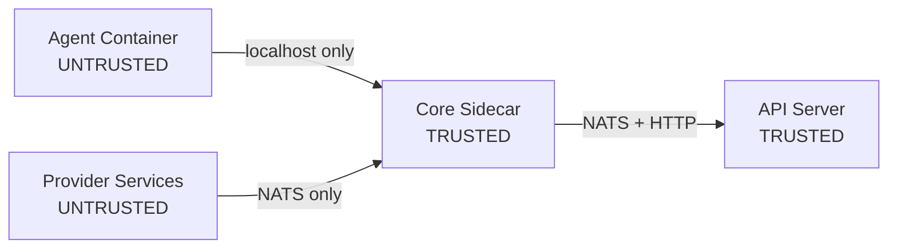

x1agent treats the agent container as fundamentally untrusted. LLMs can be prompt-injected. A compromised agent should not be able to exfiltrate credentials, access unauthorized data, or impersonate a user.

Security is enforced by container boundaries and network policy -- not by application-level checks that a compromised process could bypass.

## Trust levels

| Component | Trust level | What it can access |
|-----------|------------|-------------------|
| Agent container | Untrusted | Localhost sidecar, `/workspace` volume. Nothing else. |
| Provider services | Untrusted | NATS subjects for their domain. No user credentials. |
| Core sidecar | Trusted | User tokens (transiently), NATS, JWT signing. |
| API server | Trusted | Database, credential store, K8s API. |

## Five principles

These are architectural invariants. Features that violate them are redesigned, not shipped.

### 1. Credentials never enter untrusted containers

No API keys, OAuth tokens, or database credentials in the agent container or provider containers. The sidecar fetches user tokens per-request, uses them, and drops them. The agent receives only a `SESSION_ID` and a localhost URL for the sidecar.

### 2. The sidecar is the trust boundary

The sidecar is compiled Rust with no LLM, no dynamic code loading, and a small attack surface. All external API calls route through it. All permission checks happen in it. All operations are logged by it.

### 3. Sensitive operations require user consent

Sessions start with zero grants. When an agent needs calendar access, file access, or email -- it calls `request_permission`. The sidecar publishes a consent dialog to the user. The user approves or denies. Only then does the sidecar unlock the capability. Grants are per-session, per-user, per-scope.

### 4. Operations are attributed to users

Every tool call is attributed to the active user's verified identity. The sidecar tracks which user is active per conversation turn. Alice's permission grants do not apply to Bob's messages in the same session.

### 5. Signing keys stay in trusted components

`JWT_SECRET` lives only in the API server and sidecar. The agent cannot forge permission approvals. Consent tokens are single-use with a 5-minute TTL.
