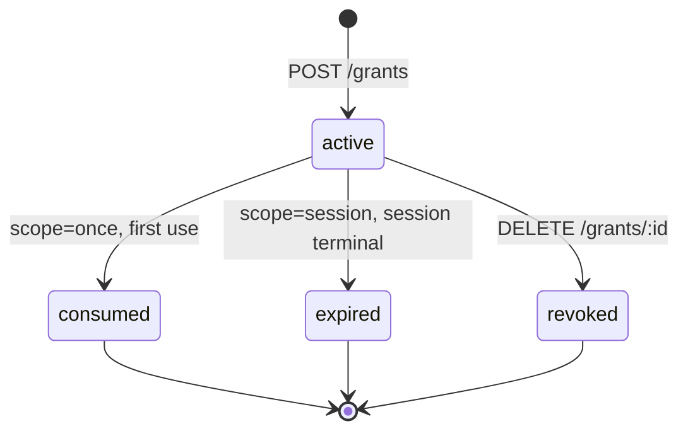
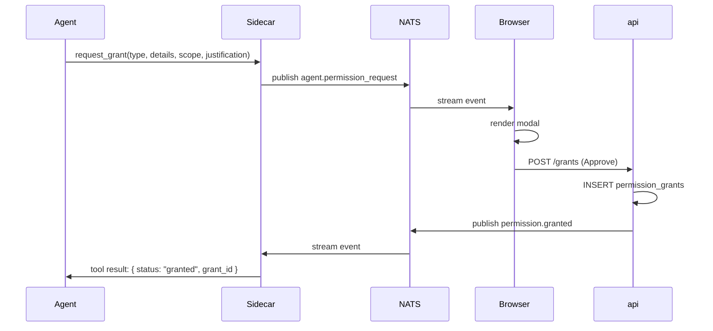

Most platforms end up with a pile of one-off permission tables — one for OAuth scopes, one for feature flags, one for agent spawns, one for per-session tool overrides. We don't. Every "the holder of this grant is allowed to do this thing" lives in a single `permission_grants` table. New capabilities add a grant type; they do not add a table.

This page defines the grant model, the schema, the lifecycle, the current grant types, and the rules for adding new ones. Spawn permissions are covered in [Orchestration](../architecture/orchestration); tool-scope permissions are covered in [Credential proxy](./credential-proxy) from the credential-handling angle. This page is the authoritative source for what the grant record itself looks like.

## A grant row is two records in one

Before the schema, the important conceptual split:

- **Audit side.** `granted_at`, `granted_by_user_id`, `details`, `reason`. Written once on insert. Never mutated. Records the historical fact that a human approved this specific capability for this specific subject at this specific time. The row stays in the table forever; soft-deletes only touch the validity side.
- **Validity side.** `scope`, `consumed_at`, `revoked_at`, and a session join when `scope='session'`. Controls whether a future tool call at runtime still sees the grant as active. Consuming or revoking a grant does not erase the audit record.

The two sides live in the same row because they describe the same event. The separation matters only because people sometimes conflate them: "did I approve this?" and "can it be used again?" are different questions with different answers.

## Why one table

A permission grant is always answering the same runtime question: "Is this caller allowed to do this thing right now?" The answer has the same shape every time:

- **Subject.** Who holds the grant. A user, or an agent acting on its own.
- **Grant type.** What kind of capability: `spawn`, `tool_scope`, something else.
- **Details.** Type-specific state — which agent id, which OAuth scope, etc.
- **Lifetime.** One call, this session, or standing.
- **Audit.** Who granted it and when.

Five columns in every permission decision. Collapsing them into one table lets the rest of the system have one endpoint, one revoke button, one audit query, and one place to reason about "why is the caller allowed to do this right now."

## Schema

```sql
CREATE TABLE permission_grants (
  id UUID PRIMARY KEY DEFAULT uuidv7(),
  workspace_id UUID NOT NULL REFERENCES workspaces(id) ON DELETE CASCADE,

  -- who holds the grant (exactly one is non-null — enforced by CHECK).
  -- Splitting into two columns lets Postgres enforce the foreign key
  -- on either side. A single polymorphic subject_id couldn't.
  user_subject_id  UUID REFERENCES users(id)  ON DELETE CASCADE,
  agent_subject_id UUID REFERENCES agents(id) ON DELETE CASCADE,

  -- what they're allowed to do
  grant_type TEXT NOT NULL,
  details JSONB NOT NULL DEFAULT '{}'::jsonb,

  -- validity
  scope TEXT NOT NULL CHECK (scope IN ('once', 'session', 'persistent')),
  session_id UUID REFERENCES sessions(id) ON DELETE CASCADE,
  consumed_at TIMESTAMPTZ,
  revoked_at TIMESTAMPTZ,

  -- audit
  granted_by_user_id UUID NOT NULL REFERENCES users(id),
  granted_at TIMESTAMPTZ NOT NULL DEFAULT now(),
  reason TEXT,

  -- invariants
  CHECK (num_nonnulls(user_subject_id, agent_subject_id) = 1),
  CHECK (
    (scope = 'session'             AND session_id IS NOT NULL) OR
    (scope IN ('once','persistent') AND session_id IS NULL)
  )
);

CREATE INDEX permission_grants_agent_active_idx
  ON permission_grants(agent_subject_id, grant_type)
  WHERE agent_subject_id IS NOT NULL
    AND revoked_at IS NULL
    AND consumed_at IS NULL;

CREATE INDEX permission_grants_user_active_idx
  ON permission_grants(user_subject_id, grant_type)
  WHERE user_subject_id IS NOT NULL
    AND revoked_at IS NULL
    AND consumed_at IS NULL;
```

The two subject columns are ugly in writes — every insert fills exactly one of them — and clean in reads. Postgres enforces foreign keys on both sides, so a user or agent deletion cascades to their grants automatically. No cleanup scripts, no orphan rows.

The partial indexes on active grants are the hot path for "does this subject have this grant." Revoked rows fall out without a separate archive table.

## Lifecycle



Three scopes. Each one answers a different question about how long the user's approval is valid.

### `once` — approve exactly one tool call

Used for sensitive, discrete actions where the user wants tight control. Sending an email to a specific person. Deleting a named folder. Creating a calendar event. The user's approval covers this one call and nothing more; a second attempt a second later triggers a fresh dialog.

Enforced by `consumed_at`. The permission check and the consume happen in a single atomic `UPDATE`:

```sql
UPDATE permission_grants
SET consumed_at = now()
WHERE id = $1 AND consumed_at IS NULL AND revoked_at IS NULL
RETURNING id;
```

Two concurrent tool calls racing on the same `once` grant get exactly one winner — the other gets zero rows back and returns `permission_required` to the agent.

### `session` — approve for the duration of this session

Used for accumulating scopes that get exercised repeatedly during one run. `git.write` during a refactor session. `gmail.read` while the agent triages an inbox. The user is saying "I trust this session to use this capability until the conversation ends."

The runtime check joins `sessions.status`; when the session terminates, the grant is effectively gone. No reaper required.

### `persistent` — standing approval

Used for configuration an admin sets deliberately and rarely. "This orchestrator is always allowed to spawn the code-writer agent." Revoked explicitly when the admin changes their mind — sets `revoked_at` via `DELETE /grants/:id`.

### Which to pick

| You want…                                   | Scope        |
|---------------------------------------------|--------------|
| A single, discrete sensitive action         | `once`       |
| A capability usable throughout one session  | `session`    |
| Standing configuration set by an admin      | `persistent` |

If you don't know: `once` is safest, `session` is friendliest, `persistent` is for config. They don't overlap in practice.

### What revoke does to each

Revoke is a soft delete: `UPDATE … SET revoked_at = now()`. The row stays for audit. A revoked grant's `consumed_at` is unchanged — if the grant was consumed before revoke, both timestamps are recorded and the row is kept forever.

## Grant types

Each grant type owns a Zod schema for its `details` shape. The application layer validates on insert and on read. Unknown fields reject; missing fields reject. `details` is a tagged union by convention, not a jsonb free-for-all.

### `spawn`

The holder may create a session of the named agent.

```ts
const spawnDetails = z.object({
  child_agent_id: z.string().uuid(),
});
```

Subject is always an `agent` (the parent). The edit-screen allowlist writes these with `scope='persistent'`; runtime request-at-dialog writes them with `scope='session'`. See [Orchestration](../architecture/orchestration).

### `tool_scope`

The holder may call tools that gate on the named scope (e.g. `git.write`, `gmail.read`). Subject is either a `user` (scope applies to every session they drive) or an `agent` (scope applies to that agent's sessions).

```ts
const toolScopeDetails = z.object({
  scope: z.string().regex(/^[a-z]+(\.[a-z]+)+$/),  // e.g. "git.write"
});
```

The sidecar's permission ledger reads from this table at session start and holds an in-memory cache; the runtime `request_permission` MCP tool writes new grants via the same POST endpoint the edit screen uses.

### Adding a new grant type

Four mechanical steps:

1. Define a Zod schema for `details` in `packages/domains/permissions/domain/`.
2. Register it in the `GrantTypeRegistry` map used by `validateGrant()`.
3. Add a section on this page describing the shape and the semantics.
4. Nothing else. No migration, no new table, no new endpoint.

## API surface

Three endpoints. All user-authenticated — no `X-Internal-Token` path.

```
POST   /api/workspaces/:slug/grants
       { user_subject_id? | agent_subject_id?,
         grant_type, details, scope, session_id?, reason? }
       → { grant }

GET    /api/workspaces/:slug/grants?user_subject_id=...
                                  &agent_subject_id=...
                                  &grant_type=...
                                  &include_revoked=false
       → { grants: [...] }

DELETE /api/workspaces/:slug/grants/:id
       → { ok: true }   # sets revoked_at
```

The settings page renders the GET as a single table filtered per workspace member or per agent. The revoke button hits DELETE. There is no UI for POST that doesn't flow through an agent's dialog or the agent edit screen — grants don't appear out of thin air.

## The "only humans grant" invariant

There is exactly one way for a grant to be created: a user authenticated to the api. Every other path — sidecar, MCP, scheduler — is gated.

- The `POST /grants` endpoint requires the session JWT cookie. `X-Internal-Token` is not accepted.
- An agent that wants a new grant calls `request_grant(grant_type, details, scope, justification)`. One MCP tool handles every grant type — spawn, tool_scope, anything else we add — because the underlying `details` is a tagged union anyway. The sidecar handler does not write to the grants table; it publishes `agent.permission_request` and waits. The user sees a modal on the session detail page, clicks Approve, and the browser's Approve hits `POST /grants`.
- Orchestrators cannot call these endpoints on behalf of their children. A child that wants a grant asks through its own `report_to_parent` → orchestrator → `request_grant` chain, which still ultimately surfaces a modal to the user.

This invariant is not an aspiration. It is the reason `permission_grants` has exactly one write endpoint and the internal-token path is physically absent.

## Runtime request flow



The flow is one round-trip of "agent asks → user approves → agent is told." Deny follows the same shape with `permission.denied`. The agent sees the decision as the tool call's return value.

Workspaces can disable this flow for stricter postures via a workspace setting `allow_runtime_permission_requests = false`. When off, the MCP tools return `runtime_requests_disabled`; grants can only be created through the agent edit screen, the workspace settings page, or a user hitting the api directly.

## Audit

```sql
SELECT
  g.granted_at,
  u.email AS granted_by,
  g.grant_type,
  g.details,
  g.scope,
  g.subject_type, g.subject_id,
  g.revoked_at, g.consumed_at,
  g.reason
FROM permission_grants g
JOIN users u ON u.id = g.granted_by_user_id
WHERE g.workspace_id = $1
ORDER BY g.granted_at DESC;
```

One query answers "what's the complete permission history of this workspace." Run it daily, pipe to a log, page a human when a `persistent` grant is created outside business hours. The audit layer is the absence of plumbing, not the presence of it.

## Out of scope

- **Group subjects.** A grant's subject is a single user or a single agent. "Everyone in the workspace" is approximated by granting per-user.
- **Role-derived grants.** Workspace roles (`admin`, `member`) gate which endpoints a user can hit; they do not synthesize grants. A workspace admin still has to explicitly grant `spawn` to an orchestrator.
- **Conditional grants.** No "allowed only if X," no rate limits on the grant itself. Rate limits belong on the tools.
- **Delegation.** An agent cannot pass a grant to another agent. Grants are non-transferable.
