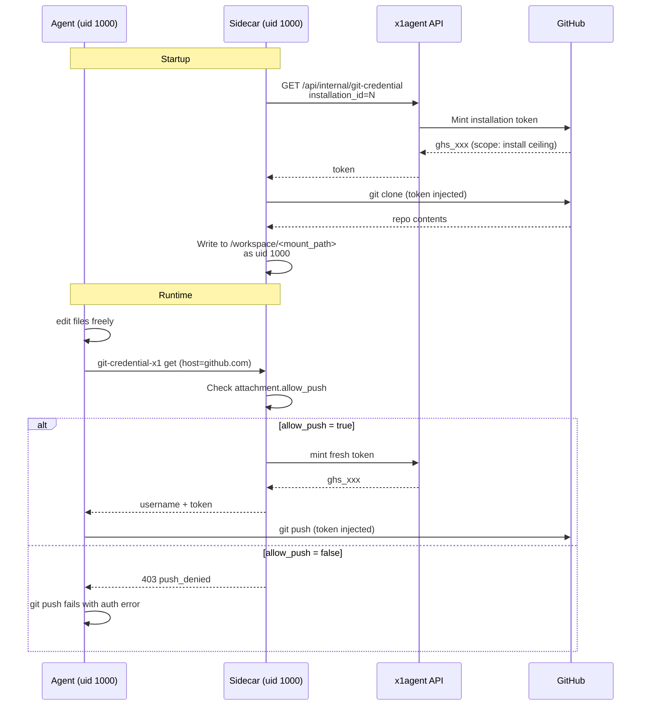

Agents need to edit code. Some agents need to push it. Most don't. This page describes how x1agent gives an agent a writable checkout of a repository, and how push capability is gated independently — without relying on GitHub's own scope model to do the gating.

`allow_push` ships. New attachments default to `false` (safe-by-default).
Pre-migration attachments were backfilled to `true` to avoid breaking
running sessions. Operators flip per-repo via the agent edit screen or
the api. Sidecar enforces in `git.rs` — when no attached repo on the
session has `allow_push=true`, the credential helper returns
`403 push_denied`.

### Caveat: today's gate is per-session, not per-repo

The sidecar's check (`packages/sidecar/src/git.rs`) is coarse: if ANY
attached repo on the session has `allow_push=true`, the credential
helper hands out a token for ALL repos on the session. An agent with
one push-enabled repo and one read-only repo can use the minted token
to push to either.

Per-repo enforcement requires parsing the git credential-helper stdin
to identify the target remote URL. Tracked as a follow-up. Until it
lands, treat `allow_push` as "this session can push to its repos" —
not "this session can push to this specific repo only."

## Why not gate at GitHub

A GitHub App install is a one-time, high-friction operation. Operators install it once, with whatever scope they're willing to grant — usually broad. They will not return to GitHub's UI to narrow permissions per repo per agent. Expecting them to is unrealistic.

Worse, GitHub's installation tokens are coarse:

- Scopes are `contents: read` / `contents: write`, not per-branch.
- Token scope is fixed per install — you can't mint a write-scoped token for one call and a read-scoped token for the next without bookkeeping GitHub itself doesn't help with.
- Asking operators to install the app with `contents: read` and later upgrading to `contents: write` requires them to re-approve the install.

So GitHub's scopes are the **ceiling**, not the enforcement layer. x1agent enforces at its own trust boundary.

## Trust boundary: the sidecar

The agent container is untrusted. The sidecar is the trust boundary. (Same principle as [the credential proxy](/security/credential-proxy).) Every credential the agent needs to push, pull, or authenticate against GitHub is minted on demand by the sidecar and never lives in the agent container's environment or filesystem.



Two distinct actions, two distinct checks:

1. **Clone at startup.** Always succeeds for attached repos. The agent gets a checkout.
2. **Credential request at runtime.** The sidecar consults the per-attachment policy before minting a token. Fetch (read) requests are allowed. Push (write) requests are rejected if `allow_push = false`.

The credential helper (`git-credential-x1`) in the agent container is a dumb shell script that HTTPs the sidecar. It has no policy logic. All decisions live in the sidecar.

## The working tree is always writable

Regardless of push capability, the checkout at `/workspace/<mount_path>` is writable by the agent. The agent can:

- Edit files with any tool — `vim`, `sed`, Claude's `Write`, etc.
- Run build tooling that creates artifacts — `npm install`, `cargo build`, `go build`.
- `git init`, `git add`, `git commit` — entirely local, no credentials involved.
- Run tests, format code, inspect diffs.

What changes with `allow_push = false` is the final step: `git push` fails because the sidecar refuses to mint a push-scoped credential. The local commit history still exists. An operator can inspect it, cherry-pick, or discard.

This matters because agents do a lot of useful work — scaffolding, refactoring, bug hunting — whose value doesn't require pushing anywhere. Write access to the filesystem is not the same as write access to the remote.

### What `allow_push = true` actually grants

When push is allowed, the credential helper returns a real GitHub
installation token (`ghs_...`) to `git`. That token is:

- Visible in the agent process's memory for the duration of the push.
- Visible in `git`'s own subprocess argv / env briefly while the helper
  protocol is exchanging it.
- Scoped to the GitHub App install's full set of repos — not narrowed
  to the requesting attachment.

A prompt-injection that gains shell access during the push window
can read this token. Treat `allow_push=true` as "this agent's bash
can push" rather than "this agent can push only via git push."

Token lifetime is short (GitHub App installation tokens expire in 1h)
so persistence is bounded, but exfiltration during the window is a real
risk. This is inherent to handing the agent a credential at all; the
mitigation is keeping `allow_push=false` for agents that don't actually
need to push.

## The attachment shape

Each agent-repo attachment carries policy. The shape:

```ts
interface AgentRepoAttachment {
  repo_full_name: string;        // "hirer-co/app"
  branch: string;                // default branch to check out
  mount_path: string;            // /workspace/<mount_path>
  installation_id: number;       // GitHub App install to mint tokens from

  allow_push: boolean;           // default: false
  // Future: allow_branches: string[]  — restrict push to matching refs
  //         read_only_paths: string[] — server-side blocks writes here
}
```

`allow_push` is the primary knob. Default is `false` — safe by default. Attaching a repo gives the agent reading and local editing. Giving it push requires an explicit operator decision.

At the sidecar, the check is trivial — inside `handle_git_credential`:

```rust
if !attachment.allow_push && is_push_request(&request) {
    return Err(HttpError::forbidden("push_denied"));
}
```

Detecting a push vs. a fetch from the git credential protocol is straightforward: git sets `capability[]=authtype` / different URL patterns for push vs. pull, but in practice the sidecar can't reliably distinguish. Two viable strategies:

- **Mint two tokens per attachment.** A read-scoped one and a write-scoped one. Return the read token for all credential requests; the agent's push fails at GitHub with 403. Requires `contents: read` to be separately grantable, which isn't always true — skip this for now.
- **Use a short-lived, scope-narrowed fine-grained PAT style.** Not available for GitHub App installs.
- **Deny at the sidecar.** Return 403 from `/git/credential` when `allow_push = false`. `git fetch` and `git pull` work because they don't hit this endpoint — the initial clone already populated the tree and HTTPS fetch via the credential helper is blocked. Requires the agent to use `git fetch origin` over the already-cloned remote with no creds needed for public repos, or a separate read-path. **This is not yet designed.**

For the first pass, simplest-working: when `allow_push = false`, the credential helper returns 403 for everything. The agent can't `git fetch` either — but the sidecar handles fetch itself via a periodic refresh loop, so the agent doesn't need to. That's consistent with treating the agent container as untrusted for network egress.

## Commit attribution

Push principal vs. commit author are two different things on GitHub:

- The **push principal** is the platform's GitHub App install. The credential the sidecar mints belongs to that App, so every push is recorded as the App.
- The **commit author** is whatever name + email is stamped onto the commit object itself, either via repo `user.name` / `user.email` or via the standard `GIT_AUTHOR_*` / `GIT_COMMITTER_*` environment variables. GitHub renders the commit's author avatar against this email.

Without an account-level identity, agent commits arrive at GitHub as "x1agent[bot] (via the platform's App)". That's anonymous bot output, not a person.

To attribute a worker's commits to the human who triggered the session, each user can set their own git identity (display name + email) on the account page. The api forwards the four standard env vars (`GIT_AUTHOR_NAME` / `GIT_AUTHOR_EMAIL` / `GIT_COMMITTER_NAME` / `GIT_COMMITTER_EMAIL`) into the agent container at pod-creation time. git then stamps those values onto every commit the agent makes during the session.

The email must be **verified on the user's GitHub account** for GitHub to render the avatar and link the commit to a person; unverified addresses still produce commits but show up as anonymous. The recommended choice is the GitHub `noreply` form (`<id>+<login>@users.noreply.github.com`), which is verified by default and doesn't expose a personal address.

When a user has nothing set, the env vars are simply not emitted and the existing "x1agent[bot]" attribution path is preserved — there's no regression for users who haven't opted in.

## What this does not cover

- **Non-GitHub hosts.** GitLab, Gitea, Bitbucket — same model, different credential endpoint. The policy layer is identical; only the token-mint call changes.
- **SSH-based remotes.** Not supported. The credential proxy pattern only works over HTTPS. SSH would require mounting a private key into the agent container, which puts a credential inside the trust boundary we're trying to defend.
- **Path-level restrictions.** "This agent can read `/docs` but not `/src`" is not supported. Git doesn't gate on paths. If this matters, give the agent a repo that only contains what it should see.

## Follow-ups

- **Implement `allow_push` on attachments.** Schema, UI, sidecar enforcement. Default is `false`.
- **Per-repo (not per-session) push gating.** The sidecar coarse-gates on "any attached repo allows push." Per-repo would require parsing the credential-helper protocol's remote URL.
- **Sidecar runs as uid 1000.** Currently the sidecar runs as root, drops `CAP_CHOWN`, and tries to `chown` the cloned tree to 1000 — which silently fails because the capability is gone. Agents work around this by re-cloning into an agent-owned subdirectory, wasting tokens and disk. Fix: add a uid 1000 user to `packages/sidecar/Dockerfile` and set `runAsUser: 1000` on the sidecar container in the session pod spec. This is the follow-up the Apr 19 PodSecurityContext commit called out; doing it closes the perm gap and removes the agent's need to route around the platform.
- **Fetch refresh from the sidecar.** Periodic `git fetch` so the checkout stays up to date without the agent needing egress creds every time.
- **GitHub-OAuth-driven git identity discovery.** The current account-page form is manual entry — the user types their display name and verified email by hand. A future slice will add an OAuth-driven flow that pulls the user's verified email list from the GitHub API and lets them pick from it, removing the typo surface.
- **GitLab / Gitea / Bitbucket credential mint.** Same shape, different endpoint.
- **GPG-signed commits.** Out of scope for the identity work above. Mounting a signing key into the agent container puts a credential inside the trust boundary we're defending; if signed-commit support lands it'll be sidecar-resident and gated through the credential proxy like git's HTTPS tokens.
