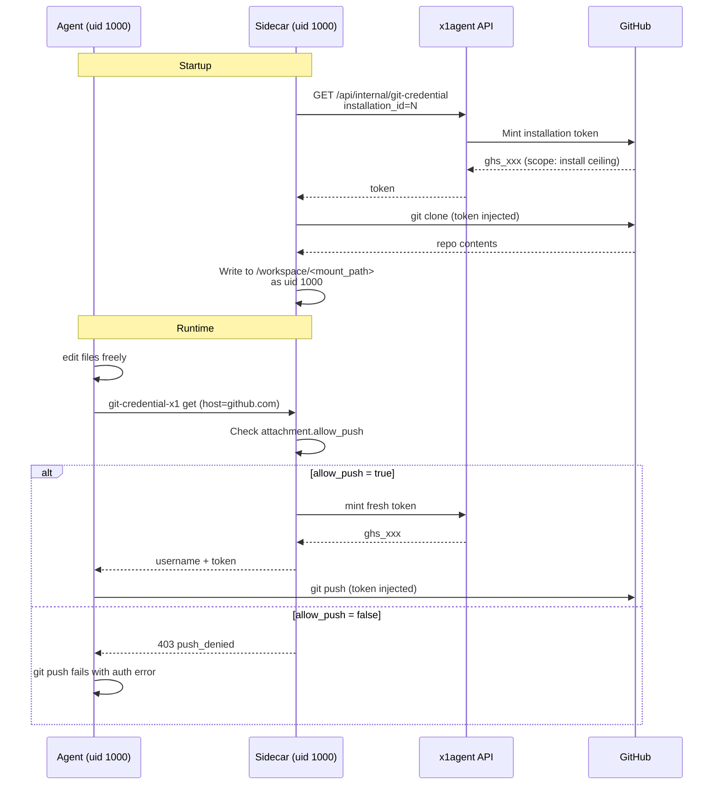

Agents need to edit code. Some agents need to push it. Most don't. This page describes how x1agent gives an agent a writable checkout of a repository, and how push capability is gated independently — without relying on GitHub's own scope model to do the gating.

This is design-level; the push-gating flag is not yet implemented. Today every attached repo is implicitly push-enabled. The fix is tracked in the follow-ups section below.

## Why not gate at GitHub

A GitHub App install is a one-time, high-friction operation. Operators install it once, with whatever scope they're willing to grant — usually broad. They will not return to GitHub's UI to narrow permissions per repo per agent. Expecting them to is unrealistic.

Worse, GitHub's installation tokens are coarse:

- Scopes are `contents: read` / `contents: write`, not per-branch.
- Token scope is fixed per install — you can't mint a write-scoped token for one call and a read-scoped token for the next without bookkeeping GitHub itself doesn't help with.
- Asking operators to install the app with `contents: read` and later upgrading to `contents: write` requires them to re-approve the install.

So GitHub's scopes are the **ceiling**, not the enforcement layer. x1agent enforces at its own trust boundary.

## Trust boundary: the sidecar

The agent container is untrusted. The sidecar is the trust boundary. (Same principle as [the credential proxy](/security/credential-proxy).) Every credential the agent needs to push, pull, or authenticate against GitHub is minted on demand by the sidecar and never lives in the agent container's environment or filesystem.



Two distinct actions, two distinct checks:

1. **Clone at startup.** Always succeeds for attached repos. The agent gets a checkout.
2. **Credential request at runtime.** The sidecar consults the per-attachment policy before minting a token. Fetch (read) requests are allowed. Push (write) requests are rejected if `allow_push = false`.

The credential helper (`git-credential-x1`) in the agent container is a dumb shell script that HTTPs the sidecar. It has no policy logic. All decisions live in the sidecar.

## The working tree is always writable

Regardless of push capability, the checkout at `/workspace/<mount_path>` is writable by the agent. The agent can:

- Edit files with any tool — `vim`, `sed`, Claude's `Write`, etc.
- Run build tooling that creates artifacts — `npm install`, `cargo build`, `go build`.
- `git init`, `git add`, `git commit` — entirely local, no credentials involved.
- Run tests, format code, inspect diffs.

What changes with `allow_push = false` is the final step: `git push` fails because the sidecar refuses to mint a push-scoped credential. The local commit history still exists. An operator can inspect it, cherry-pick, or discard.

This matters because agents do a lot of useful work — scaffolding, refactoring, bug hunting — whose value doesn't require pushing anywhere. Write access to the filesystem is not the same as write access to the remote.

## The attachment shape

Each agent-repo attachment carries policy. The shape:

```ts
interface AgentRepoAttachment {
  repo_full_name: string;        // "hirer-co/app"
  branch: string;                // default branch to check out
  mount_path: string;            // /workspace/<mount_path>
  installation_id: number;       // GitHub App install to mint tokens from

  allow_push: boolean;           // default: false
  // Future: allow_branches: string[]  — restrict push to matching refs
  //         read_only_paths: string[] — server-side blocks writes here
}
```

`allow_push` is the primary knob. Default is `false` — safe by default. Attaching a repo gives the agent reading and local editing. Giving it push requires an explicit operator decision.

At the sidecar, the check is trivial — inside `handle_git_credential`:

```rust
if !attachment.allow_push && is_push_request(&request) {
    return Err(HttpError::forbidden("push_denied"));
}
```

Detecting a push vs. a fetch from the git credential protocol is straightforward: git sets `capability[]=authtype` / different URL patterns for push vs. pull, but in practice the sidecar can't reliably distinguish. Two viable strategies:

- **Mint two tokens per attachment.** A read-scoped one and a write-scoped one. Return the read token for all credential requests; the agent's push fails at GitHub with 403. Requires `contents: read` to be separately grantable, which isn't always true — skip this for now.
- **Use a short-lived, scope-narrowed fine-grained PAT style.** Not available for GitHub App installs.
- **Deny at the sidecar.** Return 403 from `/git/credential` when `allow_push = false`. `git fetch` and `git pull` work because they don't hit this endpoint — the initial clone already populated the tree and HTTPS fetch via the credential helper is blocked. Requires the agent to use `git fetch origin` over the already-cloned remote with no creds needed for public repos, or a separate read-path. **This is not yet designed.**

For the first pass, simplest-working: when `allow_push = false`, the credential helper returns 403 for everything. The agent can't `git fetch` either — but the sidecar handles fetch itself via a periodic refresh loop, so the agent doesn't need to. That's consistent with treating the agent container as untrusted for network egress.

## What this does not cover

- **Non-GitHub hosts.** GitLab, Gitea, Bitbucket — same model, different credential endpoint. The policy layer is identical; only the token-mint call changes.
- **SSH-based remotes.** Not supported. The credential proxy pattern only works over HTTPS. SSH would require mounting a private key into the agent container, which puts a credential inside the trust boundary we're trying to defend.
- **Path-level restrictions.** "This agent can read `/docs` but not `/src`" is not supported. Git doesn't gate on paths. If this matters, give the agent a repo that only contains what it should see.

## Follow-ups

- **Implement `allow_push` on attachments.** Schema, UI, sidecar enforcement. Default is `false`.
- **Sidecar runs as uid 1000.** Currently the sidecar runs as root, drops `CAP_CHOWN`, and tries to `chown` the cloned tree to 1000 — which silently fails because the capability is gone. Agents work around this by re-cloning into an agent-owned subdirectory, wasting tokens and disk. Fix: add a uid 1000 user to `packages/sidecar/Dockerfile` and set `runAsUser: 1000` on the sidecar container in the session pod spec. This is the follow-up the Apr 19 PodSecurityContext commit called out; doing it closes the perm gap and removes the agent's need to route around the platform.
- **Fetch refresh from the sidecar.** Periodic `git fetch` in the sidecar keeps the checkout up to date without the agent needing egress credentials.
