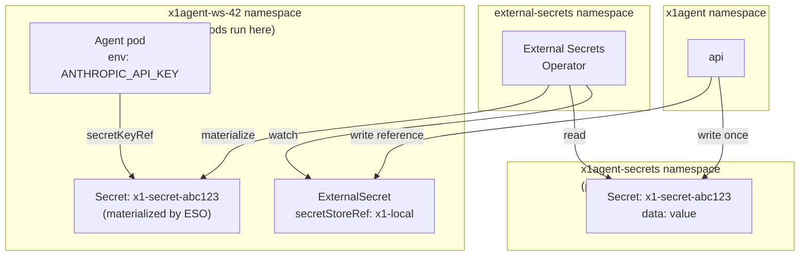

:::caution[Design target — partial implementation]
The architecture described on this page is the v2 design. **v1 ships
with a different implementation**: workspace secrets are AES-256-GCM
ciphertext in Postgres, decrypted in-process by the api at session
launch. The ESO + per-workspace-namespace + capture/bind modes
described below are the design we're migrating toward; they are not
what an install does today. See [Secrets — current implementation]()
for the v1 reality.
:::

x1agent never owns secret values. It delegates storage, encryption, rotation, and audit to the Kubernetes cluster and — for enterprise deployments — to an external secrets backend via the [External Secrets Operator](https://external-secrets.io/). x1agent writes references, not bytes. The trust boundary is the api, and the window in which the api holds plaintext is as narrow as the code path can make it.

This page documents the full model: the topology, the two interaction modes, how secrets are typed and scoped, and what changes (and what doesn't) when you move from local development to a production backend.

## Why External Secrets Operator

Three reasons.

**One CRD shape, any backend.** ESO ships with providers for Vault, AWS Secrets Manager, GCP Secret Manager, Azure Key Vault, 1Password, Doppler, Akeyless, Bitwarden, Infisical, and others — all behind the same two CRDs (`ClusterSecretStore`, `ExternalSecret`). x1agent writes those CRDs. It never needs backend-specific SDKs, auth flows, or rotation logic.

**Audit belongs to the backend.** Vault logs every secret read. CloudTrail logs every AWS Secrets Manager access. x1agent's audit layer records *binding* events (who attached secret X to agent Y, when) but deliberately does not record *read* events — those are the backend's responsibility, and duplicating them would be a weaker copy. Putting audit at the source means it survives x1agent being compromised.

**No crypto in x1agent.** etcd encryption-at-rest, KMS backends, hardware security modules, key rotation — all cluster-level concerns with mature tooling. The worst outcome for a platform like x1agent is inventing its own cryptography; ESO lets us not.

## Topology



The key property: **the api writes exactly twice per secret — once to the backing Secret, once to the ExternalSecret reference — and never reads the value again.** All downstream access goes through ESO's reconciliation, not through our code.

## Two modes

x1agent's UI runs in one of two modes depending on the backend.

### Capture mode (local dev, small deployments)

The operator has no external secrets backend and wants x1agent to be the system of record for secret values. The `ClusterSecretStore` is configured with ESO's `kubernetes` provider, pointing at the cluster-internal `x1agent-secrets` namespace.

- User types the secret value into x1agent's web UI.
- api writes a plain `Secret` in `x1agent-secrets`.
- api writes a matching `ExternalSecret` in the target workspace namespace.
- ESO materializes a Secret in the workspace namespace.
- Agent pods mount the materialized Secret via `secretKeyRef`.

Plaintext transits the api briefly on write. The dev UX is one-step (paste → save → used).

### Bind mode (enterprise backends)

The operator runs Vault (or AWS Secrets Manager, or equivalent). The `ClusterSecretStore` is configured with that backend's provider. Secret values are managed in the backend directly — by the ops team, by GitOps pipelines, by whatever the organization already uses.

- User enters a *path* (e.g. `secret/data/x1agent/ws-42/openai-prod`) into x1agent's web UI. Not a value.
- api writes only the `ExternalSecret` reference — no backing Secret in `x1agent-secrets`.
- ESO resolves the path against the backend, materializes the Secret in the workspace namespace.
- Agent pods mount as usual.

Plaintext never touches the api at all. The bind UI is a different form — "where in your backend is this secret?" — with status feedback from ESO reconciliation rather than a "reveal" button.

### When to use which

| Use case | Mode |
|---|---|
| Solo operator, local dev on OrbStack | Capture |
| Small team, single cluster, no external secrets infra | Capture |
| Regulated industry, existing Vault/cloud backend | Bind |
| Multi-team enterprise where each team manages their own secrets | Bind |
| Migration period (typing values in but planning to move later) | Capture, then swap the `ClusterSecretStore` and re-bind |

### What moves, what doesn't, when you upgrade

Moving from capture mode to bind mode is a cluster config change, not an x1agent change:

- Install the backend (Vault cluster, IAM role for AWS, service account for GCP, etc.).
- Apply a new `ClusterSecretStore` (e.g. `x1-vault`) with that backend's provider config.
- Point each workspace's `ExternalSecret` objects at the new `secretStoreRef`. Can be done per workspace, gradually.
- The x1agent code, UI, and agent definitions are untouched.

What doesn't move: existing capture-mode secrets you've already typed in aren't magically exported. Either repopulate them in the new backend and rebind, or run ESO's `PushSecret` once as a one-shot migration. x1agent doesn't automate this — it's an operator task performed once.

## Typed secrets

Every secret x1agent tracks has three typing axes, stored as metadata alongside the reference:

```
family        — top-level category   (llm_provider | messaging_provider | git_credential | ...)
variant       — vendor identity      ("anthropic" | "openai" | "cohere" | "slack" | ...)
capabilities  — readonly string[]    (["chat", "embedding", "vision", "tool_use"])
```

Consumers query by these axes instead of hardcoding vendor names. A few examples:

| Consumer | Query |
|---|---|
| Claude-based agent runtime | `family=llm_provider, variant=anthropic, capabilities⊇["chat"]` |
| Open-code / OpenAI-compatible agent runtime | `family=llm_provider, variant∈{openai, openai_compatible}, capabilities⊇["chat"]` |
| Collection with vector search | `family=llm_provider, capabilities⊇["embedding"]` |
| Slack messaging provider | `family=messaging_provider, variant=slack` |
| MCP server that needs Notion | `family=generic, name="notion_token"` (catalog-unknown keys fall back to name matching) |

The typed-secrets catalog is a code constant, not a table. Adding a new runtime vendor means one entry in the catalog; no migrations, no UI branching.

**Why this matters:** consumers are forward-compatible. When a new embedding provider emerges (say, Voyage or a local model with an OpenAI-compatible API), the collection config screen automatically offers secrets that declare `capabilities⊇["embedding"]` — no code change. Same reason agent runtime types will be pluggable without the secrets UI having to know each one.

## Scoping

A secret belongs to exactly one of three scopes:

- **`workspace`** — usable by anything in the workspace. Shared credentials: workspace-wide Anthropic key, GitHub App install, embedding key.
- **`agent`** — only agents with that id (and their sessions) can bind to it. Used when different agents in the same workspace need different credentials.
- **`mcp_attachment`** — only the specific MCP server instance attached to an agent. Used for per-MCP tokens (Notion, Linear, Jira, and other third-party services).

Scoping is enforced at **two layers**, each alone insufficient, together a defensible barrier:

**Kubernetes namespace.** Per-workspace namespaces (`x1agent-ws-{id}`) mean an agent pod in workspace A physically cannot mount a Secret from workspace B — kubelet rejects cross-namespace mounts without explicit RBAC. Workspace boundaries are a K8s primitive.

**Explicit injection, no wildcards.** The job-watcher reads an agent's configured secret bindings from the database and injects only those specific secrets into the pod spec as `secretKeyRef` entries. No `envFrom: secretRef:` dumps, no volume mounts of secret directories. The pod sees exactly the environment variables we chose — nothing else.

**Automount disabled.** Agent containers run with
`automountServiceAccountToken: false` (TODO: not yet enforced —
tracked as a follow-up). When this lands, a compromised agent has
no credential to call kube-apiserver. Today, the default SA token
is mounted; the only protection is that the SA has no RBAC bindings
granting access to other Secrets in the namespace.

**Per-MCP env filtering.** MCPs spawn as child processes inside the agent container. By default they inherit the parent's full environment — including secrets they don't need. x1agent's MCP launcher **explicitly filters the env per subprocess**: each MCP receives only the secrets its attachment declared. A Notion MCP never sees the Slack token; a Slack MCP never sees the Anthropic key.

## Display policy

x1agent **never displays a secret value** after the initial write.

- **Capture mode**: stored values are shown only as a prefix/suffix mask (e.g. `sk-a1…bC02`). The prefix and suffix are extracted at write time and stored in the metadata row — we don't re-read the Secret to display.
- **Bind mode**: the *path* is visible (it's configuration, not a credential) but there is no mask — the api never sees the value, so there's nothing to prefix.

No "reveal" button. No "copy to clipboard" button that fetches the value. Rotation is "create new, rebind, delete old" — not "reveal and edit".

## Rotation

**Capture mode.** User enters a new value via the UI. The api writes over the old Secret; ESO re-materializes on its next sync (typically 1h, configurable per ExternalSecret). Agent pods pick up the new value when they restart. For immediate rotation, `kubectl -n x1agent-ws-42 rollout restart deploy/...` on the consuming pods.

**Bind mode.** The operator rotates in the backend (Vault's rotation API, cloud KMS rotation schedules, manual `vault kv put`, etc.). ESO picks up the new value on its refresh interval. No x1agent involvement at all.

For both modes, short-lived credentials are preferred over static ones wherever the consuming API supports them. Vault's dynamic-secrets engines are the gold standard here; ESO works with them transparently.

## What x1agent explicitly does not do

- **Generate or rotate the workspace-secrets master key.** x1agent
  uses `WORKSPACE_SECRETS_MASTER_KEY` (32 bytes hex, set at install).
  Rotation requires re-encrypting every row; we do not automate this.
  etcd encryption-at-rest is operator-configured at the cluster
  level — required for at-rest protection of per-session K8s Secrets.
- **Run its own KMS.** When backed by Vault or a cloud KMS, cryptographic operations belong to the backend.
- **Sync values between backends.** `PushSecret` is an explicit operator action, not an x1agent feature.
- **Cache plaintext values.** The api reads the value exactly once per write — immediately passed to the k8s api, then dropped.
- **Log request bodies on secrets routes.** Loggers, APM auto-instrumentation, and trace captures are opt-out for `/auth/password` and `/secrets/*`. A per-route `x-no-log: true` marker is verified by a fuzz test in CI.

## What you the operator are responsible for

- **etcd encryption-at-rest** (capture mode). Without it, your Secrets are recoverable from etcd backups.
- **Ingress TLS** on the public surface so the browser→api plaintext leg is encrypted. Required in any deployment that isn't localhost.
- **KUBECONFIG permissions.** The api's service account needs write on Secrets (capture mode) and write on ExternalSecrets (both modes) in the workspace and `x1agent-secrets` namespaces.
- **Backend policy** (bind mode). Vault's auth methods, AWS IAM roles, GCP workload identity — all operator-configured. x1agent honors whatever policy the backend enforces.

## Related reading

- [Security model](/security/overview) — trust boundaries, permission grants, the untrusted agent container model that makes scoping worth doing.
- [Provider isolation](/security/provider-isolation) — how credential-holding code is kept out of provider deployments.
- [Credential proxy](/security/credential-proxy) — the sidecar's `gh` / `git` credential handoff, which uses the same secret-retrieval pattern.
- [Kubernetes deployment](/deployment/kubernetes) — production install covering ESO configuration for external backends.
